# Functional Specification - BiteMatch <!-- omit in toc -->

## Table of Content <!-- omit in toc -->

- [Introduction](#introduction)
  - [Project Overview](#project-overview)
  - [Project Definition](#project-definition)
    - [Vision](#vision)
    - [Objectives](#objectives)
    - [Scope](#scope)
    - [Target Audience](#target-audience)
    - [Deliverables](#deliverables)
  - [Project Organisation](#project-organisation)
    - [Project Representatives](#project-representatives)
    - [Stakeholders](#stakeholders)
    - [Project Reviewers](#project-reviewers)
  - [Project Plan](#project-plan)
    - [Retroplanning](#retroplanning)
    - [Milestones](#milestones)
    - [Dependencies](#dependencies)
    - [Assumptions/Constraints](#assumptionsconstraints)
    - [Risks/Mitigation](#risksmitigation)
- [UI/UX](#uiux)
  - [Wireframes](#wireframes)
  - [Mockups](#mockups)
  - [Color Palette](#color-palette)
  - [Logo](#logo)
  - [Font](#font)
  - [Data](#data)
    - [Meals](#meals)
    - [Tags](#tags)
  - [Image Assets](#image-assets)
- [Funtional Requirements](#funtional-requirements)
- [Non-Functional Requirements](#non-functional-requirements)
- [Glossary](#glossary)

## Introduction

### Project Overview

---

This project is about creating an application to recommend to user wine and cheese according to the meal they want to eat.

The client is "Intermarché Saint-Rémy-de-Provence". <!-- Our contact point is ___, the --> <!-- TODO: add name & role. -->

---

### Project Definition

---

#### Vision

---

The vision behind this project is to help people chose better wine assortiment for their meal all day long, even when there is no department expert in the store. Allowing new commers and tourist to try and find by themselves new and local product.

---

#### Objectives

---

- **Helping client finding meal assortiment**: The application should allow user to find wine, or cheese without any human help.
- **Bringing discovery to client**: The application should permit client to discover new and local ingredients/wine. It would allow client to have a new experience with the French culture.
- **Ease of use**: The application should be totally user-friendly and compatible in many languages. The application should be quick to use-no more than 3 pages to navigate through-and accessible without connection.

---

#### Scope

---

This peoject will be made in bubble, a no-code platform, and should be compatible with every mobile device. If this concept is adapted and should be spread around or scaled, then another language would be used to create the application.

The implementation would mainly concern the front-end as it is a UX project. A back-end would still be implemented. However, this one would be smaller than the actual database. As it is a proof of concept, quality would be prioritize as quantity.

---

#### Target Audience

---

**Tourist**: People that aren't from the region, wanting to discover more about the culture and culinary habits of its inhabitants. They would use the application in their own language (or most common one) to discover new wines and cheese quickly during their journey.

**Locals**: People that live annually or partially in the region. They could use the application for recommendation in particular events such as weddings or party.

**Wine Amateurs**: People that likes wines and have knowlegde about them. They could use the application to know more about the different tastes of the wine, with what it suits best.

**Cheese Amateurs**: People that likes cheeses and have knowlegde about them. They could use the application to know more about the different kind of the cheese and their best assortiment.

---

#### Deliverables

---

The main deliverable of this project is the bubble application/source code. Alongside, five documents would be written:

- The Functional Specification
- The Technical Specification
- The Test Plan
- The User Manual
- Management Planning and Weekly Reports

In addition, a 15-minute long presentation would be done in front of the client to show this advancement.

---

### Project Organisation

---

#### Project Representatives

---

| Name            | Role              | Responsibilities                                                                                                                     | Links                                                             |
| --------------- | ----------------- | ------------------------------------------------------------------------------------------------------------------------------------ | ----------------------------------------------------------------- |
| Antoine PREVOST | Project Manager   | Managment (time, resources) Workload distribution  Report to stakeholders Risk anticipation and mitigation                  | [LinkedIn](https://www.linkedin.com/in/antoine-prevost-dev/)      |
| Maxime THIZEAU  | Program Manager   | Mock-ups and general design of the software Communication with the client Functional specification delivery Risk management | [LinkedIn](https://www.linkedin.com/in/maxime-thizeau-0b311a293/) |
| Antoine PREVOST | Technical Leader  | Define coding conventions Choose technical tools used Technical specification delivery Manages developer tasks              | [LinkedIn](https://www.linkedin.com/in/antoine-prevost-dev/)      |
| Pavlo PRENDI    | Software engineer | Write the code Fix bugs Document the code Create the tests if needed for the code                                           | [LinkedIn](https://www.linkedin.com/in/pavlo-prendi/)             |
| MARIEM ZAIANE   | Quality assurance | Verify documents Test the program Confirm we match the client expectations Test plan delivery                               | [LinkedIn](https://www.linkedin.com/in/mariem-zaiane/)            |

---

#### Stakeholders

---

| Role            | Representative              | Expectation                                                            |
| --------------- | --------------------------- | ---------------------------------------------------------------------- |
| Client          | Célia & Dylan (Intermarché) | Finished project while meeting requirements and proof-tested prototype |
| School director | Franck JEANNIN (ALGOSUP)    | Clear documentation and management based on the skills learnt in class |

---

#### Project Reviewers

---

External project reviewers have been appointed by the project owner to review our specifications and provide us with feedback.

---

### Project Plan

---

#### Retroplanning

---

**End Goal and Deadline**:

<!-- TODO -->

**Key Milestones**:

<!-- TODO -->

**Task Breakdown**:

<!-- TODO -->

**Critical Path**:

<!-- TODO -->

**Timeline Visualization**:

<!-- TODO -->

---

#### Milestones

---

| Date       | Time   | Milestones                        |
| ---------- | ------ | --------------------------------- |
| 04/22/2025 | 9 A.M. | Project kick-off with the client  |
| 05/16/2025 | 5 P.M. | Functional Specification delivery |
| 05/28/2025 | 5 P.M. | Technical Specification delivery  |
| 06/06/2025 | 5 P.M. | Test Plan delivery                |
| 06/16/2025 | 5 P.M. | Final product codebase delivery   |
| 06/16/2025 | 5 P.M. | User Manual Delivery              |
| 06/20/2025 | 9 A.M. | Final Presentation Pitch          |

---

#### Dependencies

---

**Task Dependencies**:

<!-- TODO -->

**Resource Dependencies**:

<!-- TODO -->

---

#### Assumptions/Constraints

---

**Assumptions**:

<!-- TODO -->

**Constraints**:

<!-- TODO -->

---

#### Risks/Mitigation

---

| Type                                     | Description                                                                                                                | Likelihood | Impact                  | Mitigation                                                     |
| ---------------------------------------- | -------------------------------------------------------------------------------------------------------------------------- | ---------- | ----------------------- | -------------------------------------------------------------- |
| New requirements                         | The client might request some changes at any time, forcing us to change our specifications and potentially creating delays | Medium     | Varies from low to high | Avoidance                                                      |
| Wrong interpretation of the requirements | We might forget a key point in our solution or misinterpret a requirement                                                  | Medium     | High                    | Regular communications about what's being done with the client |

---

## UI/UX

### Wireframes

---

This project has been into many states and was at first designed as a wireframe on Excalidraw. You can find it by clicking on the following link: [Excalidraw, Read only](https://excalidraw.com/#json=CeX56Qg24DF5ZD2TAaS40,9vrUyinyniIOAFH6zy5HQA).

**First Idea**:

The first workflow idea was to enter the name of the meal the user would like to eat and a recomendation of wines or cheeses would appear underneath the search input.

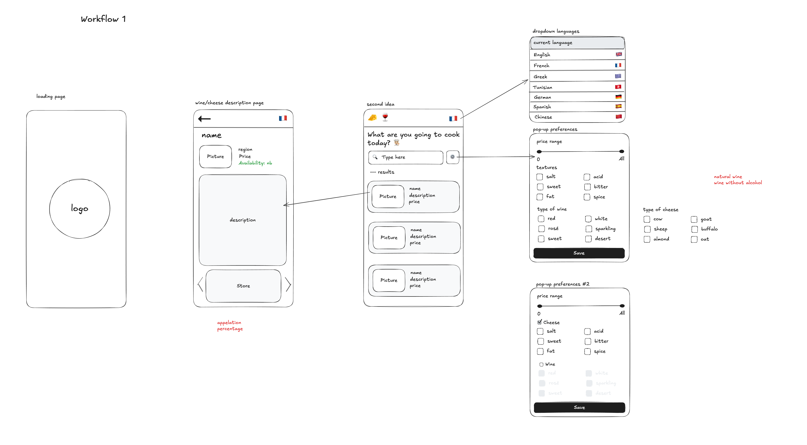

This idea wasn't retained because the database necessary at its well-behavement wasn't feasable for this project.

**Second Idea**:

This one was more based in a menu "a la carte" way. The user could choose between many predefined dishes (local culinary specifities) and it would send them to a description page of the meal with recommendations for wine and cheese.

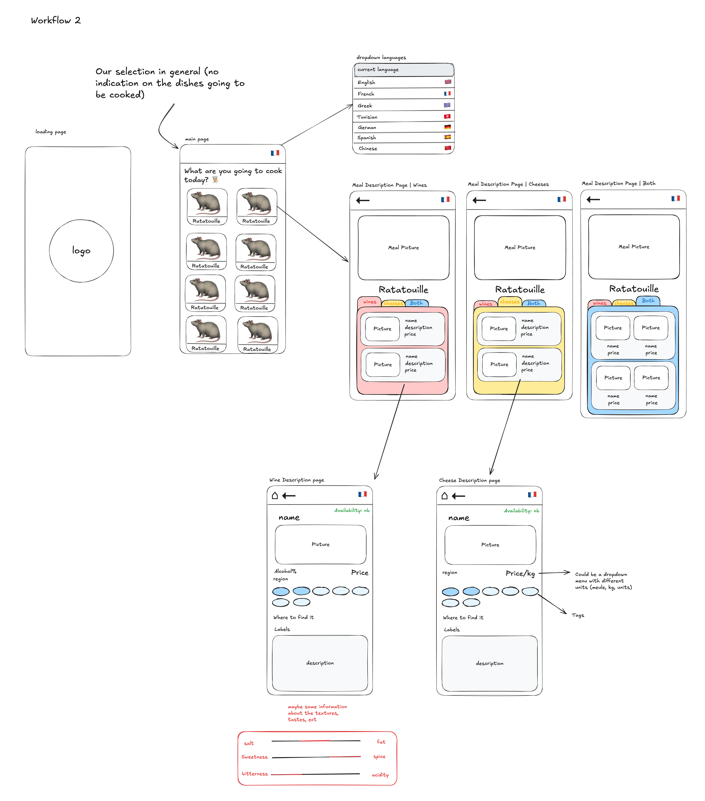

This idea was not retained due to the lack of possible dishes. The user could want something totally different from what is shown in the cards.

**Third Idea**:

This idea was solely based on a tag system. The user could select in the navigation bar (top bar) if he was searching for a wine or a cheese. Afterward, they could select tags to filter results until they find the expected wine/cheese.

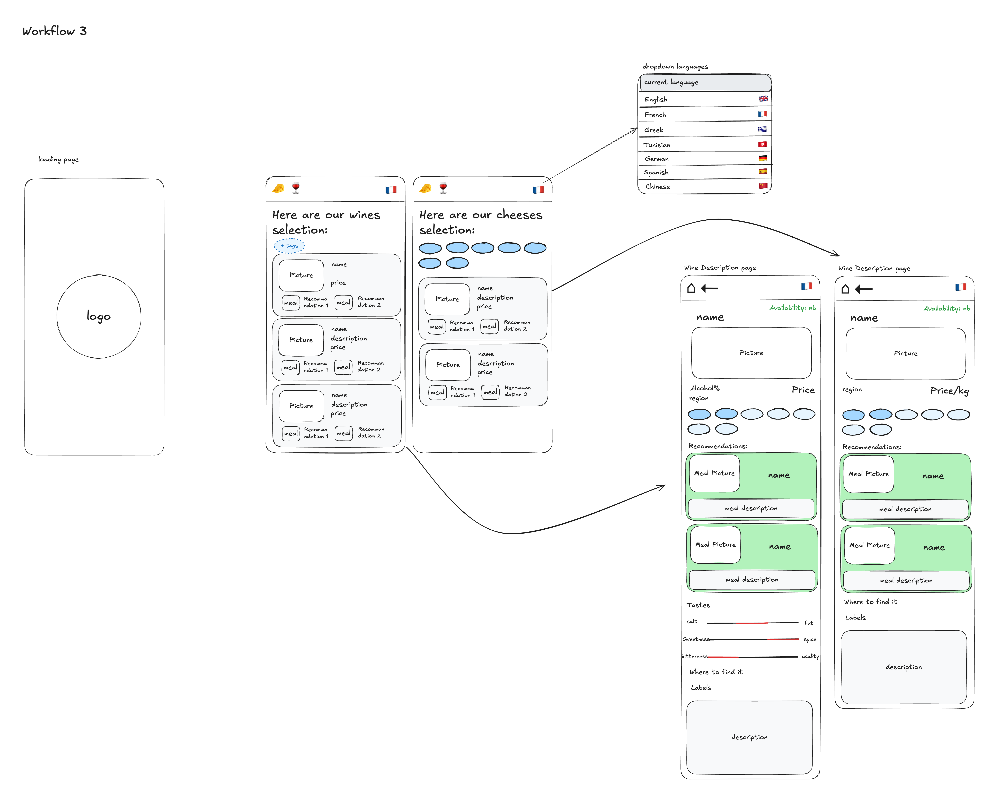

This idea was rejected for being too specific. Only amateurs of wine and cheese could easily navigate through the different tags to select the desired product.

---

None of those ideas was convenient enough to solve the client's requirement. However, they all have a part that was interesting to dig in. Therefore, a last design was created by merging the three ideas.

**Final Idea**:

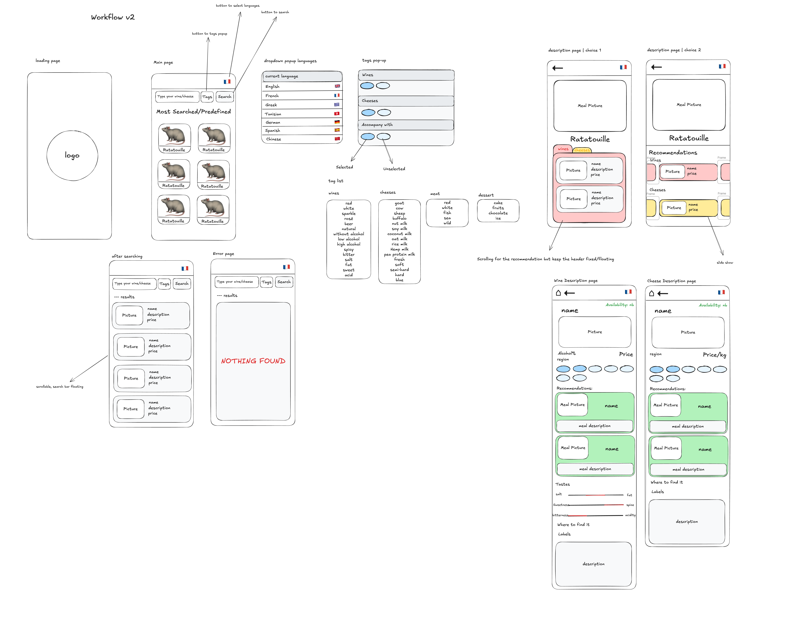

This idea combines the search bar from the first idea, the cards from the second one, and tags from the last one. However some differences can be spotten.

Firstly, the search bar would be used for wines and cheeses, and not meals anymore. The user would enter the name of a product and they would apear underneath.

Secondly, in the meal description page, the "both section" has been removed, judged as useless with the two others.

Finally, tags won't be visible on the main screen, since there could be a lot of them at the same time. They would be accessible through the "add tags" button and categorized by type and product (wines, cheeses, accompaniement).

---

### Mockups

---

The Mockups have been made on Figma and can be found in two places, either as a [pdf file]() or with this link: [Figma, Read only](https://www.figma.com/design/YYSa0BxXfyM5PNkdnCFYeZ/BiteMatch-wine-cheese-application?node-id=0-1&t=jhOQGM6NhjMpkwJ6-1).

<!-- TODO: add link to pdf file -->

BiteMatch's Mockups were made following previously mentionned wireframes and through a try & error process.

**First Version**:

This version was made following the last version of the wireframe. Colors used was Intermarché's one, referred as choice 1 in [Color Palette](#color-palette).

This version had some changes, mainly on the sizes of different elements, judged as too big, and feeling like an application for elders, which was not the point.

**Second Version**:

This version was modified according to the first version feedback.

For this version, the cards (wine, cheese, meals) has been reduced as well as the font size and pictures, giving a more recent feeling about the application. \
Also, the brown color has been slightly lighten up to have a more harmonious page. \
Home button has been replaced by the [BiteMatch Logo](#logo). \
Finally, Intermarché's logo has been implemented in the middle of the top bar.

---

<!--
### Unique UI Feature

---

TODO

--- -->

### Color Palette

---

Many color charts has been defined for this project, but only three choices have been kept. They are the following:

| Colors           | Choice 1 | Choice 2 | Choice 3 |
| ---------------- | -------- | -------- | -------- |
| Primary          | #E00E1F  | #DD1717  | #590031  |
| Primary Contrast | #DECE9C  | #F4460B  | #FCFCEA  |
| Text             | #000000  | #940B0B  | #88A895  |
| Surface          | #F1F1F2  | #67140B  | #E5B355  |
| Background       | #FFFFFF  | #E5951A  | #442C42  |
| Destructive      | #B0200C  | #B0200C  | #B0200C  |
| Success          | #1E6C30  | #1E6C30  | #1E6C30  |
| Alert            | #DCA114  | #DCA114  | #DCA114  |

Since colors are quite easy and fast to change, the first choice was selected, as it was the same colors as Intermarché's ones.

---

### Logo

---

As none of the team members are graphic designers and that a logo could be quite difficult to design, it was decided to use an AI ([DeepAI](https://deepai.org)) to generate our logo.

The first selection was generated with a prompt containing information about the project and chart colors. DeepAI returned these six:

|                          Logo 1                           |                          Logo 2                           |                           Logo 3                            |                           Logo 4                           |                           Logo 5                           |                          Logo 6                           |
| :-------------------------------------------------------: | :-------------------------------------------------------: | :---------------------------------------------------------: | :--------------------------------------------------------: | :--------------------------------------------------------: | :-------------------------------------------------------: |
| 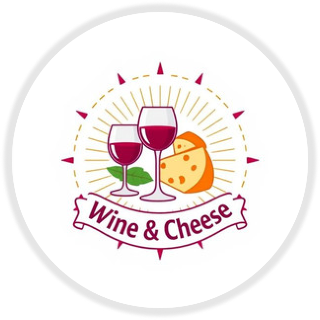 | 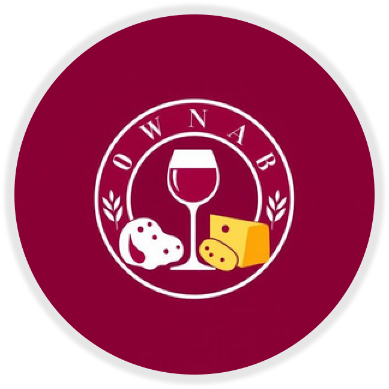 | 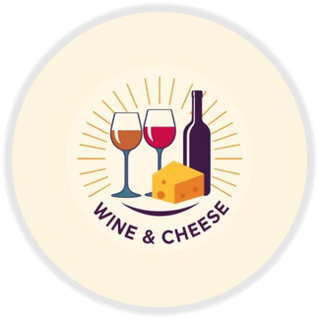 | 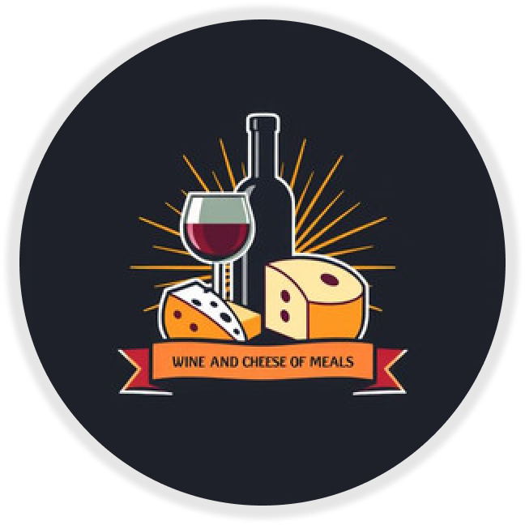 | 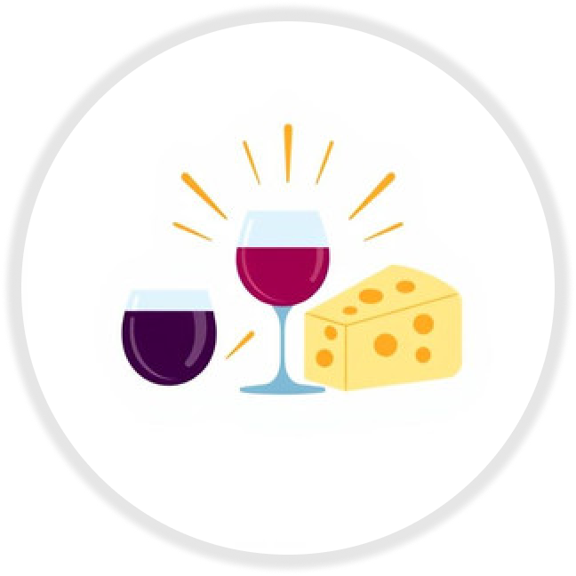 | 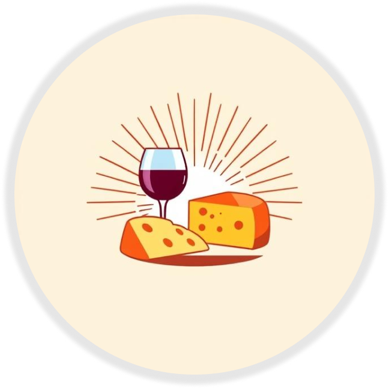 |

However, none of them has been consider as a good option since they weren't personified enough. Therefore, the team chosed a name for the application and a new prompt was generated with BiteMatch:

|                                        Logo 1                                         |                                        Logo 2                                         |                                         Logo 3                                          |
| :-----------------------------------------------------------------------------------: | :-----------------------------------------------------------------------------------: | :-------------------------------------------------------------------------------------: |
| 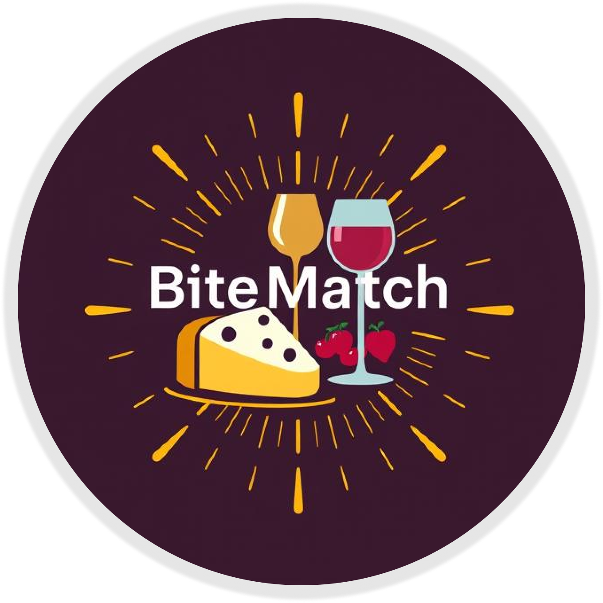 | 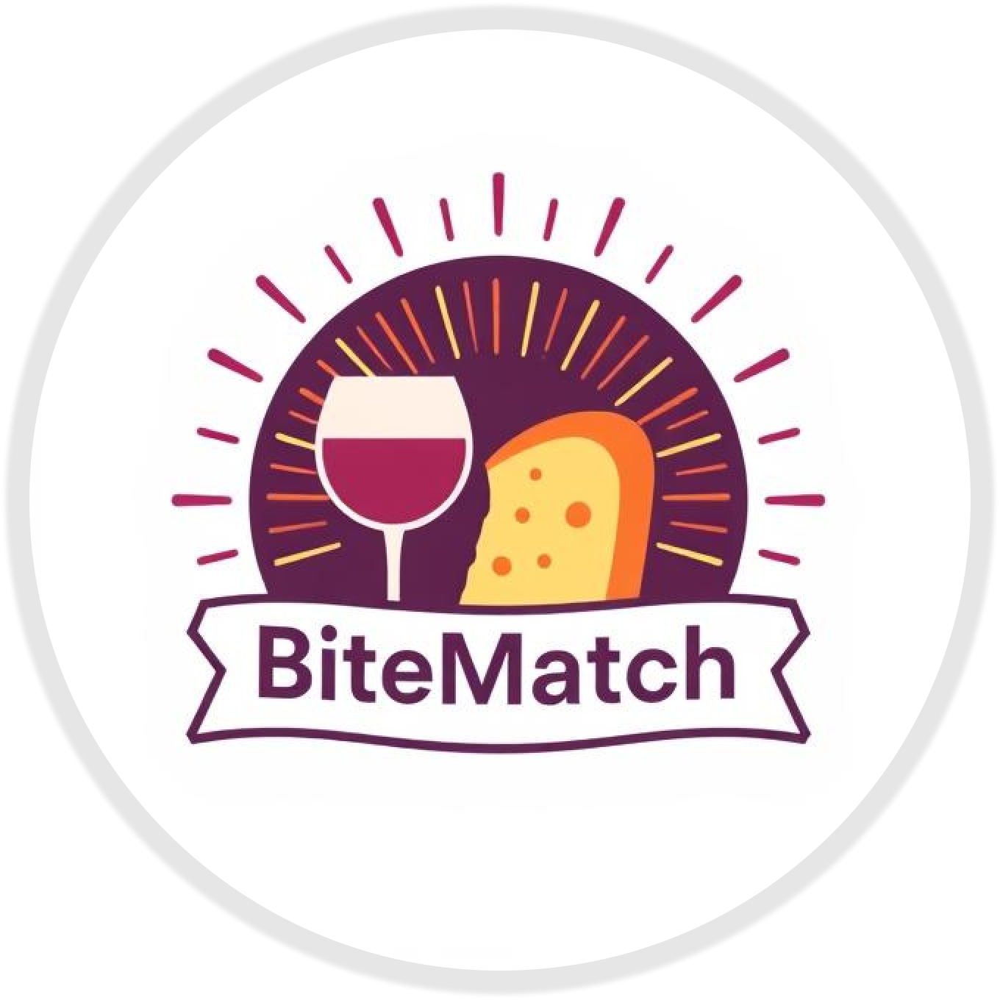 | 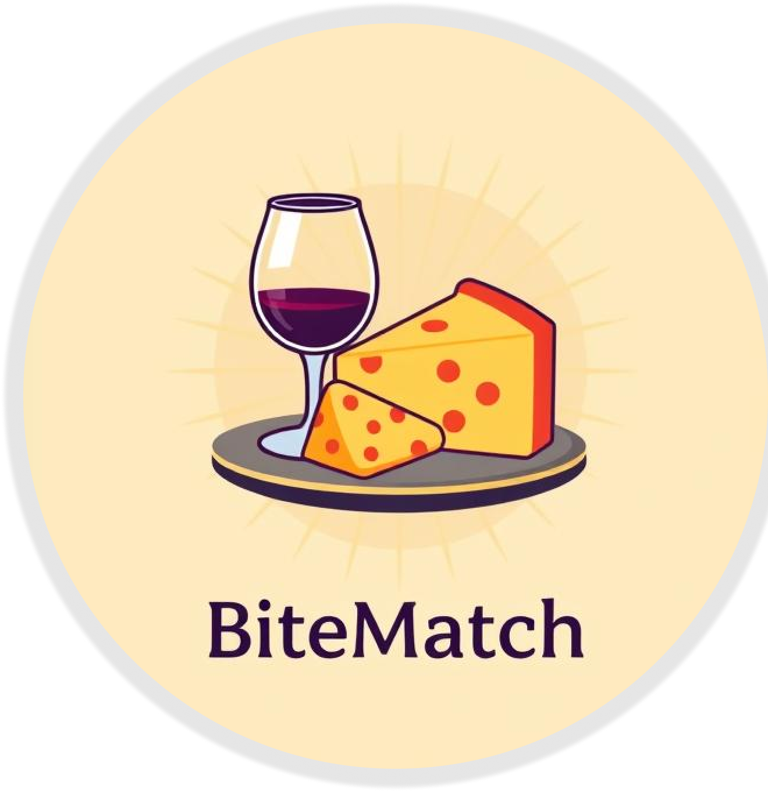 |

This second prompt exceeded our expectations giving us three good logos. After mindful reflections, the logo chosed was the second one, judged as more adequate with the application colors.

---

### Font

---

This application would be written with the `Inter` font because it is widely used in application and websites.

---

### Data

---

#### Meals

---

For this application, the main page would display meal cards which would be predefined and regional specialities. You can find the selection hereunder:

|         Meal Name         |                                         Picture                                         |                                                              Meal description                                                               |
| :-----------------------: | :-------------------------------------------------------------------------------------: | :-----------------------------------------------------------------------------------------------------------------------------------------: |
|         Anchoïade         |              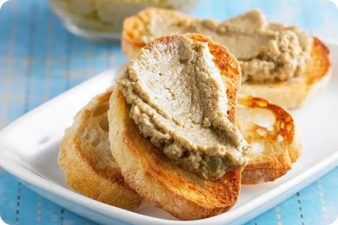              |          A savory dip made from anchovies, garlic, olive oil, and sometimes capers, typically served with raw vegetables or bread.          |
|           Aïoli           |                  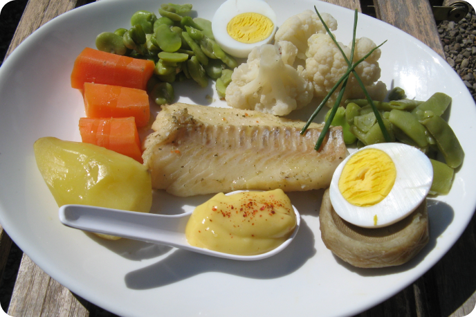                  |                 A garlic mayonnaise often served with vegetables, fish, or hard-boiled eggs, central to Provençal cuisine.                  |
|  Tomate à la Provençale   | 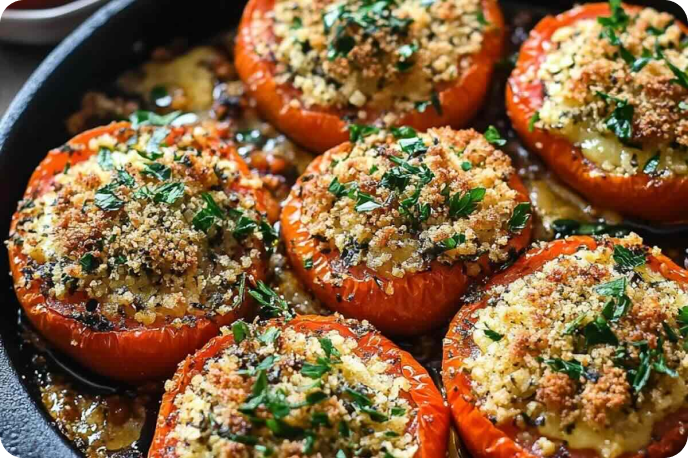 |                            Tomatoes baked with herbs, garlic, and breadcrumbs—an aromatic and simple side dish.                             |
|       Bouillabaisse       |          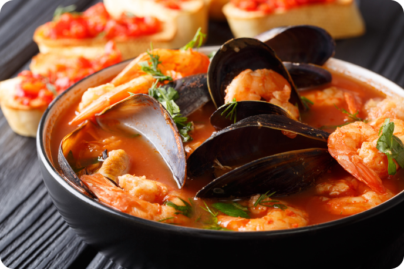          | A traditional fish stew from Marseille made with various local fish, shellfish, and a flavorful broth, served with rouille sauce and bread. |
| Ratatouille de Saint-Rémy |     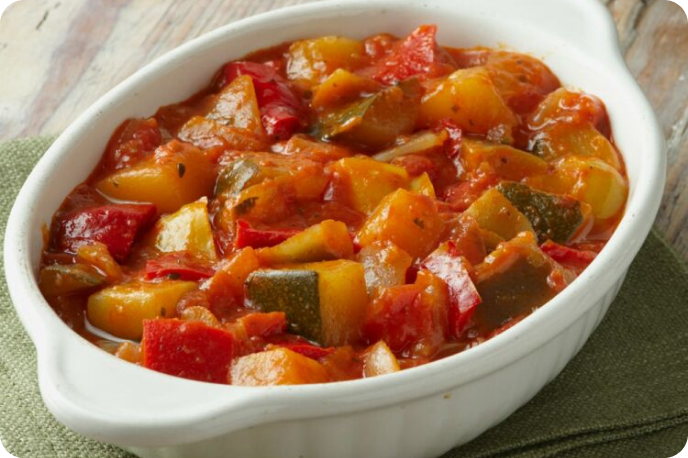     |              A slow-cooked vegetable medley of eggplant, zucchini, peppers, tomatoes, and herbs, originating from Saint-Rémy.               |
|           Socca           |                  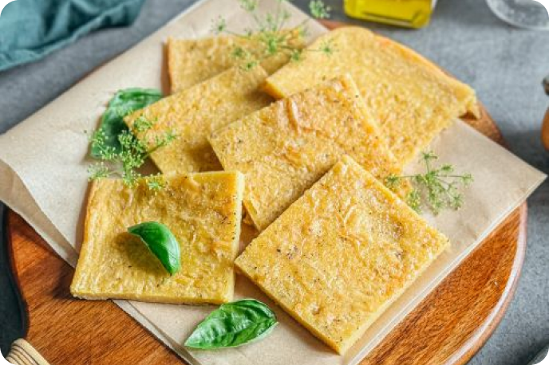                  |                         A thin, crispy chickpea flour pancake from Nice, seasoned with olive oil and black pepper.                          |
|         Broufado          |               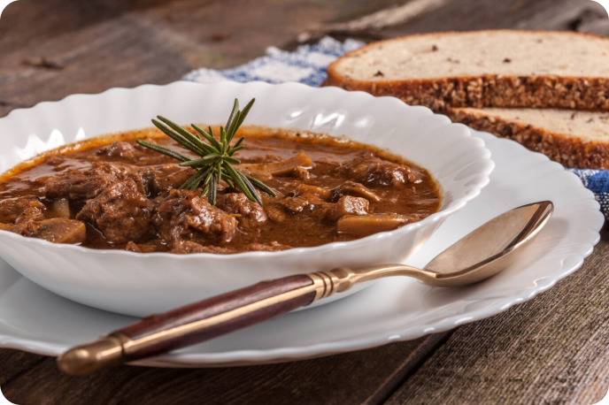               |                A hearty Provençal beef stew marinated in red wine and slow-cooked with onions, herbs, and sometimes olives.                 |
|         Crespeou          |               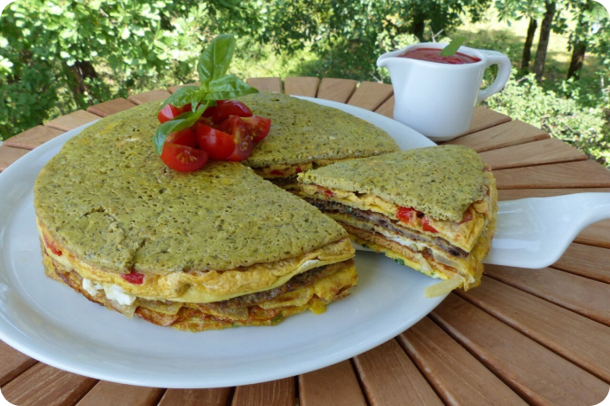               |                       A layered savory cake made of different colored omelets with herbs and vegetables, served cold.                       |
|     Tian aux Légumes      |       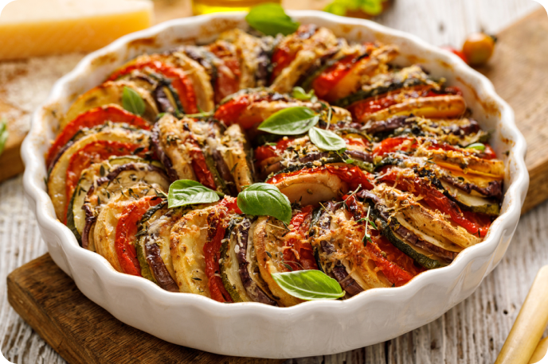       |     A baked dish of sliced vegetables (usually zucchini, tomatoes, and eggplant) arranged in a colorful spiral and roasted with herbs.      |
|       Pissaladière        |           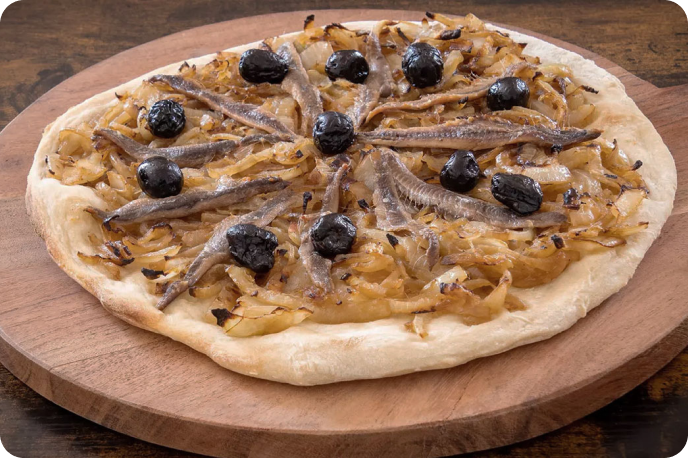           |                    A savory tart from Nice topped with caramelized onions, anchovies, and olives, on a bread-like crust.                    |
|     Daube Provençale      |       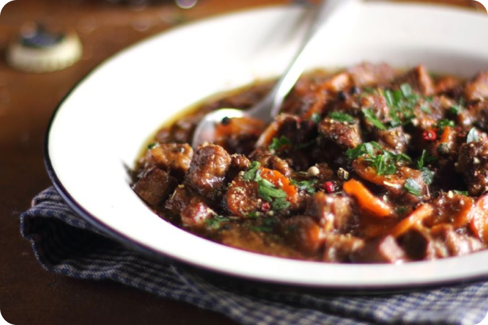       |             A rich beef stew braised in red wine with carrots, garlic, and Provençal herbs, often served with pasta or polenta.             |
|         Tapenade          |               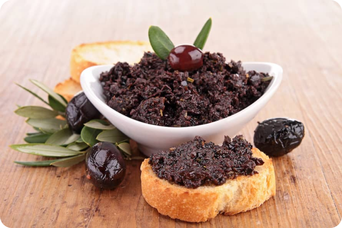               |                   A spread made of finely chopped olives, capers, anchovies, and olive oil, served on toast or as a dip.                    |

---

#### Tags

---

<!-- TODO -->

---

### Image Assets

---

<!-- TODO -->

---

## Funtional Requirements

<!-- TODO -->

---

## Non-Functional Requirements

<!-- TODO -->

---

## Glossary

<!-- TODO -->

---
