# Functional Specification - BiteMatch <!-- omit in toc -->

 Table of Contents 

- [Introduction](#introduction)
  - [Project Overview](#project-overview)
  - [Project Definition](#project-definition)
    - [Vision](#vision)
    - [Objectives](#objectives)
    - [Scope](#scope)
    - [Target Audience](#target-audience)
    - [Deliverables](#deliverables)
  - [Project Organisation](#project-organisation)
    - [Project Representatives](#project-representatives)
    - [Stakeholders](#stakeholders)
    - [Project Reviewers](#project-reviewers)
  - [Project Plan](#project-plan)
    - [Retroplanning](#retroplanning)
    - [Milestones](#milestones)
    - [Dependencies](#dependencies)
    - [Assumptions/Constraints](#assumptionsconstraints)
    - [Risks/Mitigation](#risksmitigation)
- [Personas and Use Cases](#personas-and-use-cases)
  - [Personas](#personas)
    - [Persona 1: Hao Huang](#persona-1-hao-huang)
    - [Persona 2: Remi Passereau](#persona-2-remi-passereau)
    - [Persona 3: Maxence Vidal](#persona-3-maxence-vidal)
  - [Use Cases](#use-cases)
    - [Selecting a Wine for a Meal](#selecting-a-wine-for-a-meal)
    - [Selecting a Cheese with Filters](#selecting-a-cheese-with-filters)
- [UI/UX](#uiux)
  - [Wireframes](#wireframes)
  - [Mockups](#mockups)
  - [Color Palette](#color-palette)
  - [Logo](#logo)
  - [Font](#font)
- [Functional Requirements](#functional-requirements)
  - [Languages](#languages)
  - [Data](#data)
    - [Products](#products)
    - [Meals](#meals)
    - [Tags](#tags)
  - [Product Description Page](#product-description-page)
  - [User Workflow](#user-workflow)
- [Non-Functional Requirements](#non-functional-requirements)
  - [Performance](#performance)
  - [Connectivity](#connectivity)
  - [Responsiveness](#responsiveness)
  - [Marketing](#marketing)
- [Glossary](#glossary)

## Introduction

### Project Overview

---

This project is about creating an application to recommend to user wine and cheese according to the meal they want to eat.

The client is "Intermarché Saint-Rémy-de-Provence". Our contact points are Célia Moustier and Chrys Cadeau, respectively, the Intermarché's representative and the intern aisle responsible.

---

### Project Definition

---

#### Vision

---

The vision behind this project is to help people choose better wine assortments <a id="1-bis" href="#1">[1]</a> for their meal all day long, even when there is no department expert in the store. This allows newcomers and tourists to try and find new and local products for themselves.

---

#### Objectives

---

- **Helping client find meal assortiment**: The application should allow the user to find wine or cheese without any human help.
- **Bringing discovery to client**: The application should permit the client to discover new and local ingredients/wines. It would allow the client to have a new experience with the French culture.
- **Ease of use**: The application should be totally user-friendly and compatible in many languages. The application should be quick to use no more than 3 pages to navigate through-and accessible without connection.

---

#### Scope

---

This project will be made in Bubble<a id="2-bis" href="#2">[2]</a>, a no-code platform, and should be compatible with every mobile device. If this concept is adapted and should be spread around or scaled, then another language would be used to create the application.

The implementation would mainly concern the front-end, as it is a UX project. A back-end would still be implemented. However, this one would be smaller than the actual database. As it is a proof of concept, quality would be prioritized over quantity.

---

#### Target Audience

---

**Tourist**: People who aren't from the region, wanting to discover more about the culture and culinary habits of its inhabitants. They would use the application in their own language (or the most common one) to discover new wines and cheese quickly during their journey.

**Locals**: People who live annually or partially in the region. They could use the application for recommendations in particular events such as weddings or parties.

**Wine Amateurs**: People who like wines and have knowledge about them. They could use the application to know more about the different tastes of the wine, with what suits it best.

**Cheese Amateurs**: People who like cheeses and have knowlegde about them. They could use the application to know more about the different kind of the cheese and their best assortiment.

---

#### Deliverables

---

The main deliverable of this project is the bubble application/source code. Alongside, five documents would be written:

- The Functional Specification
- The Technical Specification
- The Test Plan
- The User Manual
- Management Planning and Weekly Reports

In addition, a 15-minute-long presentation would be done in front of the client to show this advancement.

---

### Project Organisation

---

#### Project Representatives

---

| Name            | Role              | Responsibilities                                                                                                                     | Links                                                             |
| --------------- | ----------------- | ------------------------------------------------------------------------------------------------------------------------------------ | ----------------------------------------------------------------- |
| Antoine PREVOST | Project Manager   | Managment (time, resources) Workload distribution  Report to stakeholders Risk anticipation and mitigation                  | [LinkedIn](https://www.linkedin.com/in/antoine-prevost-dev/)      |
| Maxime THIZEAU  | Program Manager   | Mock-ups and general design of the software Communication with the client Functional specification delivery Risk management | [LinkedIn](https://www.linkedin.com/in/maxime-thizeau-0b311a293/) |
| Antoine PREVOST | Technical Leader  | Define coding conventions Choose technical tools used Technical specification delivery Manages developer tasks              | [LinkedIn](https://www.linkedin.com/in/antoine-prevost-dev/)      |
| Pavlo PRENDI    | Software engineer | Write the code Fix bugs Document the code Create the tests if needed for the code                                           | [LinkedIn](https://www.linkedin.com/in/pavlo-prendi/)             |
| MARIEM ZAIANE   | Quality assurance | Verify documents Test the program Confirm we match the client expectations Test plan delivery                               | [LinkedIn](https://www.linkedin.com/in/mariem-zaiane/)            |

---

#### Stakeholders

---

| Role            | Representative              | Expectation                                                            |
| --------------- | --------------------------- | ---------------------------------------------------------------------- |
| Client          | Célia & Dylan (Intermarché) | Finished project while meeting requirements and proof-tested prototype |
| School director | Franck JEANNIN (ALGOSUP)    | Clear documentation and management based on the skills learnt in class |

---

#### Project Reviewers

---

External project reviewers have been appointed by the project owner to review our specifications and provide us with feedback.

---

### Project Plan

---

#### Retroplanning

---

**End Goal and Deadline**:

Launch of a new application to help tourists find good wines/cheeses for their meal by June 20, 2025.

**Key Milestones**:

- Final Testing completed by June 16, 2025.
- Final Product codebase completed by June 14, 2025.
- Functional Specification completed by May 16, 2025.

**Task Breakdown**:

- Correcting codebase product from June 11 to June 13, 2025.
- Testing codebase product from June 11 to June 13, 2025.
- Implementing Nice-to-have features from June 4 to June 11, 2025.
- Implementing core features from May 22 to June 2, 2025.
- Reviewing Functional Specification from May 14 to May 16, 2025.
- Defining Functional Specification from May 7 to May 14, 2025.
- Creating the mock-up<a id="3-bis" href="#3">[3]</a> from April 28 to May 7, 2025.

**Critical Path**:

- Core feature development must be completed before final testing.
- Mock-up must be completed before Implementing Core features.

**Timeline Visualization**:

The Gantt Chart could be found in the [management_artifacts.md file](../management/management_artifacts.md#tasks-and-schedule).

---

#### Milestones

---

| Date       | Time   | Milestones                        |
| ---------- | ------ | --------------------------------- |
| 04/22/2025 | 9 A.M. | Project kick-off with the client  |
| 05/16/2025 | 5 P.M. | Functional Specification delivery |
| 05/28/2025 | 5 P.M. | Technical Specification delivery  |
| 06/06/2025 | 5 P.M. | Test Plan delivery                |
| 06/16/2025 | 5 P.M. | Final product codebase delivery   |
| 06/16/2025 | 5 P.M. | User Manual Delivery              |
| 06/20/2025 | 9 A.M. | Final Presentation Pitch          |

---

#### Dependencies

---

**Task Dependencies**:

- The Final Testing cannot start until Core Features are developed.
- The Nice-to-have Feature Development cannot start until Core Features are developed.
- The Core Feature Development cannot start until the mockup is approved.

**Resource Dependencies**:

- QA must be available for the testing phase from June 2 to June 13, 2025.
- Tech Lead must be available for code review from June 11 to June 13, 2025.

---

#### Assumptions/Constraints

---

**Assumptions**:

- Tourists have access to smartphones with internet connectivity while shopping, at least to download the application.
- Intermarché will allow application usage in-store and possibly promote it.
- The application will run on both iOS and Android platforms.
- The application will use a simple and intuitive interface to accommodate casual or non-tech-savvy users.

**Constraints**:

- Limited access to real-time inventory from the grocery store may restrict the accuracy of in-stock recommendations.
- The search bar will only be used for cheeses and wines in the Proof of Concept.
- Must comply with local regulations for food labeling, allergens<a id="4-bis" href="#4">[4]</a>, and data privacy (e.g., GDPR).
- The application must function offline or with limited connectivity, at least for basic features.
- UI must accommodate quick usage in a shopping setting.

---

#### Risks/Mitigation

---

| Type                                     | Description                                                                                                                | Likelihood | Impact                  | Mitigation                                                     |
| ---------------------------------------- | -------------------------------------------------------------------------------------------------------------------------- | ---------- | ----------------------- | -------------------------------------------------------------- |
| New requirements                         | The client might request some changes at any time, forcing us to change our specifications and potentially creating delays | Medium     | Varies from low to high | Avoidance                                                      |
| Wrong interpretation of the requirements | We might forget a key point in our solution or misinterpret a requirement                                                  | Medium     | High                    | Regular communications about what's being done with the client |

---

## Personas and Use Cases

### Personas

---

#### Persona 1: Hao Huang

---

**Name**: Hao Huang

**Age Range**: 20-60 years

**Description**: Hao Huang is a tourist who wants to discover new traditional meals from her different trips.

**Frustrations**:

- She can't read the description card in the store because she doesn't speak French.
- She never found traditional dishes from Provence.
- She really liked a wine in her country, but can't find one that tastes the same.

**Goals**:

- She wants to use an application translated into many languages.
- She wants to discover new traditional dishes of the region.
- She wants to find wines that taste the same as those in her hometown.

#### Persona 2: Remi Passereau

---

**Name**: Remi Passereau

**Age Range**: 45-65 years

**Description**: Remi is a wine amateur and loves to discover new wines.

**Frustrations**:

- No application gives enough details about wine tastes in its opinion.
- He would like to filter his research for a more accurate result.
- He never finds the bottle in the store aisle.

**Goals**:

- He wants to select his wine according to the wine's taste description.
- He wants to find the bottle quickly without getting lost in the aisle.
- He wants precise research and not to lose time while searching.

#### Persona 3: Maxence Vidal

---

**Name**: Maxence Vidal

**Age Range**: 18-30 years

**Description**: A young person new to the culinary world and traditions.

**Frustrations**:

- Maxence never tasted a traditional dish of the region.
- Maxence has enough to search for wines and cheeses on different applications.
- Maxence can't use the online application due to its poor quality internet connection.

**Goals**:

- They want to discover the traditional dishes of their heart region.
- They want to save time in their research by searching for both cheeses and wines on the same application.
- They want a free-connection application to use it even with their connection.

### Use Cases

---

#### Selecting a Wine for a Meal

---

**Actor**: user \
**Goal**: Want to select a wine corresponding to a traditional meal of Provence.

**Preconditions**:

- Need to have a phone.
- Need to have access to the application (QR code).

> [!Note]
> If it is the first time the user downloads the application, they would need an internet connection.

**Basic Flow**:

1. Scroll through the predefined meals suggested by the application.
2. Select the desired traditional meal.
3. Select the Wine Tab.
4. Scroll through the corresponding wine.
5. Click on the desired one.

> [!Warning] Alternate Flows
>
> - The intended meal isn't available on the application.
> - The desired wine isn't in the database.

**Postconditions**:

- The user can find the wine by following the "Where to find" section's instructions.

---

#### Selecting a Cheese with Filters

---

**Actor**: user \
**Goal**: Want to select a cheese with filters for better time management.

**Preconditions**:

- Need to have a phone.
- Need to know a bit about cheeses.
- Need to know the kind of cheese they want.
- Need to have access to the application (QR code).

> [!Note]
> If it is the first time the user downloads the application, they would need an internet connection.

**Basic Flow**:

1. Click on the "Add Tags" Button.
2. Select Tags according to the needed cheese by clicking on them.
3. Close the Pop-up.
4. Click the "Search button".
5. Scroll through Cheeses.
6. Click on the desired Cheese.

> [!Warning] Alternate Flows
>
> - None of the cheeses correspond to the filters.
> - None of the cheeses appear.
> - The desired cheeses aren't in the database

**Postconditions**:

- Follow the instructions in the "Where to find" section to find the product within the building.

---

## UI/UX

### Wireframes

---

This project has been in many states and was at first designed as a wireframe<a id="5-bis" href="#5">[5]</a> on Excalidraw. You can find it by clicking on the following link: [Excalidraw, Read only](https://excalidraw.com/#json=CeX56Qg24DF5ZD2TAaS40,9vrUyinyniIOAFH6zy5HQA).

**First Idea**:

The first workflow idea was to enter the name of the meal the user would like to eat, and a recommendation of wines or cheeses would appear underneath the search input.

This idea wasn't retained because the database necessary for its well-being wasn't feasible for this project.

**Second Idea**:

This one was more based on a "menu a la carte" way. The user could choose between many predefined dishes (local culinary specialties), and it would send them to a description page of the meal with recommendations for wine and cheese.

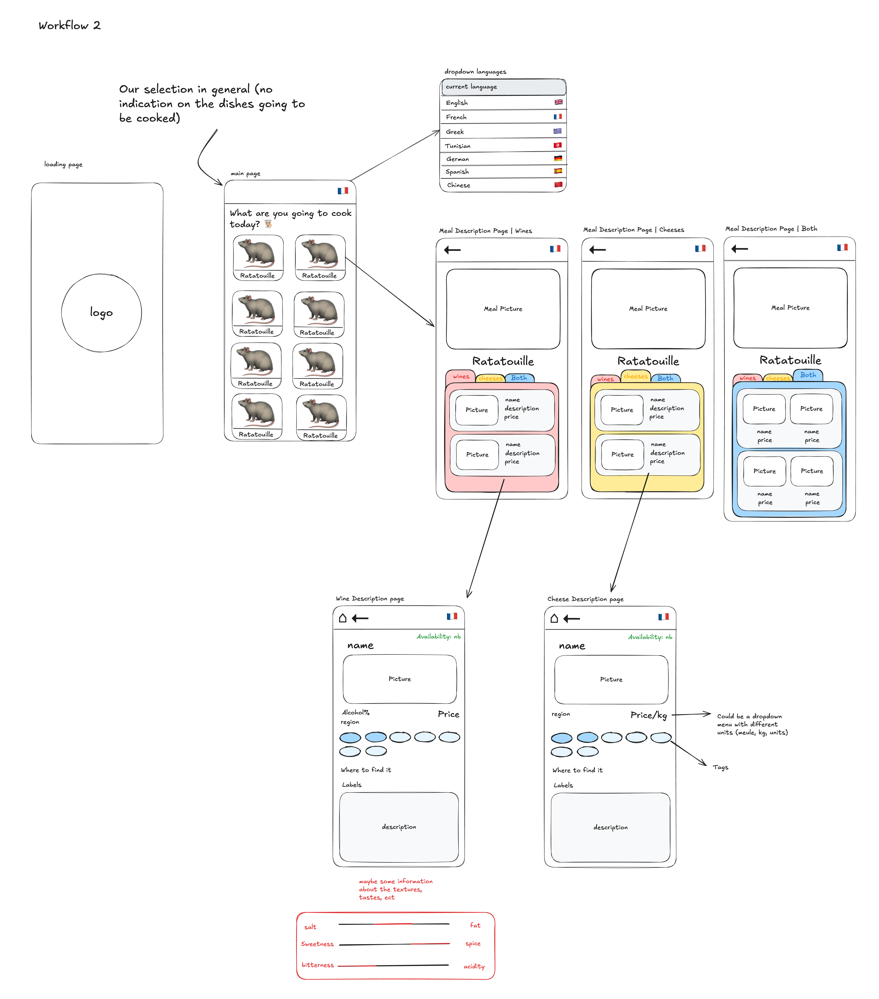

This idea was not retained due to the lack of possible dishes. The user may want something totally different from what is shown in the cards.

**Third Idea**:

This idea was solely based on a tag system. The user could select in the navigation bar (top bar) if he was searching for a wine or a cheese. Afterward, they could select tags to filter results until they find the expected wine/cheese.

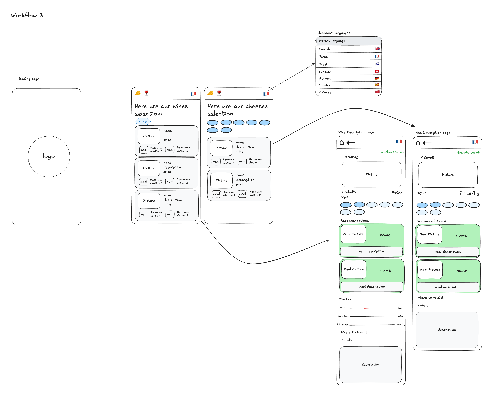

This idea was rejected for being too specific. Only amateurs of wine and cheese could easily navigate through the different tags to select the desired product.

---

None of those ideas was convenient enough to solve the client's requirement. However, they all have a part that was interesting to dig into. Therefore, a last design was created by merging the three ideas.

**Final Idea**:

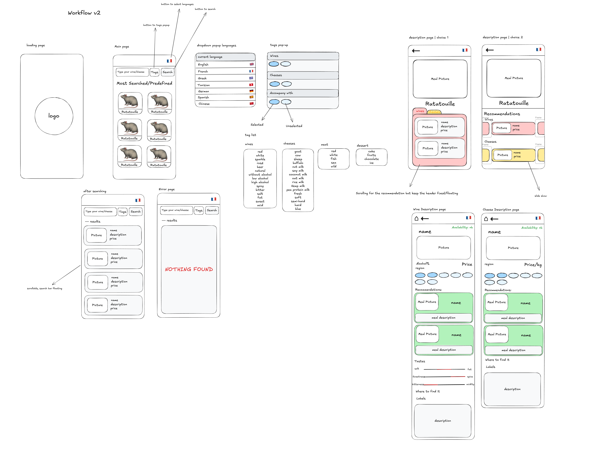

This idea combines the search bar from the first idea, the cards from the second one, and tags from the last one. However, some differences can be spotted.

Firstly, the search bar would be used for wines and cheeses, and not meals anymore. The user would enter the name of a product, and it would appear underneath.

Secondly, in the meal description page, the "both section" has been removed, judged as useless with the two others.

Finally, tags won't be visible on the main screen, since there could be a lot of them at the same time. They would be accessible through the "add tags" button and categorized by type and product (wines, cheeses, accompaniments).

---

### Mockups

---

The Mockups have been made on Figma and can be found in two places, either in the [pdf folder](./pdf/) or with this link: [Figma, Read only](https://www.figma.com/design/YYSa0BxXfyM5PNkdnCFYeZ/BiteMatch-wine-cheese-application?node-id=0-1&t=jhOQGM6NhjMpkwJ6-1).

BiteMatch's Mockups were made following previously mentioned wireframes and through a try & error process.

**First Version**:

This version was made following the last version of the wireframe. Colors used were Intermarché's one, referred to as choice 1 in [Color Palette](#color-palette).

This version had some changes, mainly on the sizes of different elements, judged as too big, and feeling like an application for elders, which was not the point.

**Second Version**:

This version was modified according to the first version's feedback.

For this version, the cards (wine, cheese, meals) have been reduced as well as the font size and pictures, giving a more recent feeling about the application. \
Also, the brown color has been slightly lightened up to have a more harmonious page. \
The "Home button" has been replaced by the [BiteMatch Logo](#logo). \
Finally, Intermarché's logo has been implemented in the middle of the top bar.

**Arabic Version**:

This application will be translated into many languages to be used by the many people possible. You can find which languages will the application be translated too at the following part, [Languages](#languages).

However, some languages aren't written the same way as Europeans do (up-to-down or right-to-left), as is the case with Arabic. Therefore, another design with a different layout has been designed to avoid issues when creating the application on Bubble.

Here is a picture of the Arabic mockups:

---

### Color Palette

---

Many color charts have been defined for this project, but only three choices have been kept. They are the following:

| Colors           | Choice 1 | Choice 2 | Choice 3 |
| ---------------- | -------- | -------- | -------- |
| Primary          | #E00E1F  | #DD1717  | #590031  |
| Primary Contrast | #DECE9C  | #F4460B  | #FCFCEA  |
| Text             | #000000  | #940B0B  | #88A895  |
| Surface          | #F1F1F2  | #67140B  | #E5B355  |
| Background       | #FFFFFF  | #E5951A  | #442C42  |
| Destructive      | #B0200C  | #B0200C  | #B0200C  |
| Success          | #1E6C30  | #1E6C30  | #1E6C30  |
| Alert            | #DCA114  | #DCA114  | #DCA114  |

Since colors are quite easy and fast to change, the first choice was selected, as it was the same colors as Intermarché's.

---

### Logo

---

As none of the team members are graphic designers and a logo could be quite difficult to design, it was decided to use an AI ([DeepAI](https://deepai.org)) to generate our logo.

The first selection was generated with a prompt containing information about the project and chart colors. DeepAI returned these six:

|                             Logo 1                             |                             Logo 2                             |                              Logo 3                              |                             Logo 4                              |                             Logo 5                              |                             Logo 6                             |
| :------------------------------------------------------------: | :------------------------------------------------------------: | :--------------------------------------------------------------: | :-------------------------------------------------------------: | :-------------------------------------------------------------: | :------------------------------------------------------------: |
| 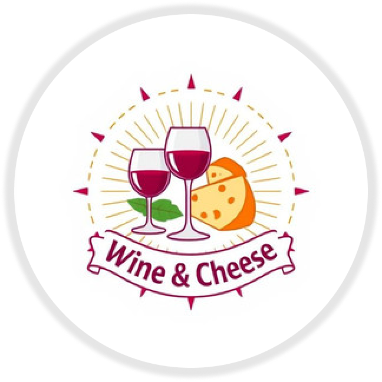 |  |  | 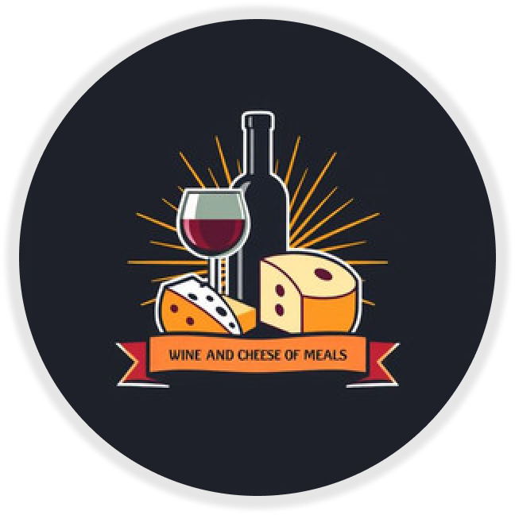 |  | 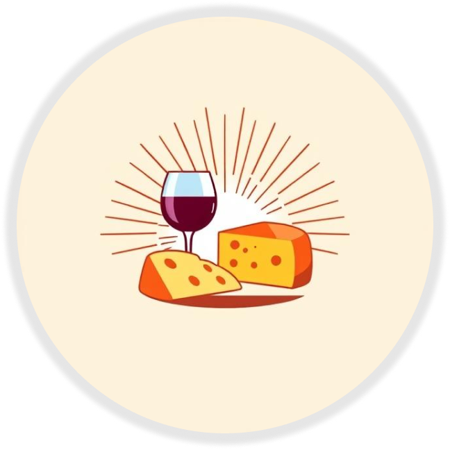 |

However, none of them has been considered a good option since they weren't personified enough. Therefore, the team chose a name for the application, and a new prompt was generated with BiteMatch:

|                                           Logo 1                                           |                                           Logo 2                                           |                                            Logo 3                                            |
| :----------------------------------------------------------------------------------------: | :----------------------------------------------------------------------------------------: | :------------------------------------------------------------------------------------------: |
| 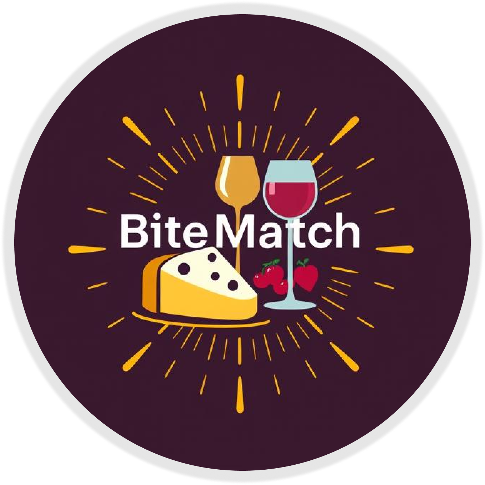 | 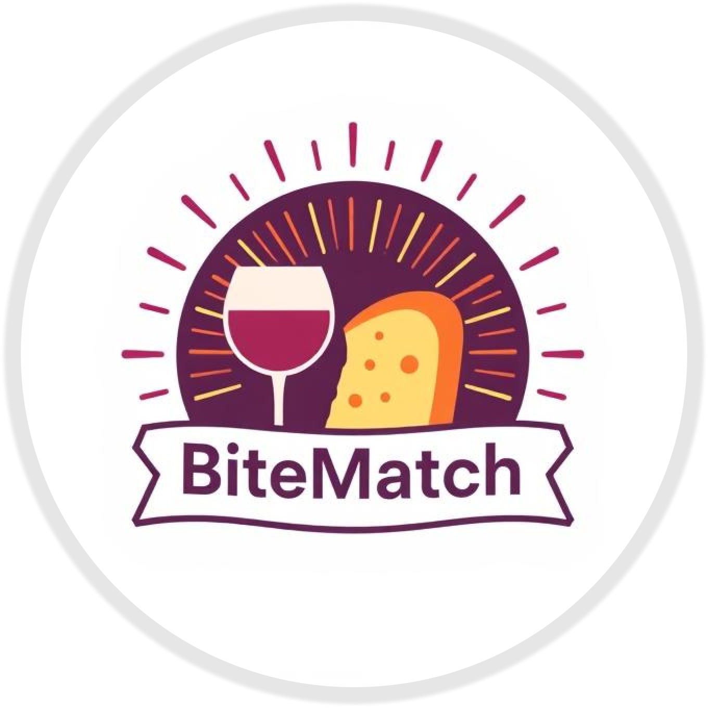 | 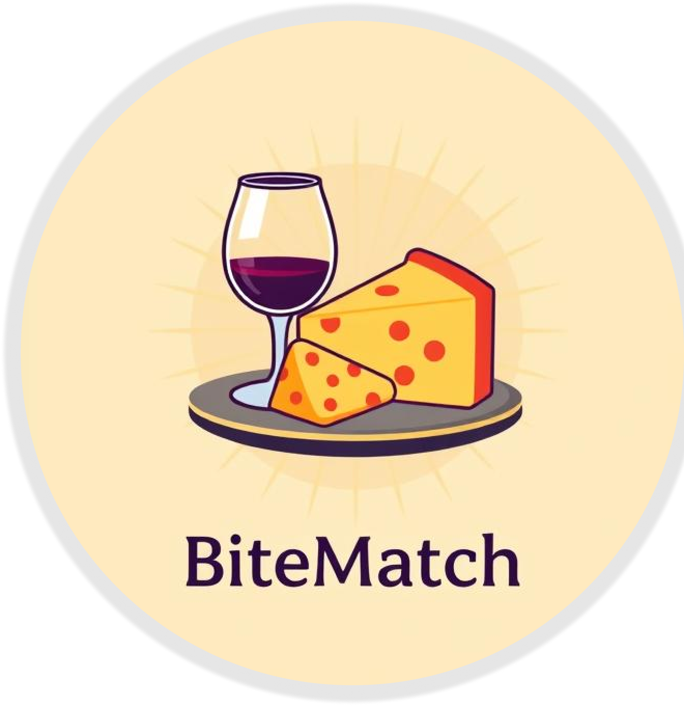 |

This second prompt exceeded our expectations, giving us three good logos. After mindful reflections, the logo chosen was the second one, judged as more adequate with the application colors.

Moreover, the application would also use Intermarché's logo on the main page, as it is a project in collaboration with them. \
This logo would be only displayed on the main page for design purposes. The logo used is the following:

---

### Font

---

This application would be written with the `Inter` font because it is widely used in applications and websites.

---

## Functional Requirements

### Languages

---

Since this application is meant to be used by tourists, it will be translated into many languages.

The two main languages of the application would be French and English, as we are in France, and English is the most spoken language abroad.

However, we decided not to stop to these two languages and to translate the application to other languages, which are:

| Language | Flag | Reason                                                                                                                                    |
| -------- | ---- | ----------------------------------------------------------------------------------------------------------------------------------------- |
| Greek    | 🇬🇷   | A team member comes from Greece.                                                                                                          |
| Arabic   | 🇦🇪   | Arabic is a widespread language, it also allows the application to change, since Arabic is written from right to left.                    |
| German   | 🇩🇪   | Germans are the second greatest tourists in France.                                                                                        |
| Spanish  | 🇪🇸   | Spanish is one of the most used languages in France. Moreover, Spain is near France, allowing Spanish people to do tourism quite easily. |
| Chinese  | 🇨🇳   | This is the most spoken language in the world.                                                                                            |

You can find the Mockup in Arabic above, in the [Mockups](#mockups) section.

---

### Data

---

#### Products

---

**Cheeses database**:

| Image                                                                                               | Product Name                                                             | ITM8          | EAN           | Tags                                                         | Description                                                                                        | Link                                                                                                               | Price |
| --------------------------------------------------------------------------------------------------- | ------------------------------------------------------------------------ | ------------- | ------------- | ------------------------------------------------------------ | -------------------------------------------------------------------------------------------------- | ------------------------------------------------------------------------------------------------------------------ | ----- |
|          | CHEVRE NATURE OU AROMATISE                                               | 0000099006106 | 0205010000000 | goat, fresh, soft, white, spring, summer, milk               | A creamy and tangy goat cheese available in both natural and flavored varieties.                   | [Link](https://www.intermarche.com/produit/yaourt-au-lait-de-chevre-nature/3250391945993)                          | 3,6   |
|  | YAOURT AUX FRUITS MERE RICHARD                                           | 0000099064583 | 0000000000198 | cow, fresh, soft, fruit, dessert, milk                       | A rich and smooth fruit-flavored yogurt made by Mère Richard.                                      | [Link](https://www.intermarche.com/produit/yaourt-onctueux-aux-fruits-mixes-fruits-rouges/3250392046705)           | 2,1   |
|            | P&C ROCAMADOUR AOP<a id="6-bis" href="#6">[6]</a> NU 35G      | 0000043439167 | 2663702000000 | goat, soft, white, aop, spring, summer, milk                 | A soft and delicate goat cheese from Rocamadour, with a creamy texture and mild flavor.            | [Link](https://www.intermarche.com/produit/rocamadour-aop/2663702000000)                                           | 1,2   |
|                              | TOME DE PROVENCE                                                         | 0000099060048 | 0204410000000 | goat, semi-hard, local, spring, summer, milk                 | A semi-soft cheese from Provence with a smooth texture and earthy, herbal flavor.                  | [Link](https://www.intermarche.com/produit/tomme-des-pyrenees-igp/3250391594146)                                   | 5,0   |
| 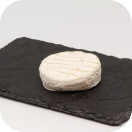                                               | PELARDON                                                                 | 0000099041865 | 0204510000000 | goat, soft, aop, spring, summer, milk                        | A small, soft goat cheese from the South of France with a creamy interior and tangy taste.         | Not found                                                                                                          | 3,8   |
|            | ST MARCELLIN MERE RICHARD                                                | 0000099041874 | 0204600000000 | cow, soft, aop, spring, summer, milk                         | A creamy, delicate cow's milk cheese with a mild and smooth flavor, made by Mère Richard.          | [Link](https://www.intermarche.com/produit/saint-marcellin/3250390153344)                                          | 4,0   |
|              | ST FELICIEN MERE RICHARD                                                 | 0000099041873 | 0204590000000 | cow, soft, aop, spring, summer, milk                         | A soft, creamy cow's milk cheese with a rich texture and mild flavor, made by Mère Richard.        | [Link](https://www.intermarche.com/produit/saint-felicien/3250390213994)                                           | 6,0   |
|                            | SECHONS DE CHEVRE                                                        | 0000099041867 | 0204530000000 | goat, hard, spring, summer, milk                             | A dried, firm goat cheese with a concentrated, tangy flavor.                                       | Not found                                                                                                          | 2,7   |
|    | FE ST FELICIEN ST MARCEL 260G                                            | 0000019315996 | 3237054005744 | cow, soft, aop, spring, summer, milk                         | A large, creamy cow's milk cheese with a rich, soft interior and mild taste.                       | [Link](https://www.intermarche.com/produit/duo-saint-marcellin-igp-saint-felicien/3237054005744)                   | 6,6   |
|      | CROTTIN DE CHAVIGNOL AOP 60G                                             | 0000043439418 | 2663716000000 | goat, soft, aop, spring, summer, milk                        | A famous French goat cheese from Chavignol, known for its tangy flavor and crumbly texture.        | [Link](https://www.intermarche.com/produit/crottin-de-chavignol-aop/3250390155478)                                 | 2,9   |
|  | ETOILE QUERCY PAVE DU LOT 180G                                           | 0000019026731 | 2663713000000 | goat, semi-hard, spring, summer, milk                        | A rich, soft cow’s milk cheese from the Lot region, with a creamy texture and mild flavor.         | [Link](https://www.intermarche.com/produit/fromage-de-chevre-rocamadour/3346200101039)                             | 4,9   |
|                                          | LE VENTOUX                                                               | 0000099060040 | 0204830000000 | goat, semi-hard, local, spring, summer, milk                 | A semi-soft goat cheese with a smooth texture and earthy flavor, named after the iconic mountain.  | [Link](https://www.intermarche.com/produit/ventoux-vin-rouge/3250391461554)                                        | 3,9   |
|                                    | BANON FEUILLE                                                            | 0000099041863 | 2670978000000 | goat, soft, aop, local, spring, summer, milk                 | A traditional French goat cheese wrapped in chestnut leaves, offering a creamy and tangy flavor.   | [Link](https://www.intermarche.com/produit/banon-aop-cave-25%25-mg/2670978000000)                                  | 6,3   |
|          | ST FELICIEN TENTATION 200G                                               | 0000019026713 | 2663532000000 | cow, soft, aop, spring, summer, milk                         | A luscious, creamy cow's milk cheese with a mild and rich flavor.                                  | [Link](https://www.intermarche.com/produit/fromage-saint-felicien/3237055000724)                                   | 4,7   |
| 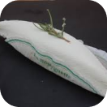                                           | BOUYGUETTE                                                               | 0000099041859 | 0204450000000 | goat, soft, spring, summer, milk                             | A soft, creamy goat cheese with a fresh, tangy taste and a smooth texture.                         | Not found                                                                                                          | 6,7   |
|          | FE ST FELICIEN AFFINE 150G                                               | 0000019676898 | 3523230034289 | cow, soft, aop, spring, summer, milk                         | A matured version of St Félicien, with a stronger, richer flavor and creamy texture.               | [Link](https://www.intermarche.com/produit/saint-felicien/3523230034289)                                           | 3,8   |
|              | PICODON AOP MERE RICHARD                                                 | 0000099059676 | 0204660000000 | goat, soft, aop, spring, summer, milk                        | A flavorful goat cheese with a tangy, slightly spicy taste, made by Mère Richard.                  | Not found                                                                                                          | 3,6   |
|  | FE P&C ST MARCELLIN IGP<a id="7-bis" href="#7">[7]</a> 2X80GR | 0000043434119 | 3250391104116 | cow, soft, igp, spring, summer, milk                         | A mild, creamy cow’s milk cheese with a soft, rich texture, made by P&C.                           | [Link](https://www.intermarche.com/produit/st-marcellin-igp/3250391104116)                                         | 3,7   |
|                    | MOZZARELLA DI BUFFALA                                                    | 0000099006090 | 0204880000000 | buffalo, fresh, soft, white, summer, milk                    | A creamy, soft cheese made from buffalo milk, known for its rich and delicate flavor.              | [Link](https://www.intermarche.com/produit/mozzarella-di-bufala/3760056265316)                                     | 4,0   |
|                                            | XV DU PIC                                                                | 0000099031468 | 0206360000000 | goat, semi-hard, spring, summer, milk                        | A semi-soft goat cheese with a smooth texture and mild, nutty flavor.                              | Not found                                                                                                          | 4,8   |
|                      | FE CHEVRE FRAIS 115G                                                     | 0000019278690 | 3358150002120 | goat, fresh, soft, spring, summer, milk                      | A fresh and tangy goat cheese with a smooth, creamy texture.                                       | [Link](https://www.intermarche.com/produit/fromage-de-chevre-frais-12%25-mg/3358150002120)                         | 2,4   |
|        | DEMI BRILLAT SAVARIN AFFINE                                              | 0000099041870 | 0204560000000 | cow, soft, aop, spring, summer, milk                         | A creamy, soft cheese with a buttery texture and a subtle, refined flavor.                         | [Link](https://www.intermarche.com/produit/brillat-savarin-moule-a-la-louche-affine-40%25-mg/3296651111937)        | 8,9   |
|                  | ST MARCELLIN CERAMIQUE                                                   | 3266360612018 | 3266360612018 | cow, soft, aop, spring, summer, milk                         | A classic, creamy cow's milk cheese encased in ceramic, offering a mild and smooth flavor.         | Not found                                                                                                          | 3,5   |
|                | RIGOTTE DE CONDRIEU AOP                                                  | 0000099041876 | 0204620000000 | goat, soft, aop, spring, summer, milk                        | A creamy goat cheese from the Condrieu region, known for its delicate texture and mild flavor.     | Not found                                                                                                          | 2,5   |
|                                      | QUATRE VENTS                                                             | 0000099021317 | 0204650000000 | goat, semi-hard, spring, summer, milk                        | A semi-soft cheese with a smooth, buttery texture and a mildly tangy flavor.                       | [Link](https://www.intermarche.com/produit/languedoc-la-clape-aop-vin-blanc-sec-cuvee-des-4-vents/3760176170156)   | 3,9   |
|                | FE ROCAMADOUR AOP 2X35G                                                  | 0000019026725 | 3428380002549 | goat, soft, aop, spring, summer, milk                        | A small, creamy goat cheese with a delicate, tangy flavor from Rocamadour.                         | [Link](https://www.intermarche.com/produit/rocamadour-aop/3428380002549)                                           | 2,8   |
|                | CHEVRE FRAIS AUX FLEURS                                                  | 0000099041850 | 0204370000000 | goat, fresh, soft, spring, summer, milk                      | A fresh goat cheese flavored with flowers, offering a mild and aromatic taste.                     | [Link](https://www.intermarche.com/produit/fromage-de-chevre-la-pyramide/3250390749332)                            | 7,0   |
|                          | LE CHEVROT NU 200G                                                       | 0000043439409 | 2663700000000 | goat, semi-hard, spring, summer, milk                        | A mild and creamy goat cheese with a soft texture, perfect for spreading.                          | Not found                                                                                                          | 6,3   |
|  | P&C STE MAURE TOURAINE AOP250G                                           | 0000043439400 | 2663715000000 | goat, semi-hard, aop, spring, summer, milk                   | A tangy, creamy goat cheese from the Touraine region with an aromatic flavor.                      | [Link](https://www.intermarche.com/produit/sainte-maure-de-touraine-aop-au-lait-cru/3250391420797)                 | 6,7   |
|                | FE VIVALDI BURRATA 200G                                                  | 0000999211445 | 8002461872419 | cow, fresh, soft, summer, milk                               | A rich, creamy Italian cheese with a smooth, soft center wrapped in mozzarella.                    | [Link](https://www.intermarche.com/produit/burrata-di-bufala/8002461872525)                                        | 7,2   |
|          | YAOURT NATURE MERE RICHARD                                               | 0000099043122 | 0000000000197 | cow, fresh, soft, dessert, milk                              | A smooth and rich natural yogurt made by Mère Richard, known for its creamy texture.               | [Link](https://www.intermarche.com/produit/yaourt-a-la-grecque-nature/3250392060015)                               | 1,7   |
|  | FE MOZZA DI BUFALA BONBON 200G                                           | 0000019076830 | 2663760000000 | buffalo, fresh, soft, summer, milk                           | Small, bite-sized mozzarella balls made from buffalo milk with a soft and creamy texture.          | [Link](https://www.intermarche.com/produit/mozzarella-di-latte-di-bufala/8000430900231)                            | 4,5   |
|  | FE P&C 1/2REBLOCHON AOP LC250G                                           | 0000043434095 | 2873981000000 | cow, semi-hard, aop, spring, summer, milk                    | A semi-soft, creamy cow's milk cheese with a mild, nutty flavor from the Savoie region.            | [Link](https://www.intermarche.com/produit/reblochon-de-savoie-aop/3294580201019)                                  | 4,8   |
|                                | BUCHE DE CHEVRE                                                          | 0000099006105 | 0205000000000 | goat, semi-hard, spring, summer, milk                        | A log-shaped goat cheese with a creamy texture and tangy flavor.                                   | [Link](https://www.intermarche.com/produit/buche-de-chevre/3250392551407)                                          | 7,7   |
|            | FE BURRATA DE CHEVRE 120G                                                | 0000019969645 | 3417881210577 | goat, fresh, soft, summer, milk                              | A rich, creamy goat’s milk burrata cheese with a smooth, indulgent texture.                        | [Link](https://www.intermarche.com/produit/burrata-cœur-ricotta/3760056266078)                                     | 3,7   |
|                                  | BRIQUE CENDREE                                                           | 0000099041298 | 0204040000000 | goat, semi-hard, spring, summer, milk                        | A soft, creamy goat cheese covered with a light dusting of ash, adding a subtle smoky flavor.      | Not found                                                                                                          | 6,3   |
|      | FROMAGE DE CHEVRE FERMIER X2                                             | 0000099090403 | 0000000000176 | goat, semi-hard, spring, summer, milk                        | Two artisanal, farm-made goat cheeses with a fresh and tangy flavor.                               | [Link](https://www.intermarche.com/produit/crottin-de-chavignol-fermier/3542430036114)                             | 7,1   |
|    | 1/2M ABONDANCE LC AOP 4K5/5KG                                            | 0000043439380 | 2663664000000 | cow, hard, aop, spring, summer, milk                         | A firm, cow's milk cheese with a nutty and fruity flavor, aged for a few months.                   | [Link](https://www.intermarche.com/produit/abondance-au-lait-cru-aop/3250391408818)                                | 6,6   |
|              | P&C SELLES/CHER AOP 150G                                                 | 0000043439405 | 2663704000000 | goat, semi-hard, aop, spring, summer, milk                   | A tangy, creamy goat cheese from Selles-sur-Cher, coated with ash.                                 | [Link](https://www.intermarche.com/produit/fromage-de-chevre-selles-sur-cher-aop/3250391046331)                    | 4,6   |
|                             | TOMME AUX FLEURS                                                         | 0000099006095 | 0204930000000 | cow, semi-hard, spring, summer, milk                         | A semi-soft cheese flavored with edible flowers, offering a mild and floral taste.                 | Not found                                                                                                          | 34,0  |
|        | MOZZARELLA DI BUFALA TRESSE                                              | 0000099006154 | 3770007325617 | buffalo, fresh, soft, summer, milk                           | A braided version of mozzarella made from buffalo milk, with a rich and creamy texture.            | [Link](https://www.intermarche.com/produit/mozzarella-di-bufala-campana-aop/3250391053322)                         | 6,5   |
|        | COMTE EXTRA AOP 18M 1/8 5KG                                              | 0000019665927 | 2843295000000 | cow, hard, aop, spring, summer, milk                         | A firm, aged cow's milk cheese with a rich, nutty flavor, aged for 18 months.                      | [Link](https://www.intermarche.com/produit/comte-aop-fort-des-rousses-18m/3542860952244)                           | 30,2  |
|                  | P&C CHABICHOU AOP 150G                                                   | 0000043439396 | 2663703000000 | goat, semi-hard, aop, spring, summer, milk                   | A soft, creamy goat cheese with a tangy and slightly salty taste from the Poitou region.           | [Link](https://www.intermarche.com/produit/chabichou-du-poitou-aop/2663703000000)                                  | 4,4   |
|          | FE PLATEAU 3 FROMAGES 190G                                               | 0000019453295 | 3492847279003 | cow, goat, sheep, variety, spring, summer, milk              | A selection of three cheeses, offering a variety of textures and flavors.                          | [Link](https://www.intermarche.com/produit/3-fromages-rapes/3250391901746)                                         | 4,2   |
|  | CABECOU PERIGORD CAISSE 12X35G                                           | 0009919362340 | 2891829000000 | goat, soft, spring, summer, milk                             | A small, creamy goat cheese from the Périgord region, offering a mild, tangy flavor.               | [Link](https://www.intermarche.com/produit/cabecou-du-perigord-fromage-de-chevre-au-lait-pasteurise/3305510066629) | 4,5   |
|          | APERITIF BQ LAIT CRU VACHE                                               | 0000099026567 | 3760081251155 | cow, fresh, soft, spring, summer, milk                       | A French raw milk cow cheese, perfect for snacking or pairing with wine.                           | Not found                                                                                                          | 7,7   |
|                              | COUPE FROMAGE LS                                                         | 0000000000016 | 0000000000016 | cow, fresh, soft, spring, summer, milk                       | A selection of cheeses, ideal for serving at a cheese tasting or as a snack.                       | [Link](https://www.intermarche.com/produit/comte-fromage-a-pate-presse-cuite-affine-9-mois-minimum/2663571000000)  | 5,1   |
|              | GORGONZOLA A LA CUILLERE                                                 | 0000099006089 | 0204870000000 | cow, blue, soft, aop, spring, summer, milk                   | A creamy, spoonable blue cheese with a strong, tangy flavor.                                       | [Link](https://www.intermarche.com/produit/gorgonzola-aop-'a-la-louche'/2843303000000)                             | 30,0  |
| 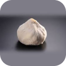                                                     | FIGOU                                                                    | 0000099041453 | 0204160000000 | goat, soft, fruit, dessert, spring, summer, milk             | A small, tangy, goat's milk cheese with a firm texture and floral notes.                           | Not found                                                                                                          | 7,0   |
|            | SAINT DOMNIN A LA LAVANDE                                                | 0000099041858 | 0204440000000 | goat, soft, spring, summer, milk                             | A goat cheese infused with lavender, offering a unique floral, aromatic flavor.                    | Not found                                                                                                          | 8,5   |
|                                    | BRIE DE MEAUX                                                            | 0000099041848 | 0204350000000 | cow, soft, aop, spring, summer, milk                         | A classic, soft cow's milk cheese with a creamy texture and rich, buttery flavor.                  | [Link](https://www.intermarche.com/produit/brie-de-meaux-aop/2663500000000)                                        | 23,1  |
|  | FE PARMI REGG AOP COPEAUX 100G                                           | 0000043434033 | 8001868003129 | cow, hard, aop, spring, summer, milk                         | Shaved Parmesan, a hard, nutty cow's milk cheese perfect for grating or sprinkling.                | [Link](https://www.intermarche.com/produit/parmigiano-reggiano-aop-en-copeaux/8002461871832)                       | 3,4   |
|                        | ENROBE AIRELLES 80G                                                      | 0000043439092 | 2663695000000 | goat, soft, fruit, dessert, spring, summer, milk             | A cheese coated with cranberries, offering a tangy-sweet flavor contrast to the creamy interior.   | [Link](https://www.intermarche.com/produit/l'enrobe-airelles-frais-emballe/3417881212274)                          | 3,2   |
|    | PARMIGIANO REGG AOP 24M 4.5KG                                            | 0000019950665 | 2831292000000 | cow, hard, aop, spring, summer, milk                         | An aged Parmesan with a granular texture and a deep, savory flavor.                                | [Link](https://www.intermarche.com/produit/parmigiano-reggiano-aop/3250391989959)                                  | 29,5  |
|                        | MOTHAIS SUR FEUILLE                                                      | 0000099041844 | 0204310000000 | goat, soft, spring, summer, milk                             | A soft goat cheese wrapped in leaves, with a smooth and tangy flavor.                              | Not found                                                                                                          | 8,2   |
|            | MORBIER AOP 100J 1/2M 3K5                                                | 0000019849086 | 2843995000000 | cow, semi-hard, aop, spring, summer, milk                    | A semi-soft, cow’s milk cheese with a unique layer of ash running through its center.              | [Link](https://www.intermarche.com/produit/morbier-aop/2663662000000)                                              | 21,0  |
|      | LOU PERAC PERAIL BREBIS 150G                                             | 0000043439450 | 2663709000000 | sheep, soft, spring, summer, milk                            | A creamy sheep's milk cheese from the South of France, with a rich and tangy flavor.               | [Link](https://www.intermarche.com/produit/la-brique-pur-brebis/3023260031017)                                     | 4,8   |
|       | MASCARPONE GORGONZOLA 1.2KG                                              | 0000024389388 | 2824730000000 | cow, soft, blue, dessert, spring, summer, milk               | A rich, creamy mascarpone cheese blended with the bold flavor of Gorgonzola.                       | [Link](https://www.intermarche.com/produit/torta-gorgonzola-mascarpone/2663725000000)                              | 19,2  |
| 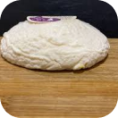                                             | GALLETOUT                                                                | 0000099041511 | 0204170000000 | goat, semi-hard, spring, summer, milk                        | A creamy, tangy cheese with a smooth texture, perfect for pairing with fresh bread.                | Not found                                                                                                          | 5,8   |
| 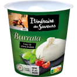                                                 | BURRATA                                                                  | 0000099008081 | 0205070000000 | cow, fresh, soft, summer, milk                               | A fresh, creamy cheese made from mozzarella and cream, with a delicate, rich texture.              | [Link](https://www.intermarche.com/produit/burrata/3250392341695)                                                  | 7,2   |
|    | FE CAMEMBERT PYRO ISIGNY 250G                                            | 0000019118070 | 3254550030193 | cow, soft, aop, spring, summer, milk                         | A soft, creamy cow’s milk cheese from Isigny, offering a mild and smooth flavor.                   | [Link](https://www.intermarche.com/produit/camembert-au-lait-cru/3254550039639)                                    | 4,4   |
|  | FE CAMEMBERT LAIT CRU AOP 250G                                           | 0000043439007 | 2663503000000 | cow, soft, aop, spring, summer, milk                         | A traditional, raw milk Camembert with a rich, creamy texture and a bold, earthy flavor.           | [Link](https://www.intermarche.com/produit/camembert-de-normandie-au-lait-cru-aop/3252950012016)                   | 5,2   |
| 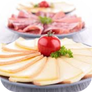                                               | RACLETTE                                                                 | 0000099009832 | 0205160000000 | cow, semi-hard, winter, milk                                 | A semi-firm, cow’s milk cheese that melts beautifully, often enjoyed in fondue or with potatoes.   | Not found                                                                                                          | 25,5  |
|   | GRAND MORIN A LA TRUFFE D'ETE                                            | 0000099041288 | 0204030000000 | cow, soft, spring, summer, milk                              | A creamy cheese infused with the luxurious flavor of summer truffles.                              | Not found                                                                                                          | 40,1  |
|                        | ST NECTAIRE FERMIER                                                      | 0000099041837 | 0204240000000 | cow, semi-hard, aop, spring, summer, milk                    | A creamy, cow’s milk cheese from the Auvergne region with a rich, smooth texture and tangy flavor. | [Link](https://www.intermarche.com/produit/saint-nectaire-fermier-aop-29%25-mg/2829856000000)                      | 29,7  |
|          | EMMENTAL LT CRU 1/8M 27% 10KG                                            | 0009919782641 | 2839008000000 | cow, hard, spring, summer, milk                              | A mild Swiss cheese with a slightly nutty flavor and firm texture.                                 | [Link](https://www.intermarche.com/produit/emmental-francais-est-central-grand-cru-label-cru/0212224000000)        | 13,0  |
|                  | GRUYERE FRANCE IGP 5K5                                                   | 0009919667068 | 2843122000000 | cow, hard, igp, spring, summer, milk                         | A firm, cow’s milk cheese with a nutty, sweet flavor, produced in the Gruyère region.              | [Link](https://www.intermarche.com/produit/gruyere-rape-igp-france/3250390547372)                                  | 19,8  |
|                     | L'ENROBE ABRICOT 80G                                                     | 0000024447157 | 2849441000000 | goat, soft, fruit, dessert, spring, summer, milk             | A creamy cheese coated with apricots, offering a sweet and tangy contrast to the mild flavor.      | Not found                                                                                                          | 3,2   |
|              | FE FETA GRECQUE AOP 180G                                                 | 0000019443461 | 5202425001128 | sheep, hard, aop, spring, summer, milk                       | A crumbly, brined sheep’s milk cheese with a tangy and savory flavor, made in Greece.              | [Link](https://www.intermarche.com/produit/feta-grecque-aop/3250391226078)                                         | 4,1   |
|                                        | LE SAUVAGET                                                              | 0000099006094 | 0204920000000 | goat, semi-hard, spring, summer, milk                        | A soft, creamy cow’s milk cheese with a mild, fresh taste.                                         | Not found                                                                                                          | 7,2   |
|                 | VAGNE COMTE 9/12MOIS 1/8M 5KG                                            | 0000043439327 | 2663571000000 | cow, hard, aop, spring, summer, milk                         | A firm, aged Comté cheese with a nutty, savory flavor, aged for 9 to 12 months.                    | [Link](https://www.intermarche.com/produit/comte-aop-9-mois-d'affinage/2257156000000)                              | 24,9  |
|                                    | COMTE 12 MOIS                                                            | 0000099041350 | 0204080000000 | cow, hard, aop, spring, summer, milk                         | A classic, aged cow's milk cheese with a nutty, rich flavor, matured for 12 months.                | [Link](https://www.intermarche.com/produit/comte-le-montarlier-aop-affine-12-mois/3228021200156)                   | 28,8  |
|        | BEAUFORT PTPERCE AOP 1/12M 3K5                                           | 0009943439268 | 2890729000000 | cow, hard, aop, spring, summer, milk                         | A firm, cow's milk cheese with a fruity and nutty flavor, aged for 12 months.                      | [Link](https://www.intermarche.com/produit/abondance-au-lait-cru-aop/3250391408818)                                | 33,3  |
|                            | COURONNE LOCHOISE                                                        | 0000099041420 | 0204130000000 | goat, semi-hard, spring, summer, milk                        | A soft, creamy cheese with a smooth texture, often presented in a round shape.                     | Not found                                                                                                          | 6,8   |
|  | P&C ST NECTAIRE LAITIE AOP 1K7                                           | 0009943439221 | 2890801000000 | cow, semi-hard, aop, spring, summer, milk                    | A creamy cow’s milk cheese with a rich texture and tangy flavor, produced in the Auvergne region.  | [Link](https://www.intermarche.com/produit/saint-nectaire-laitier-aop/3250392493936)                               | 16,3  |
|        | FE BRILLAT SAVARIN IGP 200G                                              | 0000019248513 | 3296651111937 | cow, soft, igp, spring, summer, milk                         | A creamy, soft cheese with a rich texture and mild, buttery flavor.                                | [Link](https://www.intermarche.com/produit/brillat-savarin-moule-a-la-louche-affine-40%25-mg/3296651111937)        | 5,8   |
|                      | FE HALLOUMI AOP 225G                                                     | 0000024454373 | 3760280680817 | sheep, hard, aop, spring, summer, milk                       | A firm, salty cheese with a slightly rubbery texture, perfect for grilling.                        | [Link](https://www.intermarche.com/produit/halloumi-aop/3760280680817)                                             | 4,9   |
|                               | PICODON AOP 60G                                                          | 0009919915032 | 2844180000000 | goat, soft, aop, spring, summer, milk                        | A small, tangy goat cheese from the Rhône Valley, known for its rich flavor.                       | Not found                                                                                                          | 7,6   |
|                      | FE EPOISSES AOP 250G                                                     | 0000043439171 | 2663495000000 | cow, soft, aop, spring, summer, milk                         | A creamy, pungent cow’s milk cheese from Burgundy with a strong, distinctive flavor.               | [Link](https://www.intermarche.com/produit/epoisses-aop/3250392142032)                                             | 8,2   |
|                  | P&C MORBIER AOP LC 6K5                                                   | 0000043439334 | 2663661000000 | cow, semi-hard, aop, spring, summer, milk                    | A cow’s milk cheese with a soft, creamy texture and a characteristic layer of ash in the center.   | [Link](https://www.intermarche.com/produit/morbier-au-lait-cru-aop/3250391160785)                                  | 17,2  |
|  | GP CANTAL JEUNE LAIT CRU AOP5K                                           | 0009919362372 | 2891827000000 | cow, hard, aop, spring, summer, milk                         | A firm, raw milk cow's cheese with a slightly tangy and nutty flavor.                              | [Link](https://www.intermarche.com/produit/cantal-jeune-au-lait-cru-aop/2663688000000)                             | 18,0  |
|      | TOMME CAZELLES BREBIS 4.4ENV                                             | 0000019749800 | 2843639000000 | sheep, semi-hard, spring                                     | A firm sheep’s milk cheese with a nutty and earthy flavor, from the South of France.               | [Link](https://www.intermarche.com/produit/tomme-du-pays-basque/3023260030515)                                     | 21,0  |
|      | TOMME DE MONTAGNE CHARTREUSE                                             | 0000099006097 | 0204950000000 | cow, semi-hard, local, spring, summer, milk                  | A semi-soft cheese with a creamy interior and slightly earthy, grassy taste.                       | [Link](https://www.intermarche.com/produit/tomme-fruitee/3176580111546)                                            | 23,1  |
|                                | OLIVES DE NYONS                                                          | 0000099041877 | 0204630000000 | fruit, accompaniment, appetizer, label (AOP), spring, summer | Olives from the Nyons region, often used as a snack or paired with cheese.                         | [Link](https://www.intermarche.com/produit/olives-de-nyons-noires/3250392400927)                                   | 20,3  |
|              | PETIT POT CREME CHOCOLAT                                                 | 0000099011577 | 3483130046402 | cow, dessert, soft, spring, summer, milk                     | A smooth and rich chocolate-flavored cream dessert, often served in small pots.                    | [Link](https://www.intermarche.com/produit/petit-pot-de-creme-au-chocolat/3250390803409)                           | 1,9   |
|      | P'TIT BASQUE PUR BREBIS 660G                                             | 0000043439455 | 2663545000000 | sheep, semi-hard, spring, summer, milk                       | A firm, sheep’s milk cheese with a smooth texture and nutty, savory flavor.                        | [Link](https://www.intermarche.com/produit/fromage-p'tit-basque-pur-brebis/2663545000000)                          | 26,6  |
|                    | REBLOCHON FERMIER AOP                                                    | 0000099041875 | 0204610000000 | cow, soft, aop, spring, summer, milk                         | A soft, creamy cow’s milk cheese with a delicate, mild flavor from the Savoie region.              | [Link](https://www.intermarche.com/produit/saint-nectaire-fermier-aop-29%25-mg/2829856000000)                      | 33,0  |
|          | ITCHEBAI CHEVRE&BREBIS 4K5                                               | 0000024105511 | 2831762000000 | goat, sheep, hard, blend, spring, summer, milk               | A blend of goat and sheep’s milk cheeses with a rich, creamy texture and tangy flavor.             | Not found                                                                                                          | 25,9  |
|                          | PICHOLINES NATURES                                                       | 0000099060024 | 0204690000000 | fruit, accompaniment, appetizer, spring, summer              | A variety of green olives, often served as a snack or appetizer.                                   | [Link](https://www.intermarche.com/produit/olives-picholines-vertes/3250391686698)                                 | 16,7  |
|              | FE P&C CHAOURCE AOP 250G                                                 | 0000043434115 | 3250391105335 | cow, soft, aop, spring, summer, milk                         | A soft, creamy cow's milk cheese with a mild, tangy flavor from the Champagne region.              | [Link](https://www.intermarche.com/produit/chaource-aop/3250391105335)                                             | 4,6   |
|                      | PELISSONNE D'ARDECHE                                                     | 0000099041839 | 0204260000000 | goat, semi-hard, local, spring, summer, milk                 | A soft, creamy cheese with a fresh, tangy flavor, from the Ardèche region.                         | Not found                                                                                                          | 22,6  |
|                        | TOMME DE TARENTAISE                                                      | 0000099041838 | 0204250000000 | cow, semi-hard, local, spring, summer, milk                  | A firm, cow’s milk cheese with a nutty, slightly sweet flavor, from the Tarentaise Valley.         | [Link](https://www.intermarche.com/produit/tomme-noire-des-pyrenees-igp/3250391231621)                             | 18,8  |
|                                    | COMTE 24 MOIS                                                            | 0000099041352 | 0204100000000 | cow, hard, aop, aged, spring, summer, milk                   | A long-aged, firm cow's milk cheese with a nutty, complex flavor, matured for 24 months.           | [Link](https://www.intermarche.com/produit/comte-extra-vieux-24-mois-aop/2843291000000)                            | 38,7  |
|        | COMTE VAGNE AOP 18 MOIS 5KG                                              | 0000043439371 | 2663568000000 | cow, hard, aop, aged, spring, summer, milk                   | A firm, nutty cheese from the Jura region, aged for 18 months for a rich flavor.                   | [Link](https://www.intermarche.com/produit/comte-prestige-affinage-18-mois-minimum-aop-35%25-mg/2843637000000)     | 7,4   |
|            | BROCCIU FRAIS FERMIER AOP                                                | 0000099052839 | 3429881511936 | sheep, fresh, soft, aop, spring, summer, milk                | A fresh sheep’s milk cheese from Corsica with a creamy texture and delicate flavor.                | Not found                                                                                                          | 8,9   |
|                      | PETIT POT CREME CAFE                                                     | 0000099011579 | 3483130046419 | cow, dessert, soft, spring, summer, milk                     | A rich, smooth coffee-flavored cream dessert, often served in small pots.                          | [Link](https://www.intermarche.com/produit/petit-pot-de-creme-cafe/3483130046419)                                  | 1,9   |
|                    | ROITELET BRIE 3,150KG                                                    | 0000043439010 | 2663499000000 | cow, soft, brie, spring, summer, milk                        | A creamy, soft cheese with a delicate flavor, similar to Brie, in a large portion size.            | [Link](https://www.intermarche.com/produit/petit-brie/3250390344674)                                               | 14,7  |
|                                  | PAVE DU LARZAC                                                           | 0000099006092 | 0204900000000 | sheep, semi-hard, local, spring, summer, milk                | A smooth, creamy cow’s milk cheese with a tangy and slightly earthy flavor from the Larzac region. | [Link](https://www.intermarche.com/produit/pave-daffinois-l'original/3307907100084)                                | 5,7   |
|                | PETIT POT CREME CARAMEL                                                  | 0000099011576 | 3483130046426 | cow, dessert, soft, spring, summer, milk                     | A rich, smooth caramel-flavored cream dessert, often served in small pots.                         | Not found                                                                                                          | 1,9   |

---

The database above could be too heavy for Bubble standards. Therefore, a selection of the most sold cheeses would be displayed according to the data provided by Intermarché. \
The following products would be in the application database:

- Comté 18 mois
- Morbier
- Roquefort société
- Gorgonzola
- St néctaire fermier
- Tomme Tarentaise
- Tomme aux fleurs
- Manchego
- Ossau Iraty
- Tomme de chèvre
- Crottin de Chavignol (piece)
- Banon
- Chèvre de St Rémy (piece)
- Bouyguette (piece)
- Pérail des Bruissières
- St Marcellin (piece)
- Munster
- Brie de Meaux
- Grand morin à la truffe
- Camembert de Bufflonne (piece)

**Wines database**:

| Image                                                                                             | Product Name                                                     | ITM8          | EAN           | Tags                                                     | Taste (Sa/F - Sw/Sp - B/A) | Description                                                                                        | Links                                                                                                                        | Price |
| ------------------------------------------------------------------------------------------------- | ---------------------------------------------------------------- | ------------- | ------------- | -------------------------------------------------------- | -------------------------- | -------------------------------------------------------------------------------------------------- | ---------------------------------------------------------------------------------------------------------------------------- | ----- |
|        | IGP ALPILLES ROSE TRADITION                                      | 3760076070020 | 0000099056669 | rosé, <14%, acid, local, igp, summer, sulfites           | 3 - 4 - 6                  | A well-balanced wine from the IGP region, perfect for casual enjoyment or pairing with light fare. | Not found                                                                                                                    | 10,5  |
|              | GRAND MAS DE LANSAC BLAN                                         | 3760059140030 | 0000099016142 | white, <14%, acid, igp, summer, sulfites                 | 4 - 3 - 6                  | A classic white from the GRAND MAS estate, offering freshness and finesse.                         | [Link](https://www.intermarche.com/produit/monbazillac-vin-blanc/3250391044054)                                              | 5,1   |
|            | IGP VAR GRIS GRIS DE ROSE                                        | 3760146021815 | 0000099005260 | rosé, <14%, acid, igp, summer, sulfites                  | 3 - 4 - 5                  | A delicate rosé from the VAR region, showcasing soft berry aromas and crisp minerality.            | [Link](https://www.intermarche.com/produit/miss-gris-vin-rose-igp/3760146023659)                                             | 5,1   |
|                    | GRAND MAS LANSAC ROSE                                            | 3760059140023 | 0000099016143 | rosé, <14%, acid, igp, summer, sulfites                  | 3 - 4 - 6                  | A fruity rosé with floral notes from the esteemed MAS LANSAC estate.                               | [Link](https://www.intermarche.com/produit/bergerac-vin-rose/3250391326204)                                                  | 4,9   |
|  | AOP FOLIE EN PROVENCE 2023 COT                                   | 3760092070349 | 0000099064698 | rosé, <14%, acid, local, aop, summer, sulfites           | 3 - 4 - 6                  | A Provence AOP wine bursting with vibrant fruit flavors and youthful elegance.                     | [Link](https://www.intermarche.com/produit/coteaux-d'aix-en-provence-aop-vin-blanc-2023-bio/3701215700156)                   | 5,0   |
|                                  | LANSAC ROSE 5L                                                   | 3760059140078 | 0000099016147 | rosé, <14%, acid, igp, summer, sulfites                  | 3 - 4 - 6                  | A large-format rosé ideal for entertaining, with bright and refreshing character.                  | [Link](https://www.intermarche.com/produit/vin-de-pays-de-l'herault-vin-rose/3250390801283)                                  | 15,7  |
|  | LAGOY VIN ROSE IGP ALPILLES BI                                   | 3760063300321 | 0000099010236 | rosé, <14%, acid, local, igp, ab (bio), summer, sulfites | 3 - 5 - 5                  | A biodynamic rosé from the Alpilles region, crafted for purity and expression.                     | Not found                                                                                                                    | 9,1   |
|                      | LE GRIS MAS MARIGNAN                                             | 3538650074333 | 0000099066408 | rosé, <14%, acid, igp, summer, sulfites                  | 3 - 4 - 5                  | A pale rosé offering subtle citrus and floral notes, perfect as an aperitif.                       | Not found                                                                                                                    | 4,8   |
|                          | LUBERON LES CLAPES                                               | 3760028200048 | 0000099060230 | red, <14%, spicy, aop, autumn, sulfites                  | 3 - 4 - 6                  | A structured wine from Luberon, balancing earthy undertones with red fruit charm.                  | [Link](https://www.intermarche.com/produit/aop-luberon-rose/3760028200048)                                                   | 6,6   |
|  | ROSE CUVEE EVIDENCE MAS LANSAC                                   | 3760059140184 | 0000099012318 | rosé, <14%, acid, igp, summer, sulfites                  | 3 - 4 - 6                  | A carefully crafted cuvée with elegant structure and a smooth finish.                              | [Link](https://www.intermarche.com/produit/champagne-brut-rose-cuvee-prestige/3250390033677)                                 | 5,6   |
|      | IGP ROSE ETOILE DES ALPILLES                                     | 3760251190161 | 0000099035796 | rosé, <14%, acid, local, igp, summer, sulfites           | 3 - 4 - 6                  | A star among Alpilles rosés, crisp and luminous with red fruit undertones.                         | [Link](https://www.intermarche.com/produit/pays-d'oc-igp-vin-rose-bio/3186122002805)                                         | 6,5   |
|                  | TRADITION 2023 AOP BIO<a id="8-bis" href="#8">[8]</a> | 3760025420012 | 0000099016911 | red, <14%, spicy, local, aop, ab (bio), autumn, sulfites | 3 - 4 - 6                  | A certified organic vintage offering terroir-driven complexity and balance.                        | [Link](https://www.intermarche.com/recherche/TRADITION%202023%20AOP%20BIO)                                                   | 9,8   |
|                | GRAND MAS DE LANSAC RGE                                          | 3760059140108 | 0000099063709 | red, <14%, spicy, igp, autumn, sulfites                  | 4 - 4 - 6                  | A bold red with dark fruit and spice from the MAS DE LANSAC vineyard.                              | Not found                                                                                                                    | 4,9   |
|    | AOP BIO PASSE-ROSE 2024 750ML                                    | 3760025420029 | 0000099016912 | rosé, <14%, acid, local, aop, ab (bio), summer, sulfites | 3 - 4 - 6                  | A 2024 organic rosé showcasing delicate aromas and a clean, dry finish.                            | [Link](https://www.intermarche.com/produit/monbazillac-aop-vin-blanc-moelleux/3250392922016)                                 | 9,8   |
|    | ETOILE DES ALPILLES IGP BLANC                                    | 3760251190154 | 0000099037189 | white, <14%, acid, local, igp, summer, sulfites          | 3 - 4 - 6                  | A luminous white wine with floral highlights and lively acidity.                                   | Not found                                                                                                                    | 6,6   |
|      | ALPILLES IGP TRADITION BLANC                                     | 3760076070037 | 0000099056670 | white, <14%, acid, local, igp, summer, sulfites          | 3 - 4 - 6                  | A traditional white blend from Alpilles, known for its freshness and finesse.                      | Not found                                                                                                                    | 10,5  |
|    | IGP TERRE CAMARGUE RS BIO75CL                                    | 3545440120149 | 0000029500338 | rosé, <14%, acid, igp, ab (bio), summer, sulfites        | 3 - 4 - 6                  | A certified organic rosé from Camargue, ideal for warm evenings.                                   | [Link](https://www.intermarche.com/produit/igp-sable-de-camargue-bio-vin-rose/3244081705202)                                 | 5,3   |
|  | IGP ALPILLES BIO TRADITION 202                                   | 3760025420036 | 0000099016913 | rosé, <14%, acid, local, igp, ab (bio), summer, sulfites | 3 - 4 - 6                  | A biodynamic expression of Alpilles terroir with complexity and minerality.                        | [Link](https://www.intermarche.com/produit/pays-d'oc-igp-vin-rose-bio/3186122002805)                                         | 9,8   |
|      | ALPILLES IGP TRADITION ROUGE                                     | 3760076070013 | 0000099056662 | red, <14%, spicy, local, igp, autumn, sulfites           | 4 - 4 - 6                  | A traditional red from Alpilles, featuring bold tannins and rich fruit.                            | [Link](https://www.intermarche.com/produit/pays-d'oc-igp-merlot-vin-rouge/3250390801054)                                     | 10,5  |
|  | MAS GOURGONNIER ROUGE TRADITIO                                   | 3760104593026 | 0000099024947 | red, <14%, spicy, local, igp, autumn, sulfites           | 4 - 4 - 6                  | A full-bodied red with rustic notes and Mediterranean herbs.                                       | Not found                                                                                                                    | 9,8   |
|  | COTES DU VENTOUX DOMAINE DE GO                                   | 3760146021914 | 0000099032673 | red, <14%, spicy, aop, autumn, sulfites                  | 4 - 4 - 6                  | A Ventoux wine with mountain freshness and balanced character.                                     | [Link](https://www.intermarche.com/produit/ventoux-bio-vin-rouge/3760146021914)                                              | 7,5   |
|      | PROSECCO SPUMANTE DOC BOTTER                                     | 8008863011081 | 0000099030361 | sparkling, <14%, acid, aop, summer, sulfites             | 3 - 4 - 6                  | A lively and sparkling Prosecco with fine bubbles and fruity bouquet.                              | [Link](https://www.intermarche.com/produit/prosecco-doc-vin-brut/8006220001669)                                              | 7,9   |
|      | MAS DE LA DAME RESEVE DU RGE                                     | 3464725107517 | 0000099016137 | red, <14%, spicy, local, aop, autumn, sulfites           | 4 - 4 - 6                  | A prestigious red blend offering depth, structure, and age-worthy elegance.                        | Not found                                                                                                                    | 11,5  |
|  | IGP MEDITERRANNEE TERRES DE BO                                   | 3760171263181 | 0000099067489 | red, <14%, spicy, igp, autumn, sulfites                  | 3 - 4 - 6                  | A Mediterranean blend reflecting sun-drenched vineyards and ripe fruit.                            | Not found                                                                                                                    | 4,3   |
|          | MAS DAME LA GOURMANDE ROSE                                       | 3464722207517 | 0000099028421 | rosé, <14%, acid, local, igp, summer, sulfites           | 3 - 4 - 6                  | A gourmet rosé designed for food pairing and leisurely sipping.                                    | [Link](https://www.intermarche.com/produit/cotes-de-provence-notre-dame-des-anges-frissons-des-anges-vin-rose/3760057981208) | 9,5   |
|  | VENTOUX SECRET DE TRUFFE ROUGE                                   | 3700026507640 | 0000099040655 | red, <14%, spicy, aop, autumn, sulfites                  | 4 - 4 - 6                  | A truffle-accented red from Ventoux, luxurious and aromatic.                                       | [Link](https://www.intermarche.com/produit/ventoux-vin-rouge/3302938500032)                                                  | 6,5   |
|        | VCE BLANC VALRIAN 25 CL X 6                                      | 3250392151645 | 0000052335025 | white, <14%, acid, igp, summer, sulfites                 | 3 - 4 - 6                  | A convenient 25cl white wine pack with crisp and easy-drinking profile.                            | [Link](https://www.intermarche.com/produit/vin-de-l'union-europeenne-blanc-sec-special-cuisine/3250392151645)                | 3,9   |
|    | VIN ESPAGNE BLC VALRIAN3X25CL                                    | 3250390488828 | 0000052335010 | white, <14%, acid, igp, summer, sulfites                 | 3 - 4 - 6                  | A trio of Spanish whites in small format, bright and versatile.                                    | [Link](https://www.intermarche.com/produit/vin-blanc-sec-de-table-de-la-communaute-europeenne/3250390488828)                 | 2,8   |
|                    | CUVEE GOURMANDE ROUGE                                            | 3464721107511 | 0000099024028 | red, <14%, spicy, igp, autumn, sulfites                  | 4 - 4 - 6                  | A richly textured red cuvée with juicy fruit and a smooth finish.                                  | [Link](https://www.intermarche.com/produit/luberon-cuvee-estaillade-vin-rouge/3760171262405)                                 | 9,5   |
|    | R.MAZET IGPOC RGE MERLOT 75CL                                    | 3175520018655 | 0000052337510 | red, <14%, spicy, igp, autumn, sulfites                  | 4 - 4 - 6                  | A soft Merlot with ripe plum and chocolate undertones.                                             | [Link](https://www.intermarche.com/produit/vin-de-pays-d'oc-merlot-vin-rouge/3175520018655)                                  | 3,0   |
|                         | LUBERON LES CLAPES                                               | 3760028200161 | 0000099037518 | red, <14%, spicy, aop, autumn, sulfites                  | 3 - 4 - 6                  | A Luberon selection with earthy finesse and savory red fruit.                                      | [Link](https://www.intermarche.com/produit/aop-luberon-rouge-les-clapes/3760028200017)                                       | 6,5   |
|      | IGP CTE TARN BLC MOEL.EC75CL                                     | 3250390207634 | 0000052338035 | white, <14%, sweet, igp, summer, sulfites                | 3 - 5 - 5                  | A mellow white from Tarn with a hint of sweetness and tropical fruit.                              | Not found                                                                                                                    | 3,2   |
|  | IGP ALPILLES ROSE CUVEE EVIDEN                                   | 3760059140153 | 0000099038691 | rosé, <14%, acid, local, igp, summer, sulfites           | 3 - 4 - 6                  | A standout cuvée from Alpilles offering elegance and aromatic complexity.                          | Not found                                                                                                                    | 16,9  |
|      | VAL DE L OULE ROSE TENDRESSE                                     | 3435600000216 | 0000099037387 | rosé, <14%, sweet, igp, summer, sulfites                 | 3 - 5 - 5                  | A tender rosé with floral aromas and a hint of sweetness.                                          | Not found                                                                                                                    | 6,3   |
|  | MAS GOURGONNIER BLANC TRADITIO                                   | 3760104593224 | 0000099024945 | white, <14%, acid, local, igp, summer, sulfites          | 3 - 4 - 6                  | A traditional white with fresh orchard fruit and Provençal herbs.                                  | [Link](https://www.intermarche.com/produit/muscat-de-tradition-vin-blanc/3193460000011)                                      | 10,4  |
|                                | LANSAC ROUGE 5L                                                  | 3760059140061 | 0000099016145 | red, <14%, spicy, igp, autumn, sulfites                  | 4 - 4 - 6                  | A robust red in large format for generous pouring and sharing.                                     | [Link](https://www.intermarche.com/produit/merlot-vin-rouge-igp-pays-d'oc/3250391433049)                                     | 15,4  |
|                               | IGP VAR 100% ROLLE                                               | 3760146021754 | 0000099012664 | white, <14%, acid, igp, summer, sulfites                 | 3 - 4 - 6                  | A varietal white showcasing Rolle's citrus zest and floral lift.                                   | [Link](https://www.intermarche.com/produit/rolle-vin-blanc-igp/3760146021754)                                                | 6,2   |
|            | CDR SEGURET VILLAGES 2021                                        | 3341332013137 | 0000099040700 | red, <14%, spicy, aop, autumn, sulfites                  | 4 - 4 - 6                  | A 2021 village wine with old-vine concentration and Rhône valley charm.                            | [Link](https://www.intermarche.com/produit/cotes-du-rhone-villages-seguret-vin-rouge/3760146021525)                          | 6,7   |
|    | IGP TER.MIDI RS GRAINS LISTEL                                    | 3244081500005 | 0000029499905 | rosé, <14%, acid, igp, summer, sulfites                  | 3 - 4 - 6                  | A light rosé with a hint of sweetness and berry freshness.                                         | [Link](https://www.intermarche.com/produit/igp-terre-du-midi-listel-grain-de-gris-vin-rose/3244081500005)                    | 3,5   |
|                            | IGP VAR MISS GRIS                                                | 3760146023659 | 0000099032690 | rosé, <14%, acid, igp, summer, sulfites                  | 3 - 4 - 6                  | A stylish Gris from Var, pale and perfumed with summer fruits.                                     | Not found                                                                                                                    | 6,0   |
|  | AOC 2021 LES TROIS ORATOIRES C                                   | 3760012970506 | 0000099041482 | red, <14%, spicy, aop, autumn, sulfites                  | 4 - 4 - 6                  | A 2021 AOC wine with refined tannins and layered complexity.                                       | Not found                                                                                                                    | 5,0   |
|        | IGP T.CAMARGUE BLC BIO 75CL                                      | 3545440130148 | 0000029500339 | white, <14%, acid, igp, ab (bio), summer, sulfites       | 3 - 4 - 6                  | A biodynamic white from Camargue, pure and mineral-driven.                                         | Not found                                                                                                                    | 5,3   |
|  | TERRES ET LUMIeRES VENTOUX BLA                                   | 3760033100081 | 0000099003837 | white, <14%, acid, aop, summer, sulfites                 | 3 - 4 - 6                  | A Ventoux white capturing sunlight and stony freshness.                                            | Not fonud                                                                                                                    | 6,5   |
|  | IGP ROUGE FRISSON VAL DE L'OUL                                   | 3435600000230 | 0000099036806 | red, <14%, spicy, igp, autumn, sulfites                  | 4 - 4 - 6                  | A vibrant red with juicy red fruit and lively acidity.                                             | Not found                                                                                                                    | 7,4   |
|  | VENTOUX ROSE 1911 LEGENDE 75CL                                   | 3760106128462 | 0000099089046 | rosé, <14%, acid, aop, summer, sulfites                  | 3 - 4 - 6                  | A heritage rosé with classic styling and elegant finish.                                           | [Link](https://www.intermarche.com/produit/ventoux-vin-rose/3250391464845)                                                   | 6,2   |
|  | IGP ROUGE CUVEE ALPILLES BIO 2                                   | 3760063300628 | 0000099010235 | red, <14%, spicy, local, igp, ab (bio), autumn, sulfites | 4 - 4 - 6                  | A biodynamic red cuvée showing depth, spice, and terroir expression.                               | Not found                                                                                                                    | 9,9   |
|          | MAS DE LA DAME ROSE DU MAS                                       | 3464723207516 | 0000099016135 | rosé, <14%, acid, local, aop, summer, sulfites           | 3 - 4 - 6                  | A signature rosé from MAS DE LA DAME, crisp and aromatic.                                          | Not found                                                                                                                    | 10,5  |
|                                | LANSAC BLANC 5L                                                  | 3760059140085 | 0000099016148 | white, <14%, acid, igp, summer, sulfites                 | 3 - 4 - 6                  | A generous 5L white wine with light body and fruity ease.                                          | Not found                                                                                                                    | 15,9  |
|        | VAL DE L'OULE ROUGE EMOTION                                      | 3435600000209 | 0000099037386 | red, <14%, spicy, igp, autumn, sulfites                  | 4 - 4 - 6                  | A passionate red with velvety texture and bold berry notes.                                        | Not found                                                                                                                    | 7,9   |
|        | COTES DE PROVENCE CŒUR ROSE                                      | 3760057981154 | 0000099020444 | rosé, <14%, acid, local, aop, summer, sulfites           | 3 - 4 - 6                  | A heartful rosé from Provence, expressing finesse and delicate fruit.                              | Not found                                                                                                                    | 6,6   |
|                            | LAGOY VIN ROSE 5L                                                | 3760063300352 | 0000099051061 | rosé, <14%, acid, local, igp, summer, sulfites           | 3 - 5 - 5                  | A generous 5L rosé with lively flavors, perfect for sharing.                                       | Not found                                                                                                                    | 25,9  |
|    | AOP CAB.ANJOU RS EX.CLUB 75CL                                    | 3250390261735 | 0000052344335 | rosé, <14%, sweet, aop, summer, sulfites                 | 3 - 5 - 5                  | A luscious Cabernet d'Anjou rosé with soft sweetness and red fruit.                                | [Link](https://www.intermarche.com/produit/cabernet-d'anjou-aop-vin-rose-2023/3250390261735)                                 | 3,9   |
|      | IGP ROSE ETOILE DES ALPILLES                                     | 3760251190161 | 0000099035796 | rosé, <14%, acid, local, igp, summer, sulfites           | 3 - 4 - 6                  | A star-bright rosé with floral elegance and crisp minerality.                                      | Not found                                                                                                                    | 4,8   |
|  | BORDEAUX CHaTEAU MARQUIS DES B                                   | 3259354143001 | 0000099031283 | red, <14%, spicy, aop, autumn, sulfites                  | 4 - 4 - 6                  | A structured Bordeaux with notes of blackcurrant, cedar, and fine tannins.                         | Not found                                                                                                                    | 5,0   |
|    | COTEAUX VAROIS LES RESTANQUES                                    | 3760146023567 | 0000099013634 | red, <14%, spicy, aop, autumn, sulfites                  | 3 - 4 - 6                  | A balanced wine from Var with aromatic herbs and stone fruit.                                      | Not found                                                                                                                    | 8,8   |
|            | DOMAINE DE LAGOY BIO 2023                                        | 3760063300024 | 0000099013439 | rosé, <14%, acid, local, igp, ab (bio), summer, sulfites | 3 - 5 - 5                  | A certified organic 2023 vintage with fresh expression and terroir clarity.                        | [Link](https://www.intermarche.com/produit/vin-de-pays-cuvee-flamant-bio-vin-blanc/3509170014413)                            | 9,9   |
|          | IGP HERAULT RGE E.CLUB75CL                                       | 3250390051534 | 0000052337100 | red, <14%, spicy, igp, autumn, sulfites                  | 4 - 4 - 6                  | A Herault red with smooth tannins and generous fruit profile.                                      | Not found                                                                                                                    | 2,0   |
|        | COTES DU RHONE PERRIN ROUGE                                      | 3296180000160 | 0000099005112 | red, <14%, spicy, aop, autumn, sulfites                  | 4 - 4 - 6                  | A classic Rhône red from Perrin, rich in spice and ripe black fruit.                               | Not found                                                                                                                    | 9,6   |
|  | IGPOC CIN.GRENACH RS R.MAZET75                                   | 3175520018686 | 0000052339397 | rosé, <14%, acid, igp, summer, sulfites                  | 3 - 4 - 6                  | A Grenache blend rosé with soft citrus and a clean finish.                                         | [Link](https://www.intermarche.com/produit/pays-d'oc-igp-cinsault-grenache-la-croix-du-pin-vin-rose/3250392104566)           | 3,0   |
|  | IGP OC CAB SAUV RG CX PIN 75CL                                   | 3250390801078 | 0000052337602 | red, <14%, spicy, igp, autumn, sulfites                  | 4 - 4 - 6                  | A Cabernet Sauvignon with bold character and hints of dark chocolate.                              | Not found                                                                                                                    | 2,2   |
|        | VAL DE L'OULE BLANC PLAISIR                                      | 3435600000223 | 0000099037388 | white, <14%, acid, igp, summer, sulfites                 | 3 - 4 - 6                  | A white wine crafted for pleasure, crisp and fruity.                                               | Not found                                                                                                                    | 8,9   |
|    | AOP PETIT CHABLIS BL EXP CLUB                                    | 3250392362898 | 0000017468346 | white, <14%, acid, aop, summer, sulfites                 | 3 - 4 - 6                  | A refined Petit Chablis with mineral backbone and vibrant acidity.                                 | Not found                                                                                                                    | 11,4  |
|                  | IGP OC GRIS DES LAUNES                                           | 3392120003533 | 0000099002256 | rosé, <14%, acid, igp, summer, sulfites                  | 3 - 4 - 6                  | A pale rosé with delicate aromatics and silky texture.                                             | Not found                                                                                                                    | 4,2   |
|            | COTES DU RHONE RGE GUIGAL                                        | 3536650501002 | 0000017376801 | red, <14%, spicy, aop, autumn, sulfites                  | 4 - 4 - 6                  | A benchmark Rhône red from Guigal with deep fruit and pepper spice.                                | [Link](https://www.intermarche.com/produit/vin-rouge-cotes-du-rhone/3536650501002)                                           | 9,8   |
|              | VAL DE L'OULE ROSE DESIR                                         | 3435600000032 | 0000099088812 | rosé, <14%, acid, igp, summer, sulfites                  | 3 - 5 - 5                  | A romantic rosé with enticing aromas and gentle finish.                                            | Not found                                                                                                                    | 9,6   |
|        | IGP OC MERLOT RSE XPIN 75CL                                      | 3250392336707 | 0000017410880 | rosé, <14%, acid, igp, summer, sulfites                  | 3 - 4 - 6                  | A rosé Merlot with strawberry tones and smooth mouthfeel.                                          | [Link](https://www.intermarche.com/produit/pays-d'oc-igp-merlot-la-croix-du-pin-vin-rose/3250392336707)                      | 2,6   |
|    | IGP OC SAUVIGNON BL CX PIN 75                                    | 3250390800996 | 0000052338202 | white, <14%, acid, igp, summer, sulfites                 | 3 - 4 - 6                  | A zesty Sauvignon Blanc with grassy notes and citrus tang.                                         | [Link](https://www.intermarche.com/produit/pays-d'oc-igp-sauvignon-croix-du-pin-vin-blanc/3250390800996)                     | 2,5   |
|  | AOP CHABLIS BLC EXPERT CLUB 75                                   | 3250391594993 | 0000017058346 | white, <14%, acid, aop, summer, sulfites                 | 3 - 4 - 6                  | A crisp and mineral-driven Chablis perfect for seafood pairings.                                   | Not found                                                                                                                    | 13,2  |
|  | AOP CTE RHONE RGE TRADITION 75                                   | 3410280017815 | 0000052341015 | red, <14%, spicy, aop, autumn, sulfites                  | 4 - 4 - 6                  | A traditional Rhône red with earthy aromas and balanced tannins.                                   | Not found                                                                                                                    | 2,8   |
|  | MAS GOURGONNIER ROSE TRADITION                                   | 3760104593125 | 0000099024946 | rosé, <14%, acid, local, igp, summer, sulfites           | 3 - 4 - 6                  | A rosé with Provençal charm and fresh berry vibrancy.                                              | Not found                                                                                                                    | 9,9   |
|  | IGP VAR DOMAINE DE PELISSE - C                                   | 3760146021358 | 0000099005261 | rosé, <14%, acid, igp, summer, sulfites                  | 3 - 4 - 6                  | A characterful wine from Domaine de Pelisse, bright and food-friendly.                             | Not found                                                                                                                    | 6,1   |
|  | IGP DES MAURES CUVEE ANE VOLAN                                   | 3760057981192 | 0000099023011 | red, <14%, spicy, igp, autumn, sulfites                  | 3 - 4 - 6                  | A unique cuvée from the Maures, offering light fruit and rustic flair.                             | Not found                                                                                                                    | 5,2   |
|    | IGP TERRE CAMARGUE ROUGE 75CL                                    | 3545440110140 | 0000029500337 | red, <14%, spicy, igp, autumn, sulfites                  | 4 - 4 - 6                  | A southern French red with bold personality and spice.                                             | [Link](https://www.intermarche.com/produit/terre-de-camargue-vin-rouge/3545440110140)                                        | 5,3   |
|  | COTES DU RHONE PRESTIGE LE SER                                   | 3700025909339 | 0000099006929 | red, <14%, spicy, aop, autumn, sulfites                  | 4 - 4 - 6                  | A Rhône Prestige cuvée with rich depth and aging potential.                                        | [Link](https://www.intermarche.com/produit/cotes-du-rhone-prestige-vin-rouge/3700025909339)                                  | 6,2   |
|    | MAS DE LA DAME LA STELE BLANC                                    | 3464720001001 | 0000099016133 | white, <14%, acid, local, aop, summer, sulfites          | 3 - 4 - 6                  | A white blend with a mineral core and vibrant orchard fruit.                                       | Not found                                                                                                                    | 12,5  |
|          | AOP CTE RHONE RG JOANNES75                                       | 3410280017792 | 0000052341010 | red, <14%, spicy, aop, autumn, sulfites                  | 4 - 4 - 6                  | A Rhône red with classic profile, ripe tannins, and elegant finish.                                | Not found                                                                                                                    | 2,0   |
|  | IGPOC RG O.CAMBRAS CAB SAUV 75                                   | 3211203420039 | 0000017110890 | red, <14%, spicy, igp, autumn, sulfites                  | 4 - 4 - 6                  | A Cabernet Sauvignon offering good structure and dark fruit notes.                                 | [Link](https://www.intermarche.com/produit/vin-de-pays-d'oc-cabernet-sauvignon/3211203420039)                                | 3,2   |
|  | AOP BOURG.ALIGOTE EX.CLUB 75CL                                   | 3250390167075 | 0000052346261 | white, <14%, acid, aop, summer, sulfites                 | 3 - 4 - 6                  | A crisp Aligoté from Burgundy with citrus zest and minerality.                                     | [Link](https://www.intermarche.com/produit/bourgogne-aligote-vin-blanc/3250390167075)                                        | 6,5   |
|    | LE GRIS MAS MARIGNAN PRESTIGE                                    | 3770016080224 | 0000099020195 | rosé, <14%, acid, igp, summer, sulfites                  | 3 - 4 - 6                  | A prestige rosé with a pale robe and floral sophistication.                                        | Not found                                                                                                                    | 5,8   |
|              | AOP CDR PRESTIGE RG 75CL                                         | 3179071000978 | 0000052341245 | red, <14%, spicy, aop, autumn, sulfites                  | 4 - 4 - 6                  | A top-tier Côtes du Rhône red with rich layers of spice and berry.                                 | Not found                                                                                                                    | 3,2   |
|                  | LE MAS BLANC MARIGNANE                                           | 3538650007058 | 0000099073088 | white, <14%, acid, igp, summer, sulfites                 | 3 - 4 - 6                  | A white wine from Marignane with fresh acidity and floral character.                               | Not found                                                                                                                    | 4,8   |
|        | COTES DU RHONE PERRIN BLANC                                      | 3296180000177 | 0000099005113 | white, <14%, acid, aop, summer, sulfites                 | 3 - 4 - 6                  | A Perrin white with balanced fruit and creamy mouthfeel.                                           | [Link](https://www.intermarche.com/produit/cotes-du-rhone-reserve-vin-blanc/3296180000177)                                   | 9,9   |
|                    | IGP MED PLAISIR BLANC                                            | 3760092070110 | 0000099035255 | white, <14%, acid, igp, summer, sulfites                 | 3 - 4 - 6                  | A Mediterranean white designed for enjoyment, light and aromatic.                                  | Not found                                                                                                                    | 5,0   |
|    | VAL DE L'OULE ROUGE SEDUCTION                                    | 3435600000049 | 0000099088813 | red, <14%, spicy, igp, autumn, sulfites                  | 4 - 4 - 6                  | A seductive red with luscious fruit and velvety finish.                                            | Not found                                                                                                                    | 10,0  |
|  | AOP MACON VILL.BL EX.CLUB 75CL                                   | 3250391325245 | 0000052346051 | white, <14%, acid, aop, summer, sulfites                 | 3 - 4 - 6                  | A classic Macon-Villages with round texture and floral nuance.                                     | Not found                                                                                                                    | 8,4   |
|    | COTES DE PROVENCE DOMAINE LES                                    | 3760255430058 | 0000099087646 | rosé, <14%, acid, local, aop, summer, sulfites           | 3 - 4 - 6                  | A Côtes de Provence wine offering finesse and southern charm.                                      | Not found                                                                                                                    | 10,0  |
|        | COTES DU RHONE SAINTE ROCHE                                      | 3344392118408 | 0000099003282 | red, <14%, spicy, aop, autumn, sulfites                  | 4 - 4 - 6                  | A Rhône blend with earthy tones and classic structure.                                             | [Link](https://www.intermarche.com/produit/cotes-du-rhone-sainte-roche-vin-rouge/3344392118408)                              | 8,8   |
|        | MAS DAME LA GOURMANDE BLANC                                      | 3464724307512 | 0000099016136 | white, <14%, acid, local, igp, summer, sulfites          | 3 - 4 - 6                  | A gourmand white with ripe pear and floral bouquet.                                                | Not found                                                                                                                    | 9,3   |
|            | VCE ROUGE VALRIAN 12 1,5L                                        | 3250391786909 | 0000052334210 | red, <14%, spicy, igp, autumn, sulfites                  | 4 - 4 - 5                  | A generous red in magnum format, fruit-forward and easy-drinking.                                  | [Link](https://www.intermarche.com/produit/vin-rouge-de-la-communaute-europeenne-de-cuisine/3250391786909)                   | 2,3   |
|                    | IGP HERAULT ROSE 75CL                                            | 3250390145349 | 0000052339100 | rosé, <14%, acid, igp, summer, sulfites                  | 3 - 4 - 6                  | A fruity Herault rosé with bright acidity and subtle floral notes.                                 | Not found                                                                                                                    | 2,1   |
|  | AOP CTE PROV. BERNE GD RECOLTE                                   | 3760033590028 | 0000017410177 | rosé, <14%, acid, local, aop, summer, sulfites           | 3 - 4 - 6                  | A grand cuvée from Château de Berne, polished and elegant.                                         | [Link](https://www.intermarche.com/produit/cotes-de-provence-aop-vin-rose-2023/3760033590028)                                | 10,8  |
|  | AOC VENTOUX MOT DEXCUSE 2020 R                                   | 3760028200314 | 0000099035453 | red, <14%, spicy, aop, autumn, sulfites                  | 4 - 4 - 6                  | A 2020 vintage Ventoux red with bold body and depth.                                               | Not found                                                                                                                    | 6,4   |
|  | AOC CDR RESERVE ROUGE GRAND CH                                   | 3365385001545 | 0000099066251 | red, <14%, spicy, aop, autumn, sulfites                  | 4 - 4 - 6                  | A grand reserve Côtes du Rhône with dense structure and aging promise.                             | [Link](https://www.intermarche.com/produit/cotes-du-rhone-reserve-vin-rouge/3296180000160)                                   | 5,1   |
|          | MAS DE LA DAMELA STELE RGE                                       | 3464726107516 | 0000099016138 | red, <14%, spicy, local, aop, autumn, sulfites           | 4 - 4 - 6                  | A red from MAS DE LA DAME with spicy depth and Provençal soul.                                     | Not found                                                                                                                    | 17,4  |
|  | BANDOL DOMAINE L'OLIVETTE ROSE                                   | 3458301571120 | 0000099032689 | rosé, <14%, acid, local, aop, summer, sulfites           | 4 - 3 - 7                  | A refined Bandol rosé with power, finesse, and Mediterranean identity.                             | [Link](https://www.intermarche.com/produit/bandol-vin-rouge/3458301151117)                                                   | 14,5  |
|      | AOP COST.NIME.RG.E.CLUB 75CL                                     | 3250390261797 | 0000052340033 | red, <14%, spicy, aop, autumn, sulfites                  | 4 - 4 - 6                  | A Costières de Nîmes red with sun-soaked fruit and smooth tannins.                                 | [Link](https://www.intermarche.com/produit/costieres-de-nimes-aop-vin-rouge/3250390261797)                                   | 3,7   |
|            | IGP MED ROSE STUD MIRAVAL                                        | 3296180007794 | 0000999221454 | rosé, <14%, acid, igp, summer, sulfites                  | 3 - 4 - 6                  | A trendy rosé from Miraval, pale and aromatic with great freshness.                                | [Link](https://www.intermarche.com/produit/mediterranee-igp-vin-rose/3296180007794)                                          | 11,9  |
|  | BIB ROSE TERRE DE CAMARGUE REY                                   | 3545441020417 | 0000099022053 | rosé, <14%, acid, igp, summer, sulfites                  | 3 - 4 - 6                  | A boxed rosé from Camargue, ideal for gatherings and casual sipping.                               | [Link](https://www.intermarche.com/produit/terre-de-camargue-vin-rose/3545440120149)                                         | 16,0  |
|    | MAS SAINTE BERTHE LA CHAPELLE                                    | 1212121212121 | 1212121212121 | red, <14%, spicy, local, aop, autumn, sulfites           | 4 - 4 - 6                  | A complex wine from Sainte Berthe, balanced and expressive.                                        | Not found                                                                                                                    | 16,5  |

---

As for cheeses, wines would have a selection that will be within the database if space constraints are applicable to Bubble. \
The following wines would be:

- IGP VAR GRIS DE ROSE
- LAGOY VIN ROSE IGP ALPILLES BI
- ROSE CUVEE EVIDENCE MAS LANSAC
- GRAND MAS DE LANSAC BLAN
- GRAND MAS LANSAC ROSE
- LANSAC ROSE 5L
- MAS STE BERTHE ROUGE TRADITION
- MAS STE BERTHE ROSE 75 CL
- MAS STE BERTHE BLANC DE BLANC
- COEUR DE CAMARGUE ROSE
- IGP ROSE ETOILE DES ALPILLES
- ETOILE DES ALPILLES IGP BLANC
- VAL DE L OULE ROSE TENDRESSE
- PINOT NOIR 2022 ROUGE
- IGP ALPILLES ROSE TRADITION
- ALPILLES IGP TRADITION BLANC
- LUBERON LES CLAPES
- GRAND MAS DE LANSAC RGE
- AOP FOLIE EN PROVENCE 2023 COT
- LE GRIS MAS MARIGNAN

---

#### Meals

---

For this application, the main page would display meal cards, which would be predefined and regional specialities. You can find the selection hereunder:

|         Meal Name         |                                           Picture                                            |                                                              Meal description                                                               |
| :-----------------------: | :------------------------------------------------------------------------------------------: | :-----------------------------------------------------------------------------------------------------------------------------------------: |
|         Anchoïade         |              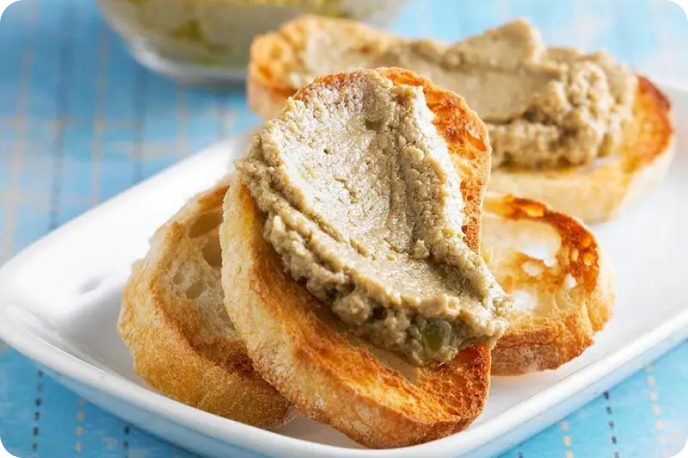              |          A savory dip made from anchovies, garlic, olive oil, and sometimes capers, typically served with raw vegetables or bread.          |
|           Aïoli           |                  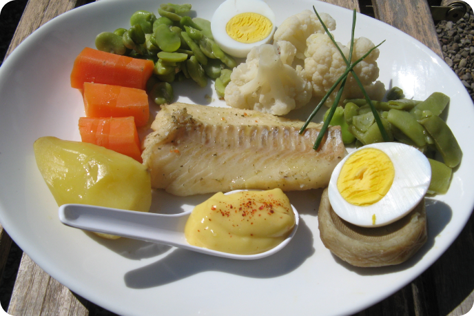                  |                 A garlic mayonnaise often served with vegetables, fish, or hard-boiled eggs, central to Provençal cuisine.                  |
|  Tomate à la Provençale   | 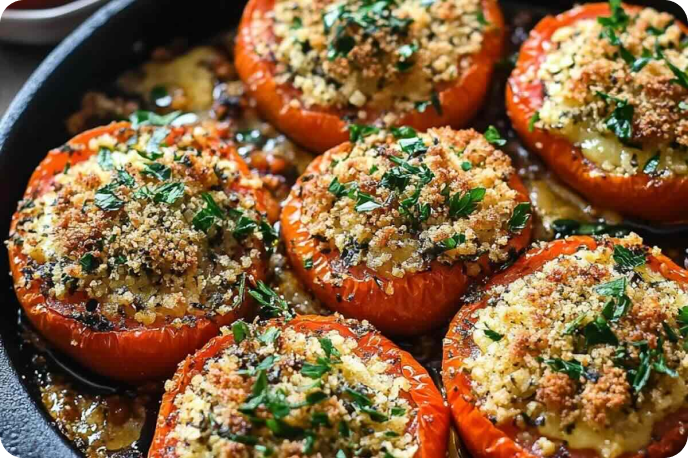 |                            Tomatoes baked with herbs, garlic, and breadcrumbs—an aromatic and simple side dish.                             |
|       Bouillabaisse       |          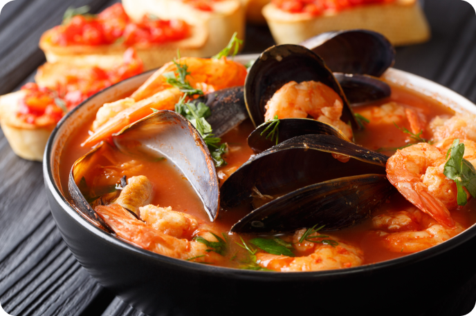          | A traditional fish stew from Marseille made with various local fish, shellfish, and a flavorful broth, served with rouille sauce and bread. |
| Ratatouille de Saint-Rémy |     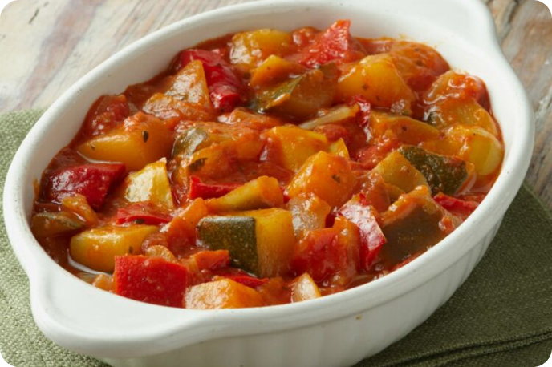     |              A slow-cooked vegetable medley of eggplant, zucchini, peppers, tomatoes, and herbs, originating from Saint-Rémy.               |
|           Socca           |                  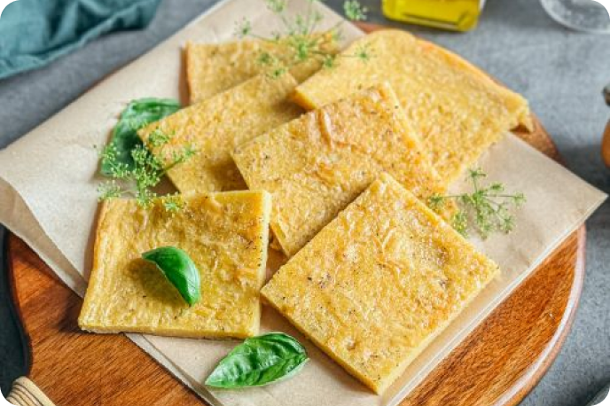                  |                         A thin, crispy chickpea flour pancake from Nice, seasoned with olive oil and black pepper.                          |
|         Broufado          |               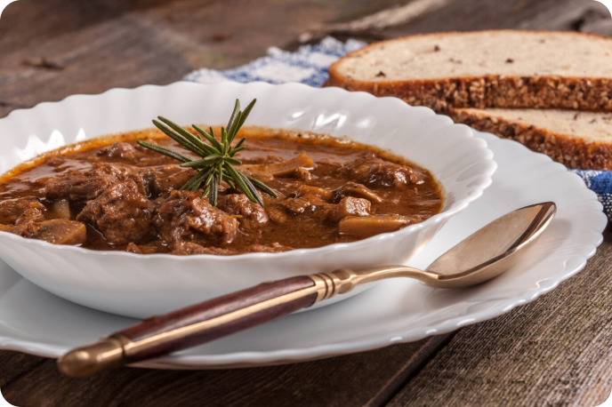               |                A hearty Provençal beef stew marinated in red wine and slow-cooked with onions, herbs, and sometimes olives.                 |
|         Crespeou          |               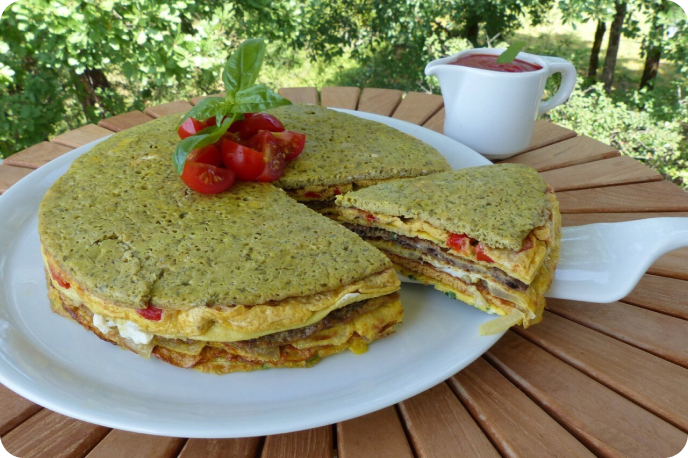               |                       A layered savory cake made of different colored omelets with herbs and vegetables, served cold.                       |
|     Tian aux Légumes      |       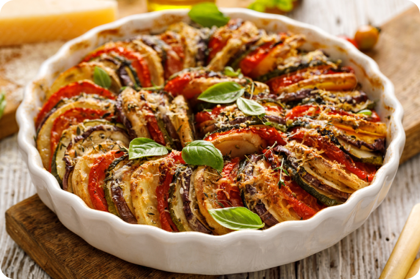       |     A baked dish of sliced vegetables (usually zucchini, tomatoes, and eggplant) arranged in a colorful spiral and roasted with herbs.      |
|       Pissaladière        |           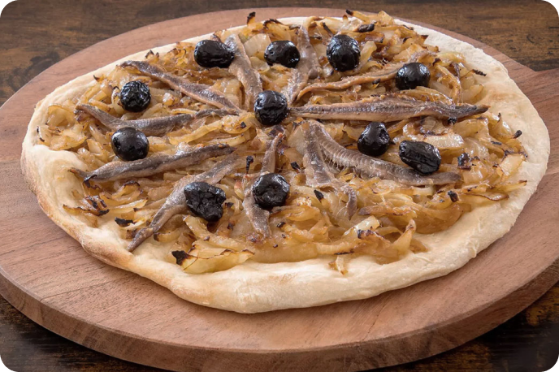           |                    A savory tart from Nice topped with caramelized onions, anchovies, and olives, on a bread-like crust.                    |
|     Daube Provençale      |       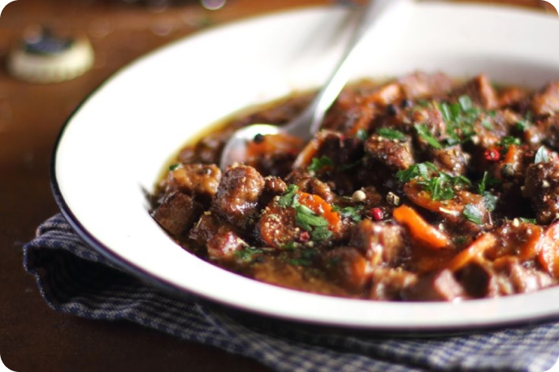       |             A rich beef stew braised in red wine with carrots, garlic, and Provençal herbs, often served with pasta or polenta.             |
|         Tapenade          |               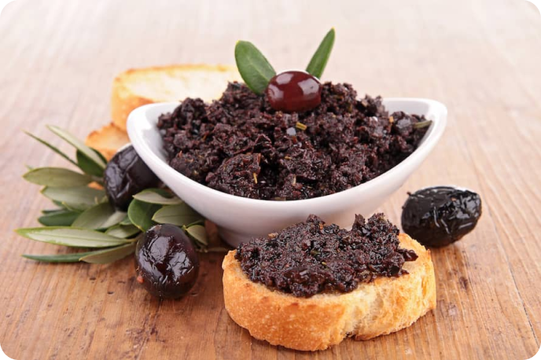               |                   A spread made of finely chopped olives, capers, anchovies, and olive oil, served on toast or as a dip.                    |

---

#### Tags

---

This application will allow users to search for wine or cheese with a search bar, as explained in the [Mockups](#mockups) section.

Therefore, some tags have been defined and classified into subcategories, which are:

- Wine
- Cheese
- Accompaniment
- Label
- Season
- Allergen

Those tags can be accessed through the "add tags" button. Moreover, every product description page would have tags associated with it. Learn more about it in [Product Description Page](#product-description-page).

Hereunder is a more detailed table for each of those subcategories.

**Wine**:

| Categories | Name      | Definition                                                                                |
| ---------- | --------- | ----------------------------------------------------------------------------------------- |
| Type       | Red       | Wine made primarily from dark-colored grape varieties; typically bold and rich in flavor. |
| Type       | White     | Wine made from green or yellowish grapes; usually light and crisp.                        |
| Type       | Sparkling | Wine containing significant levels of carbon dioxide, making it fizzy or bubbly.          |
| Type       | Rosé      | Wine with a pink hue, made from red grapes with limited skin contact during fermentation. |
| Alcohol%   | Natural   | Wine with no added alcohol; alcohol content arises solely from natural fermentation.      |
| Alcohol%   | 0%        | Non-alcoholic wine with 0% alcohol by volume (ABV).                                       |
| Alcohol%   | <8%       | Wine with a low alcohol content, typically light and often sweet.                         |
| Alcohol%   | <14%      | Standard table wine with moderate alcohol content.                                        |
| Alcohol%   | <23%      | Fortified wine with higher alcohol content, often due to added spirits.                   |
| Alcohol%   | 23+%      | Very high-alcohol content, typically liqueur-style or for cooking use.                    |
| Taste      | Spicy     | Flavor profile with notes similar to spices like pepper, clove, or cinnamon.              |
| Taste      | Bitter    | Sharp, slightly harsh taste often found in tannins or certain grape skins.                |
| Taste      | Salt      | Rare in wine, but refers to a saline or mineral-like taste.                               |
| Taste      | Fat       | A rich, full-bodied mouthfeel, often from high glycerol or alcohol content.               |
| Taste      | Sweet     | Noticeable sugar content, ranging from off-dry to dessert-level sweetness.                |
| Taste      | Acid      | Tart, tangy sensation that gives wine its freshness and balance.                          |

**Cheese**:

| Categories   | Name        | Definition                                                                                                                       |
| ------------ | ----------- | -------------------------------------------------------------------------------------------------------------------------------- |
| Animal Milk  | Goat        | Milk from goats, often used for cheeses with a tangy flavor and softer texture.                                                  |
| Animal Milk  | Cow         | The most common milk source for cheese, offering a wide variety of textures and flavors.                                         |
| Animal Milk  | Sheep       | Rich, fatty milk that yields creamy and tangy cheeses like Roquefort and Manchego.                                               |
| Animal Milk  | Buffalo     | High-fat milk known for producing rich, creamy cheeses like mozzarella di bufala.                                                |
| Vegetal Milk | Nut         | Plant-based milk made from nuts (e.g., almond, cashew), used in vegan cheese alternatives.                                       |
| Vegetal Milk | Soy         | Milk from soybeans, commonly used in dairy-free cheese products due to its high protein content.                                 |
| Vegetal Milk | Coconut     | Creamy, plant-based milk from coconuts, adding a mild sweetness to vegan cheeses.                                                |
| Vegetal Milk | Oat         | Dairy-free milk from oats, often used in plant-based cheese for its creamy texture.                                              |
| Vegetal Milk | Hemp        | Nutrient-rich milk from hemp seeds, used in alternative cheeses for its earthy flavor.                                           |
| Vegetal Milk | Rice        | Mild-flavored milk from rice, typically used in lighter vegan cheese products.                                                   |
| Vegetal Milk | Pea Protein | Plant-based milk derived from yellow peas, rich in protein and used in vegan cheese products.                                    |
| Type         | Fresh       | Cheese that is not aged, with a soft texture and high moisture content (e.g., ricotta).                                          |
| Type         | Soft        | Slightly aged cheese with a creamy interior and edible rind (e.g., Brie, Camembert).                                             |
| Type         | Semi-hard   | Firm cheese with lower moisture, aged longer for fuller flavor (e.g., Gouda, Edam).                                              |
| Type         | Hard        | Aged for extended periods, with a crumbly or firm texture (e.g., Parmesan, Pecorino).                                            |
| Type         | Blue        | Cheese inoculated with mold cultures, resulting in blue or green veins and a strong, tangy flavor (e.g., Gorgonzola, Roquefort). |

**Accompaniement**:

| Categories | Name      | Definition                                                                                                                                               |
| ---------- | --------- | -------------------------------------------------------------------------------------------------------------------------------------------------------- |
| Meat       | Red       | Meat from mammals with darker-colored flesh, typically richer in flavor (e.g., beef, lamb).                                                              |
| Meat       | White     | Lighter-colored meat, generally leaner and milder in flavor (e.g., chicken, turkey).                                                                     |
| Meat       | Fish      | Meat from freshwater or saltwater fish, known for being light and high in protein.                                                                       |
| Meat       | Sea       | Edible marine animals other than fish, such as shellfish and crustaceans (e.g., shrimp, scallops).                                                       |
| Meat       | Wild      | Meat from non-domesticated animals hunted in the wild (e.g., venison, boar).                                                                             |
| Dessert    | Cake      | A baked sweet dessert, typically made from flour, sugar, and eggs, often layered or frosted.                                                               |
| Dessert    | Fruit     | Desserts based on fresh or cooked fruits, such as tarts, compotes, or fruit salads.                                                                      |
| Dessert    | Chocolate | Desserts where chocolate is the main ingredient, including mousse, brownies, or truffles.                                                                |
| Dessert    | Ice       | Frozen desserts like ice cream, sorbet, or gelato, served cold and often creamy or fruity.                                                               |
| Aperitif   | Aperitif  | An apéritif is a light pre-meal gathering or course, often featuring drinks and small bites, meant to stimulate the appetite and encourage conversation. |

**Label**:

| Name                                     | Definition                                                                                                                  |
| ---------------------------------------- | --------------------------------------------------------------------------------------------------------------------------- |
| Local                                    | Products sourced from a specific nearby region, often highlighting freshness and reduced transport.                         |
| AOP (Appellation d'Origine Protégée)     | EU certification guaranteeing that products are made entirely in a specific region using traditional methods.               |
| AOC (Appellation d'Origine Contrôlée)    | French certification for origin and quality, often a precursor to AOP, ensuring strict geographic and production standards. |
| IGP (Indication Géographique Protégée)   | Indicates that at least one stage of production, processing, or preparation takes place in the designated area.             |
| Label Rouge                              | French quality label awarded to products that have superior taste and production standards compared to regular products.    |
| STG (Spécialité Traditionnelle Garantie) | EU label highlighting traditional character, either in composition or means of production, without linking to a region.     |
| Bio (AB)                                 | French organic certification ("Agriculture Biologique") ensuring the product is made without synthetic chemicals or GMOs.   |

**Season**:

| Name   | Definition                                                                                                                                                     |
| ------ | -------------------------------------------------------------------------------------------------------------------------------------------------------------- |
| Spring | A season for light, fresh wines such as Sauvignon Blanc, Pinot Grigio, and young rosés that pair well with seasonal vegetables and mild weather.               |
| Summer | Ideal for chilled, refreshing wines like rosé, sparkling wines, and crisp whites (e.g., Riesling, Albariño), often paired with light meals and outdoor dining. |
| Autumn | A transitional season favoring fuller whites and lighter reds such as Chardonnay, Pinot Noir, or Grenache, complementing richer harvest foods.                 |
| Winter | Best suited for bold, warming reds like Cabernet Sauvignon, Syrah, or fortified wines such as Port, often served with hearty dishes.                           |

**Allergen**:

| Wine/Cheese | Name      | Definition                                                                                      |
| ----------- | --------- | ----------------------------------------------------------------------------------------------- |
| Cheese      | Milk      | Contains lactose and milk proteins (casein, whey); present in all dairy-based cheeses.          |
| Cheese      | Eggs      | Sometimes used in processed or melted cheeses as emulsifiers or additives.                      |
| Cheese      | Tree Nuts | May be present in flavored cheeses (e.g., walnut cheese); cross-contamination is possible.      |
| Cheese      | Soy       | Rare, but may appear in plant-based or processed cheese products.                               |
| Cheese      | Gluten    | Not naturally present in traditional cheese; may be found in processed or breaded cheeses.      |
| Cheese      | Mustard   | Sometimes found in flavored cheeses or cheese spreads.                                          |
| Cheese      | Sulfites  | Can be used as preservatives in industrial cheeses.                                             |
| Wine        | Sulfites  | Common preservative to prevent oxidation and spoilage; must be labeled if over 10 mg/l.         |
| Wine        | Eggs      | Egg white (albumin) may be used for fining (clarification); must be labeled if detectable.      |
| Wine        | Milk      | Milk proteins (casein) may be used for fining; must be labeled if detectable.                   |
| Wine        | Fish      | Isinglass (fish gelatin) can be used in fining; labeling not always required unless detectable. |

---

### Product Description Page

---

The description page will be separated in seven distinct parts, each of them would describe a partocular thing about the product it is referring to.

**Basic Information**:

This section is composed of:

- The Name of the Product.
- A picture of the Product if provided in the database.
- The Price of the Product.
- The Region it comes from.

And the percentage of alcohol in wines.

**Tags**:

In this section will be a list of all the tags corresponding to the Product. They will be displayed in a row.

**Suggestions**:

As the application should be a recommendation one, two meals will be displayed as suggestions for the product. Allowing users to mix their products better and have the best experience possible. \
The two meals would be displayed only if they are predefined in the database. However, the application is a proof of concept, therefore, some data could be missing. Consequently, this section could be empty. \
In the case of an empty section, the section would be hidden/removed for the product only.

**Taste**:

This section would only be present for wines.

It will be composed of three bars showing the different tastes of the wine. They would be sorted as follows:

- Salt<a id="9-bis" href="#9">[9]</a>/Fat<a id="10-bis" href="#10">[10]</a>
- Sweetness<a id="11-bis" href="#11">[11]</a>/Spicy<a id="12-bis" href="#12">[12]</a>
- Bitterness<a id="13-bis" href="#13">[13]</a>/Acidity<a id="14-bis" href="#14">[14]</a>

**Where to find it**:

This section would be a procedure to find the product within the grocery store. This could be done thanks to our client and a system that they already have implemented.

**Labels**:

This section will hold every label the product has. They would also be displayed as tags. However, they would be more descriptive, and the full name would be written, unlike tags.

**Description**:

Finally, the description part is here to give more information about the wine in itself. It couuld be little history, how the wine was made, the year of production.

---

### User Workflow

---

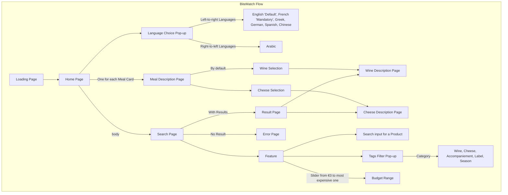
```mermaid
graph TD
 %% BiteMatch Flow
 subgraph BiteMatch Flow
 P1[Loading Page] --> P2[Home Page]

 P2 --> P3[Language Choice Pop-up]
 P2 -->|One for each Meal Card| P4[Meal Description Page]
 P2 -->|body| P5[Search Page]

 P3 -->|Left-to-right Languages| L1[English 'Default', French 'Mandatory', Greek, German, Spanish, Chinese]
 P3 -->|Right-to-left Languages| L2[Arabic]

 P4 -->|By default| S1[Wine Selection]
 P4 --> S2[Cheese Selection]
 S1 --> P6[Wine Description Page]
 S2 --> P7[Cheese Description Page]

 P5 -->|With Results| P9[Result Page]
 P5 -->|No Result| P10[Error Page]
 P5 --> F[Feature]
 F --> F1[Search input for a Product]
 F --> P8[Tags Filter Pop-up]
 F -->|Slider from €0 to most expensive one| F2[Budget Range]

 P8 -->|Category| TC[Wine, Cheese, Accompaniement, Label, Season]

 P9 --> P6
 P9 --> P7
 end
```

> [!note]
> As you might have noticed, BiteMatch is a login-free application, meaning the user doesn't need to log in to use the application.

---

## Non-Functional Requirements

### Performance

---

Our product would be used into the Intermarché grocery store of Saint-Rémy-De-Provence. The loading time should be short and the application intuitive for the users not to lose time.

However, our application still needs to be loaded into the client device at least once, so they can have access to the entire database. The user should not download the application data every time they use the application, but only the first time, so the loading time would be greatly reduced afterwards.

In other words:

- The first time the application is loaded, it should take at most 10 seconds.
- The next usages would take less than a second to load the entire application.

---

### Connectivity

---

The application should be usable without any internet connection. It would avoid losing people who do not possess any connection within the building. \
However, we are forced to use a connection at least once to download all the database into the user's device. \
To avoid this problem, we thought of using the free connection offered by Intermarché.

Once the application is fully loaded, an internet connection won't be necessary anymore.

---

### Responsiveness

---

This application is designed for mobile devices, since it would be used mainly inside Intermarché. We assume people don't go shopping with their laptops.

However, our application should be usable for every operating system and on all main screen sizes. \
Therefore, the application would be developed on the main screensize spread around the world, which is 360x800px. It would also be usable on the range of 350 to 375 pixel width.

---

### Marketing

---

As none of the team members are part of a marketing role or have any marketing experience, this section won't be really enhanced. \
However, the application could be downloaded via a QR code on a basic poster or sign, which could be displayed at the entrance of the building and at both sides of the related departments.

The team also relies on Intermarché's staff and marketing team to promote the application the best they can.

---

## Glossary

| Id                                 | Name        | Definition                                                                                                                                                   |
| ---------------------------------- | ----------- | ------------------------------------------------------------------------------------------------------------------------------------------------------------ |
| <a id="6" href="#6-bis">[6]</a>    | AOP         | _Appellation d'Origine Protégée_; a French certification guaranteeing that a product is locally grown and produced using traditional methods.                |
| <a id="14" href="#14-bis">[14]</a> | Acidity     | A taste descriptor in both wine and cheese, indicating tartness or sourness, often associated with freshness.                                                |
| <a id="4" href="#4-bis">[4]</a>    | Allergen    | A substance capable of causing an allergic reaction, especially in food products like cheese or wine (e.g., milk, nuts, sulfites).                            |
| <a id="1" href="#1-bis">[1]</a>    | Assortiment | A combination or selection of complementary food items, such as wine and cheese, designed to enhance each other's flavors.                                   |
| <a id="8" href="#8-bis">[8]</a>    | Bio         | In France, “Bio” indicates organic food certified under European regulations, free from synthetic pesticides and GMOs.                                       |
| <a id="13" href="#13-bis">[13]</a> | Bitterness  | A taste characteristic often found in aged cheeses or certain wine varietals, balancing sweetness and acidity.                                               |
| <a id="2" href="#2-bis">[2]</a>    | Bubble      | A no-code development platform used to build web applications through visual programming without traditional coding.                                         |
| <a id="10" href="#10-bis">[10]</a> | Fat         | A component of food that affects texture and flavor; in cheese, fat content contributes to richness and mouthfeel.                                           |
| <a id="7" href="#7-bis">[7]</a>    | IGP         | _Indication Géographique Protégée_; a European certification for products that have a specific geographical origin and possess qualities due to that origin. |
| <a id="3" href="#3-bis">[3]</a>    | Mock-up     | A high-fidelity, static representation of a user interface, used for visual design evaluation and client feedback.                                           |
| <a id="9" href="#9-bis">[9]</a>    | Salt        | A basic taste and nutrient, often used in cheese production to influence flavor, texture, and preservation.                                                  |
| <a id="12" href="#12-bis">[12]</a> | Spicy       | A sensory property related to heat or pungency, sometimes present in cheeses or paired with wines to contrast flavors.                                       |
| <a id="11" href="#11-bis">[11]</a> | Sweetness   | A taste quality indicating the presence of sugars; used in wine tasting to describe sugar levels.                                                            |
| <a id="5" href="#5-bis">[5]</a>    | Wireframe   | A basic visual guide used to suggest the layout and structure of a user interface before final design or development.                                        |

---
