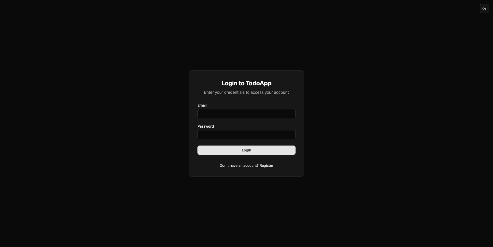
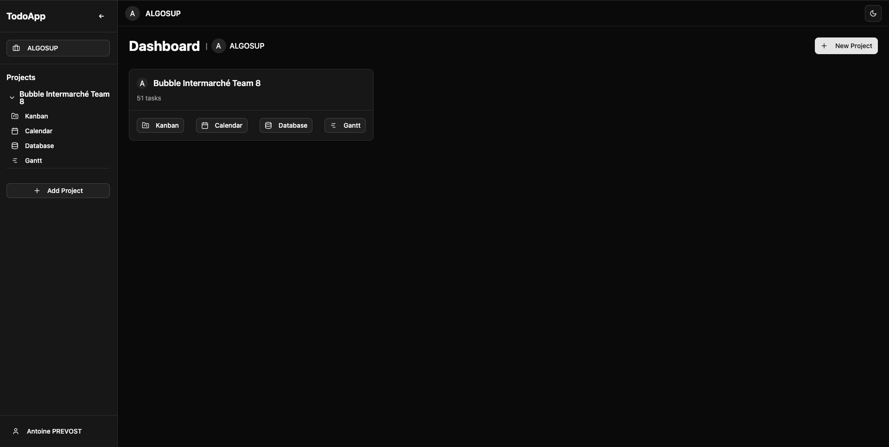
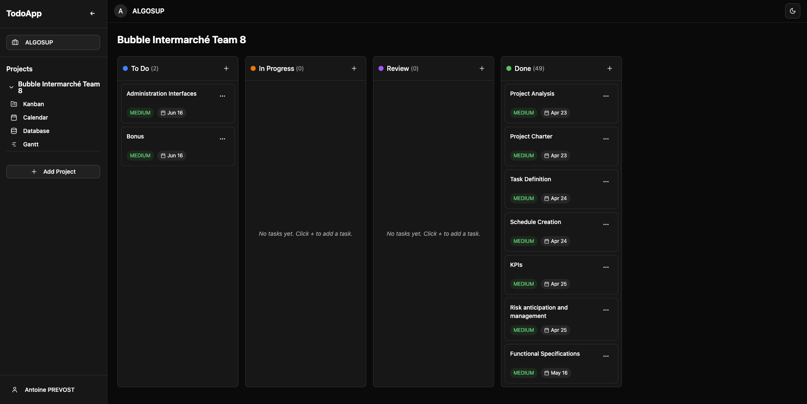
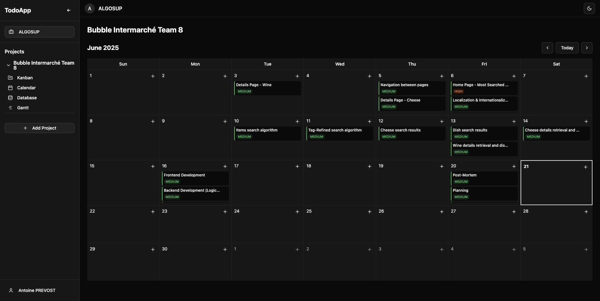
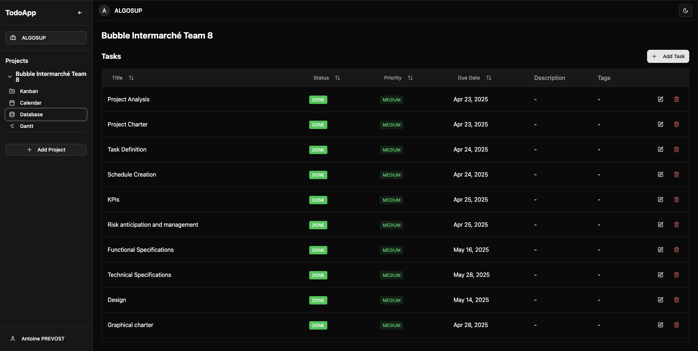
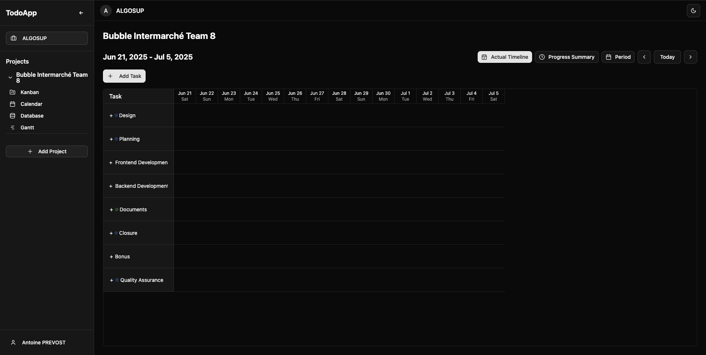
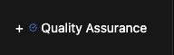
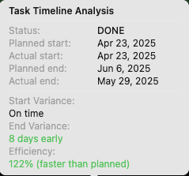

# 2024–2025 Bubble Intermarché Project - Team 8 | Management App Usage Guide <!-- omit in toc -->

Table of Contents

- [Introduction](#introduction)
- [Access the App](#access-the-app)
- [Homepage Overview](#homepage-overview)
- [Task Views](#task-views)
  - [Kanban View](#kanban-view)
  - [Calendar View](#calendar-view)
  - [Database View](#database-view)
  - [Gantt Chart View](#gantt-chart-view)
    - [Actual vs Planned Gantt Comparison](#actual-vs-planned-gantt-comparison)
    - [Expanding Task Categories](#expanding-task-categories)
    - [Viewing Performance Insights](#viewing-performance-insights)
- [Known Issues](#known-issues)
- [Contact](#contact)

---

## Introduction

Welcome to the usage guide for the management application developed as part of the Bubble Intermarché project (Team 8). This tool is designed to streamline project management for ALGOSUP initiatives while also supporting integrations with external tools such as **GitHub Projects**, **Jira**, and more.

> [!WARNING]
> The application is currently under active development. The production version you’ll access is subject to known bugs and instability, particularly due to pending core logic updates. For a list of current limitations, refer to the [Known Issues](#known-issues) section.

If you have questions or would like to provide feedback, please contact **[antoine.prevost@algosup.com](mailto:antoine.prevost@algosup.com)**.

---

## Access the App

You can access the app by clicking the following link:
👉 [https://intime.inkom.ai](https://intime.inkom.ai)

You will be presented with the login screen:

Use the following credentials:

* **Email:** `team8.bubble@algosup.com`
* **Password:** `Team8Bubble`

---

## Homepage Overview

After logging in, you'll be redirected to the homepage:

This dashboard displays all existing projects. For each project, you can view the associated tasks using one of the following layouts:

* **Kanban**
* **Calendar**
* **Database**
* **Gantt**

For purposes of comparing planning with real execution (the core goal of this app), the **Gantt** view is recommended.

---

## Task Views

### Kanban View

Clicking the **Kanban** button brings up this interface:

Tasks are sorted into four columns representing their status, allowing for a visual workflow overview.

---

### Calendar View

Clicking the **Calendar** button opens the calendar interface:

This view provides a visual representation of task deadlines, helping to quickly assess project timelines.

---

### Database View

Click the **Database** button to see a table format:

This layout is useful for filtering and sorting tasks by:

* Name
* Status
* Priority
* Due Date

---

### Gantt Chart View

Click the **Gantt** button to access the Gantt view:

By default, the chart displays tasks over the next 15 days. To view the full retro-planning of the project:

1. Click **"Period > Custom date range"**.
2. Select the range:
   **Start date:** April 20, 2025
   **End date:** June 30, 2025

#### Actual vs Planned Gantt Comparison

The chart displays a comparison between the planned and actual execution timelines. To simplify the view and display only the planned Gantt chart:

* Click the **"Actual Timeline"** toggle to hide it.

---

#### Expanding Task Categories

Tasks are organized by category. You can expand categories to see subtasks:

* Click the **“+”** icon to the left of a task title.

---

#### Viewing Performance Insights

Hover over a task bar in the Gantt chart to view a tooltip containing performance insights, such as delays or early completions:

These insights help in assessing adherence to the original schedule.

---

## Known Issues

The app currently contains several known issues that are being addressed in upcoming updates:

* **Non-responsive layout**: Pages are not optimized for screens narrower than 768px.
* **Scrolling issue on Gantt chart**: Arrows in the Gantt view overflow, causing unintended horizontal scrolling.
* **Custom date selection bugs**: Selecting the end date in the Gantt view's custom range is currently unreliable.
* **Apache error on reload**: Refreshing a page may cause an Apache error. If this happens, return to [intime.inkom.ai](https://intime.inkom.ai) and navigate back manually.

Apologies in advacne if it impacts your experience with this app.

---

## Contact

If you encounter any issues not listed above or have general inquiries, feel free to reach out to:

📧 **[antoine.prevost@algosup.com](mailto:antoine.prevost@algosup.com)**

Your feedback is not only welcome, but actively encouraged!