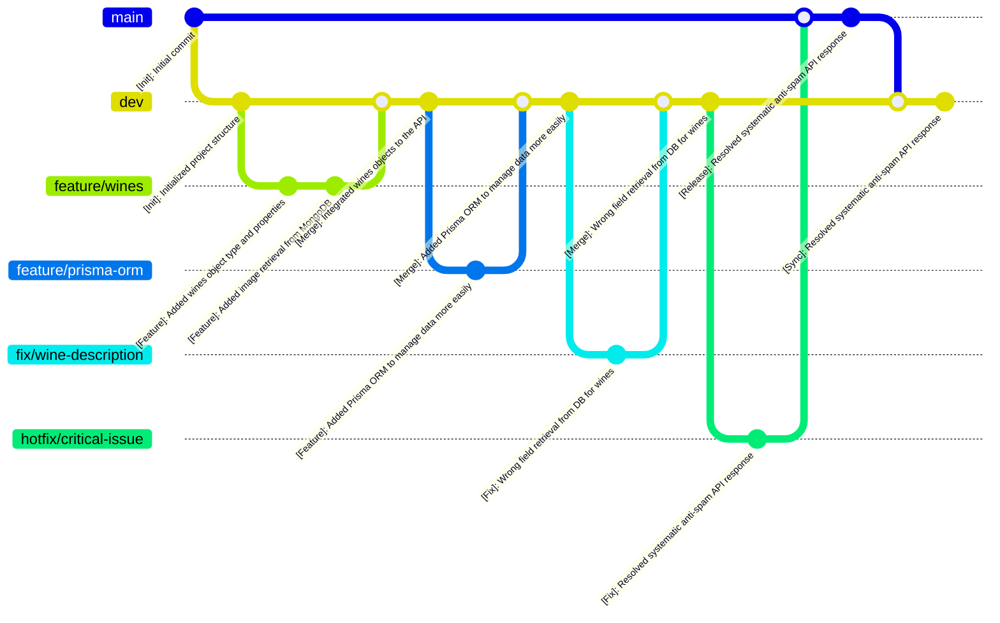

# Conventions - BiteMatch <!-- omit in toc -->

<details>
<summary>Table of Contents</summary>

- [1. Introduction](#1-introduction)
- [2. Conventions](#2-conventions)
  - [2.1. Git Workflow](#21-git-workflow)
    - [2.1.1. Branching Strategy](#211-branching-strategy)
    - [2.1.2. Commit Messages](#212-commit-messages)
    - [2.1.3. Pull Request Guidelines](#213-pull-request-guidelines)
  - [2.2. Bubble Naming Conventions](#22-bubble-naming-conventions)
    - [2.2.1. Pages Names](#221-pages-names)
    - [2.2.2. Elements Tree Components](#222-elements-tree-components)
  - [2.3. File Naming Conventions](#23-file-naming-conventions)

</details>

## 1. Introduction

This document defines the coding, Git, and file-naming conventions used throughout the BiteMatch project. Adhering to these standards ensures consistency, collaboration efficiency, and long-term maintainability.

## 2. Conventions

### 2.1. Git Workflow

#### 2.1.1. Branching Strategy

We use GitFlow to structure development into distinct phases, separating features, releases, hotfixes, and documentation updates. This improves collaboration, minimizes integration issues, and maintains production stability.



| Branch              | Purpose                                                                     |
| ------------------- | --------------------------------------------------------------------------- |
| main                | Stable production branch                                                    |
| dev                 | Main development branch; contains features in progress that require testing |
| documents           | Contains documentation updates                                              |
| feature/branch-name | Used for developing new features                                            |
| fix/branch-name     | Used for fixing bugs found in dev                                           |
| hotfix/branch-name  | Used for urgent fixes directly on main                                      |

> [!NOTE]
> Replace branch-name with a clear, concise name representing the purpose of the branch (e.g., feature/login-form).

#### 2.1.2. Commit Messages

Commit messages must be descriptive and concise. Use the following structure:

```text
[Type]: Short description

[Optional] Detailed explanation if necessary.
```

> [!NOTE]
>  Limit the summary line to a maximum of 50 characters.

**Available commit types:**

| Type       | Usage                                     |
| ---------- | ----------------------------------------- |
| \[Feature] | Adding a new feature or feature component |
| \[Docs]    | Adding or updating documentation          |
| \[Fix]     | Bug fixes (not part of a feature branch)  |
| \[Test]    | Adding or modifying tests                 |
| \[Merge]   | Merging branches                          |

**Examples:**

| Incorrect                   | Correct                                               |
| --------------------------- | ----------------------------------------------------- |
| Updated API                 | \[Feature]: Added API GET endpoint for wines          |
| README changes              | \[Docs]: Added link to CONTRIBUTING.md in README      |
| Fixed bugs                  | \[Fix]: Resolved systematic anti-spam API response    |
| Added test                  | \[Test]: Added unit tests for the retrieve() function |
| Merge dev with latest fixes | \[Merge]: Merged API GET endpoint for wines           |

#### 2.1.3. Pull Request Guidelines

All contributions to dev or main must be submitted via a Pull Request (PR) using the official PR template.

> [!WARNING]
> PRs that do not follow the template will be rejected automatically.

Pull Requests must:

- Use the provided PR template
- Be reviewed and approved by at least one team member before merging


### 2.2. Bubble Naming Conventions

#### 2.2.1. Pages Names

Page names are case sensitive and some of them play a critical role in the correct app working. To ensure compatibility between the pages, those are written in snake\_case.

**Examples:**

- `index`
- `home`
- `splash_screen`

#### 2.2.2. Elements Tree Components

In Bubble, elements must be clearly named to improve searchability and clarity in the elements tree.

- Use Camel\_Snake\_Case
- Make names descriptive and context-aware

**Examples:**

- `Burger_Group`
- `Navbar`
- `More_Examples_Button`


### 2.3. File Naming Conventions

All folders and files in the repository must follow snake\_case naming.

Examples:

- `conventions.md`
- `technical_specifications.md`
- `/src/api`