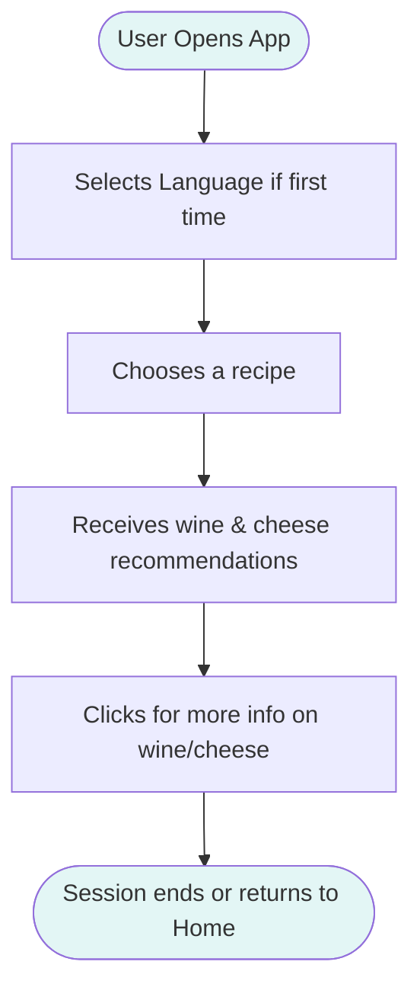
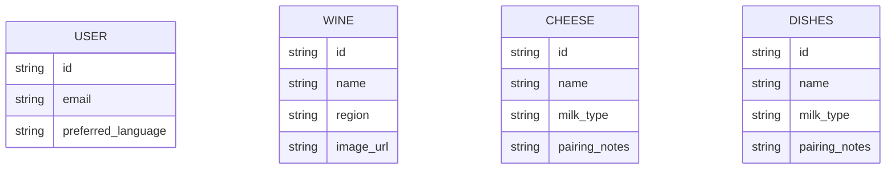

# Technical Specifications - BiteMatch <!-- omit in toc -->

<details>
<summary>Table of Contents</summary>

- [1. Introduction](#1-introduction)
  - [1.1. Glossary](#11-glossary)
  - [1.2. Project Overview](#12-project-overview)
  - [1.3. Project Defintion](#13-project-defintion)
    - [1.3.1. Vision](#131-vision)
    - [1.3.2. Objectives](#132-objectives)
    - [1.3.3. Scope](#133-scope)
    - [1.3.4. Target Audience](#134-target-audience)
    - [1.3.5. Deliverables](#135-deliverables)
- [2. Technology Used](#2-technology-used)
  - [2.1. Presentation](#21-presentation)
  - [2.2. Initial steps](#22-initial-steps)
    - [2.2.1. Create An Account](#221-create-an-account)
    - [2.2.2. Create an Application](#222-create-an-application)
  - [2.3. Minimum Required Versions for Android and IOS](#23-minimum-required-versions-for-android-and-ios)
    - [2.3.1. Android](#231-android)
    - [2.3.2. IOS](#232-ios)
  - [2.4. Bubble Components Architecture](#24-bubble-components-architecture)
- [3. Tehcnical Specifications](#3-tehcnical-specifications)
  - [3.1. Coding Conventions](#31-coding-conventions)
    - [3.1.1. Naming Conventions](#311-naming-conventions)
    - [3.1.2. File Architecture](#312-file-architecture)
  - [3.2. Routing \& Pages](#32-routing--pages)
  - [3.3. Application Logic](#33-application-logic)
  - [3.4. Data Management](#34-data-management)
  - [3.5. Caching \& Offline support](#35-caching--offline-support)
  - [3.6. Performance](#36-performance)
  - [3.7. Scalability](#37-scalability)
  - [3.8. Security \& Privacy](#38-security--privacy)
  - [3.9. Accessibility](#39-accessibility)
  - [3.10. Localization \& Internationalization](#310-localization--internationalization)
  - [3.11. Error Handling \& Logging](#311-error-handling--logging)
- [2. System Architecture](#2-system-architecture)
  - [2.1. High-level Overview](#21-high-level-overview)
  - [Description of User Flows](#description-of-user-flows)
  - [(Optional) Placeholder: Database Tables Overview](#optional-placeholder-database-tables-overview)
- [4. UI/UX Guidelines](#4-uiux-guidelines)
  - [4.1. Design Principles](#41-design-principles)
  - [4.2. Styles \& Theming](#42-styles--theming)
    - [4.2.1. Color Palette](#421-color-palette)
    - [4.2.2. Typography](#422-typography)
    - [4.2.3. Themes](#423-themes)
    - [4.2.4. Global Style Variables](#424-global-style-variables)
  - [4.2.5. Component Styles](#425-component-styles)
    - [Search Box](#search-box)
    - [Button](#button)
      - [Outline Light Primary Contrast](#outline-light-primary-contrast)
      - [Filled Light Primary Contrast](#filled-light-primary-contrast)
      - [Filled White](#filled-white)
      - [Filled Black](#filled-black)
      - [Filled Surface](#filled-surface)
      - [Tabs Disabled Left](#tabs-disabled-left)
      - [Tabs Disabled Right](#tabs-disabled-right)
      - [Tabs Enabled Left](#tabs-enabled-left)
      - [Tabs Enabled Right](#tabs-enabled-right)
    - [Repeating Groups](#repeating-groups)
      - [Transparent (Default)](#transparent-default)
    - [Slider Inputs](#slider-inputs)
      - [Range (Default)](#range-default)
      - [Properties](#properties)
    - [Text](#text)
      - [Body 12](#body-12)

</details>

## 1. Introduction

### 1.1. Glossary

| Term | Definition |
| ---- | ---------- |

### 1.2. Project Overview

This project involves creating an application that recommends wine and cheese to users based on the meal they plan to eat.

The client is "Intermarché Saint-Rémy-de-Provence". Our contact points are Célia Moustier and Chrys Cadeau, respectively, the Intermarché's representative and the intern aisle responsible.

### 1.3. Project Defintion

#### 1.3.1. Vision

The vision of our application is to provide Intermarché's customers best wine and cheese associations with the dish they plan cooking, with the potential to retrieve the product they look for in the supermarket.

#### 1.3.2. Objectives

- **Helping client find meal assortiment**: The application should allow the user to find wine or cheese without any human help.
- **Bringing discovery to client**: The application should permit the client to discover new and local ingredients/wines. It would allow the client to have a new experience with the French culture.
- **Ease of use**: The application should be totally user-friendly and compatible in many languages. The application should be quick to use no more than 3 pages to navigate through-and accessible without connection.

#### 1.3.3. Scope

The project will be developed using **Bubble**, a no-code platform, ensuring compatibility across all mobile devices. If the concept is adapted for broader distribution or scaling, a different technology stack may be considered for development.

The primary focus will be on front-end implementation, given the project's emphasis on user experience (UX). Although a back-end will be integrated, it will be lightweight compared to the database structure. As a proof of concept, the project will prioritize quality over quantity.

#### 1.3.4. Target Audience

**Tourist**: People who aren't from the region, wanting to discover more about the culture and culinary habits of its inhabitants. They would use the application in their own language (or the most common one) to discover new wines and cheese quickly during their journey.

**Locals**: People who live annually or partially in the region. They could use the application for recommendations in particular events such as weddings or parties.

**Wine Amateurs**: People who like wines and have knowledge about them. They could use the application to know more about the different tastes of the wine, with what suits it best.

**Cheese Amateurs**: People who like cheeses and have knowlegde about them. They could use the application to know more about the different kind of the cheese and their best assortiment.

#### 1.3.5. Deliverables

The main deliverable of this project is the Bubble application. Alongside, five documents will be written:

- The Functional Specification
- The Technical Specification
- The Test Plan
- Management Planning and Weekly Reports

In addition, a 15-minute-long presentation will be done in front of the client to show our final product.

## 2. Technology Used

### 2.1. Presentation

Bubble is a visual web application development platform that allows users to build fully functional web apps without writing code. It provides a drag-and-drop interface for designing user interfaces and a powerful workflow editor to define logic, database interactions, and API calls.

From a technical standpoint, Bubble operates as a backend-as-a-service (BaaS) and frontend builder combined, managing hosting, database, user authentication, and dynamic content rendering. It abstracts infrastructure and code complexity while still enabling advanced features like real-time updates, custom plugins, and responsive design.

> [!IMPORTANT]
> We'll only be using Bubble Free Plan during this project. Some features are not available, and some might be limited. Those issues are mentioned in the relevant categories through the document.

### 2.2. Initial steps

#### 2.2.1. Create An Account

To start developping with Bubble, you first need to create an account:

1. Go to [Bubble's Signup Page](https://bubble.io/login?mode=signup) and enter your email and password.
2. Click the Verify Account link you received in the mailbox of the email you filled in and foloow the instructions on your screen

You are now ready to use Bubble.

#### 2.2.2. Create an Application

In order to build your project you need to create an application. To create an application:

1. On [Bubble Home Page](https://bubble.io/home/apps), click the **Create an app** button.
2. In the popup which opened, enter the name of the application (BiteMatch) and click **Get started**

After a few seconds, you will be shown an editor with a blank page of your app.

### 2.3. Minimum Required Versions for Android and IOS

#### 2.3.1. Android

#### 2.3.2. IOS

### 2.4. Bubble Components Architecture

```mermaid
graph TD
A[Bubble Platform]

subgraph Layer 1: Interface
    B[UI Builder]
    E[Styles & Design System]
end

subgraph Layer 2: Logic
    D[Workflow Engine]
    I[API Connector]
end

subgraph Layer 3: Data & Auth
    C[Database]
    H[User Authentication & Roles]
end

subgraph Layer 4: Extensibility
    F[Plugins & Integrations]
end

subgraph Layer 5: Infrastructure
    G[Deployment & Hosting]
end

A --> B
A --> C
A --> D
A --> E
A --> F
A --> G
A --> H
A --> I

B --> B1[Drag & Drop Editor]
B --> B2[Responsive Settings]
B --> B3[Reusable Components]

C --> C1[Custom Data Types]
C --> C2[Data Privacy Rules]
C --> C3[Real-Time Updates]

D --> D1[Event Triggers]
D --> D2[Conditional Logic]
D --> D3[Scheduled Workflows]

E --> E1[Theme Customization]
E --> E2[Global Styles]

F --> F1[Official Plugins]
F --> F2[Community Plugins]
F --> F3[Custom Plugin Builder]

G --> G1[One-Click Deployment]
G --> G2[Custom Domains]
G --> G3[Built-in SSL]

H --> H1[Login/Signup Workflows]
H --> H2[Role-Based Access]

I --> I1[Connect to REST APIs]
I --> I2[Authentication Handling]
I --> I3[Dynamic API Calls]
```



## 3. Tehcnical Specifications

### 3.1. Coding Conventions

#### 3.1.1. Naming Conventions

You can find a comprehensive list of all the naming conventions we will apply during this project in the [Conventions document](./conventions.md).

#### 3.1.2. File Architecture

> [!NOTE]
> No code will be directly created in the repository. Consequently, this file architecture only contains the folder linked to documents and repository administration:

```plaintext
/
  ├── .github/
  │     ├── ISSUE_TEMPLATE/
  │     │     │     ├── 01_documentation_report.yml
  │     │     │     ├── 02_software_bug_report.yml
  │     │     │     ├── 03_feature_request.yml
  │     │     │     ├── config.yml
  │     ├── pull_request_template.md
  ├── documents/
  │     ├── functional_specification/
  │     │     ├── img/
  │     │     │     ├── List of images included in the functional specifications
  │     │     ├── pdf/
  │     │     │     ├── List of PDFs included in the functional specifications
  │     │     ├── functional_specification.md
  │     ├── management/
  │     │     ├── weekly_reports/
  │     │     │     ├── cumulative.md
  │     │     │     ├── List of all the weekly reports from week_1.md to week
  │     │     ├── management_artifacts.md
  │     │     ├── project_charter.md
  │     ├── quality_assurance/
  │     │     ├── test_cases.md
  │     │     ├── test_plan.md
  │     ├── technical_specification
  │     │     ├── conventions.md
  │     │     ├── technical_specification.md
  ├── README.md
```

### 3.2. Routing & Pages

The routing of the app will be done doing the pre-bundled router integrated into Bubble. Here is a comprehensive list of all the pages with their params and usage:

| Page URL | Params | Usage                                                                     |
| -------- | ------ | ------------------------------------------------------------------------- |
| /        | None   | Home of the application used for searching the dish you are going to cook |
|          |        |                                                                           |

### 3.3. Application Logic

### 3.4. Data Management

### 3.5. Caching & Offline support

### 3.6. Performance

### 3.7. Scalability

### 3.8. Security & Privacy

| Role | Description                | Permissions                                                                |
| ---- | -------------------------- | -------------------------------------------------------------------------- |
| User | End-user of the mobile app | - View and select recipes<br>- Receive recommendations<br>- Save favorites |

> [!NOTE]
> As this application is a proof of concept, it will only contain the end user side, with the user role. In future updates, interfaces of rhte administrators of the website will need to be created in order to manage more easily the app's data.

### 3.9. Accessibility

### 3.10. Localization & Internationalization


### 3.11. Error Handling & Logging

## 2. System Architecture

### 2.1. High-level Overview

### Description of User Flows



> [!NOTE]
> This flow represents the user journey for the proof of concept we are building. Future flows can be added for onboarding, profile editing, or feedback submission.

---

### (Optional) Placeholder: Database Tables Overview



## 4. UI/UX Guidelines

### 4.1. Design Principles

### 4.2. Styles & Theming

#### 4.2.1. Color Palette

| **Name**         | **Preview**                                                                                        | **Hex** | **RGB**          |
| ---------------- | -------------------------------------------------------------------------------------------------- | ------- | ---------------- |
| Primary          | <span style="background-color: #E00E1F; width: 10px; height: 10px; display: inline-block;"></span> | #E00E1F | rgb(224,14,31)   |
| Primary Contrast | <span style="background-color: #DECE9C; width: 10px; height: 10px; display: inline-block;"></span> | #DECE9C | rgb(222,206,156) |
| Text             | <span style="background-color: #000000; width: 10px; height: 10px; display: inline-block;"></span> | #000000 | rgb(0,0,0)       |
| Surface          | <span style="background-color: #F1F1F2; width: 10px; height: 10px; display: inline-block;"></span> | #F1F1F2 | rgb(241,241,242) |
| Background       | <span style="background-color: #FFFFFF; width: 10px; height: 10px; display: inline-block;"></span> | #FFFFFF | rgb(255,255,255) |
| Destructive      | <span style="background-color: #B0200C; width: 10px; height: 10px; display: inline-block;"></span> | #B0200C | rgb(176,32,12)   |
| Success          | <span style="background-color: #1E6C30; width: 10px; height: 10px; display: inline-block;"></span> | #1E6C30 | rgb(30,108,48)   |
| Alert            | <span style="background-color: #DCA114; width: 10px; height: 10px; display: inline-block;"></span> | #DCA114 | rgb(220,161,20)  |

#### 4.2.2. Typography

The application uses the **Inter** typeface—a modern, legible, and highly versatile font that enhances readability and consistency across the interface.

#### 4.2.3. Themes

- **Theme Supported**: Light Theme Only
- Dark mode and additional themes are not required for this application.

#### 4.2.4. Global Style Variables

To maintain consistent styling, the following global variables are defined:

| **Variable**     | **Value** |
| ---------------- | --------- |
| App Font         | Inter     |
| Primary          | #E00E1F   |
| Primary Contrast | #DECE9C   |
| Text             | #000000   |
| Surface          | #F1F1F2   |
| Background       | #FFFFFF   |
| Destructive      | #B0200C   |
| Success          | #1E6C30   |
| Alert            | #DCA114   |

> [!NOTE]
> All values are considered with 100% opacity. Default color scales are disabled for this project.

---

### 4.2.5. Component Styles

---

#### Search Box

<table>
  <tr>
    <th>Tab</th>
    <th>Property</th>
    <th>Value</th>
  </tr>
  <tr>
    <td rowspan="14">Appearance</td>
    <td>Font</td>
    <td>Inter</td>
  </tr>
  <tr><td>Font Weight</td><td>Regular (400)</td></tr>
  <tr><td>Font Size</td><td>16px</td></tr>
  <tr><td>Font Color</td><td>#000000</td></tr>
  <tr><td>Text Alignment</td><td>Left</td></tr>
  <tr><td>Word Spacing</td><td>0</td></tr>
  <tr><td>Letter Spacing</td><td>0</td></tr>
  <tr><td>Line Spacing</td><td>1.2</td></tr>
  <tr><td>Placeholder Color</td><td>#000000 (50% opacity)</td></tr>
  <tr><td>Background Style</td><td>Flat Color</td></tr>
  <tr><td>Background Color</td><td>#FFFFFF</td></tr>
  <tr><td>Border Type</td><td>Solid</td></tr>
  <tr><td>Border Width</td><td>1px</td></tr>
  <tr><td>Border Roundness</td><td>12px</td></tr>

  <tr>
    <td rowspan="4">Layout</td>
    <td>Padding Top</td>
    <td>0px</td>
  </tr>
  <tr><td>Padding Bottom</td><td>0px</td></tr>
  <tr><td>Padding Left</td><td>12px</td></tr>
  <tr><td>Padding Right</td><td>12px</td></tr>

  <tr>
    <td rowspan="1">Conditional Logic</td>
    <td>When This SearchBox isn't valid</td>
    <td>Border color - all borders: Destructive (#B0200C)</td>
  </tr>
</table>

---

#### Button

##### Outline Light Primary Contrast

<table>
  <tr>
    <th>Tab</th>
    <th>Property</th>
    <th>Value</th>
  </tr>
  <tr>
    <td rowspan="15">Appearance</td>
    <td>Font</td>
    <td>Inter</td>
  </tr>
  <tr><td>Font Weight</td><td>Semi-Bold (600)</td></tr>
  <tr><td>Font Size</td><td>16px</td></tr>
  <tr><td>Font Color</td><td>#DECE9C</td></tr>
  <tr><td>Text Alignment</td><td>Center</td></tr>
  <tr><td>Word Spacing</td><td>0</td></tr>
  <tr><td>Letter Spacing</td><td>0</td></tr>
  <tr><td>Line Spacing</td><td>1.4</td></tr>
  <tr><td>Icon Size</td><td>24px</td></tr>
  <tr><td>Icon Color</td><td>#DECE9C</td></tr>
  <tr><td>Background Style</td><td>Flat Color</td></tr>
  <tr><td>Background Color</td><td>#FFFFFF</td></tr>
  <tr><td>Border Type</td><td>Dashed</td></tr>
  <tr><td>Border Width</td><td>4px</td></tr>
  <tr><td>Border Roundness</td><td>99px</td></tr>

  <tr>
    <td rowspan="4">Layout</td>
    <td>Gap</td>
    <td>10px</td>
  </tr>
  <tr><td>Padding Top</td><td>0px</td></tr>
  <tr><td>Padding Bottom</td><td>0px</td></tr>
  <tr><td>Padding Left</td><td>20px</td></tr>
  <tr><td>Padding Right</td><td>20px</td></tr>

  <tr>
    <td rowspan="1">Conditional Logic</td>
    <td>When This Button is hovered</td>
    <td>Background Color: Surface (#F1F1F2)</td>
  </tr>
</table>

##### Filled Light Primary Contrast

> [!CAUTION]
> TO FIX

<table>
  <tr>
    <th>Tab</th>
    <th>Property</th>
    <th>Value</th>
  </tr>
  <tr>
    <td rowspan="15">Appearance</td>
    <td>Font</td>
    <td>Inter</td>
  </tr>
  <tr><td>Font Weight</td><td>Semi-Bold (600)</td></tr>
  <tr><td>Font Size</td><td>16px</td></tr>
  <tr><td>Font Color</td><td>#000000</td></tr>
  <tr><td>Text Alignment</td><td>Center</td></tr>
  <tr><td>Word Spacing</td><td>0</td></tr>
  <tr><td>Letter Spacing</td><td>0</td></tr>
  <tr><td>Line Spacing</td><td>1.4</td></tr>
  <tr><td>Icon Size</td><td>24px</td></tr>
  <tr><td>Icon Color</td><td>#000000</td></tr>
  <tr><td>Background Style</td><td>Flat Color</td></tr>
  <tr><td>Background Color</td><td>#DECE9C 75%</td></tr>
  <tr><td>Border Color</td><td>DECE9C 100%</td></tr>
  <tr><td>Border Type</td><td>Dashed</td></tr>
  <tr><td>Border Width</td><td>4px</td></tr>
  <tr><td>Border Roundness</td><td>99px</td></tr>

  <tr>
    <td rowspan="4">Layout</td>
    <td>Gap</td>
    <td>10px</td>
  </tr>
  <tr><td>Padding Top</td><td>0px</td></tr>
  <tr><td>Padding Bottom</td><td>0px</td></tr>
  <tr><td>Padding Left</td><td>20px</td></tr>
  <tr><td>Padding Right</td><td>20px</td></tr>

  <tr>
    <td rowspan="1">Conditional Logic</td>
    <td>When This Button is hovered</td>
    <td>Background Color: Surface (#F1F1F2)</td>
  </tr>
</table>

##### Filled White

<table>
  <tr>
    <th>Tab</th>
    <th>Property</th>
    <th>Value</th>
  </tr>
  <tr>
    <td rowspan="20">Appearance</td>
    <td>Font</td>
    <td>Inter</td>
  </tr>
  <tr><td>Font Weight</td><td>Medium (500)</td></tr>
  <tr><td>Font Size</td><td>16px</td></tr>
  <tr><td>Font Color</td><td>#000000</td></tr>
  <tr><td>Text Alignment</td><td>Center</td></tr>
  <tr><td>Word Spacing</td><td>0</td></tr>
  <tr><td>Letter Spacing</td><td>0</td></tr>
  <tr><td>Line Spacing</td><td>1.4</td></tr>
  <tr><td>Icon Size</td><td>16px</td></tr>
  <tr><td>Icon Color</td><td>#000000</td></tr>
  <tr><td>Background Style</td><td>Flat Color</td></tr>
  <tr><td>Background Color</td><td>#FFFFFF</td></tr>
  <tr><td>Border Type</td><td>None</td></tr>
  <tr><td>Border Roundness</td><td>12px</td></tr>
  <tr><td>Boxshadow Color</td><td>#000000 25%</td></tr>
  <tr><td>Shadow Style</td><td>Outset</td></tr>
  <tr><td>Horizontal Offset</td><td>4px</td></tr>
  <tr><td>Vertical Offset</td><td>4px</td></tr>
  <tr><td>Blur Radius</td><td>4px</td></tr>
  <tr><td>Spread Radius</td><td>0px</td></tr>

  <tr>
    <td rowspan="5">Layout</td>
    <td>Gap</td>
    <td>12px</td>
  </tr>
  <tr><td>Padding Top</td><td>0px</td></tr>
  <tr><td>Padding Bottom</td><td>0px</td></tr>
  <tr><td>Padding Left</td><td>12px</td></tr>
  <tr><td>Padding Right</td><td>12px</td></tr>
</table>

##### Filled Black

<table>
  <tr>
    <th>Tab</th>
    <th>Property</th>
    <th>Value</th>
  </tr>
  <tr>
    <td rowspan="20">Appearance</td>
    <td>Font</td>
    <td>Inter</td>
  </tr>
  <tr><td>Font Weight</td><td>Medium (500)</td></tr>
  <tr><td>Font Size</td><td>16px</td></tr>
  <tr><td>Font Color</td><td>#FFFFFF</td></tr>
  <tr><td>Text Alignment</td><td>Center</td></tr>
  <tr><td>Word Spacing</td><td>0</td></tr>
  <tr><td>Letter Spacing</td><td>0</td></tr>
  <tr><td>Line Spacing</td><td>1.4</td></tr>
  <tr><td>Icon Size</td><td>16px</td></tr>
  <tr><td>Icon Color</td><td>#FFFFFF</td></tr>
  <tr><td>Background Style</td><td>Flat Color</td></tr>
  <tr><td>Background Color</td><td>#000000</td></tr>
  <tr><td>Border Type</td><td>None</td></tr>
  <tr><td>Border Roundness</td><td>12px</td></tr>
  <tr><td>Boxshadow Color</td><td>#000000 25%</td></tr>
  <tr><td>Shadow Style</td><td>Outset</td></tr>
  <tr><td>Horizontal Offset</td><td>4px</td></tr>
  <tr><td>Vertical Offset</td><td>4px</td></tr>
  <tr><td>Blur Radius</td><td>4px</td></tr>
  <tr><td>Spread Radius</td><td>0px</td></tr>

  <tr>
    <td rowspan="5">Layout</td>
    <td>Gap</td>
    <td>12px</td>
  </tr>
  <tr><td>Padding Top</td><td>0px</td></tr>
  <tr><td>Padding Bottom</td><td>0px</td></tr>
  <tr><td>Padding Left</td><td>12px</td></tr>
  <tr><td>Padding Right</td><td>12px</td></tr>
</table>

##### Filled Surface

<table>
  <tr>
    <th>Tab</th>
    <th>Property</th>
    <th>Value</th>
  </tr>
  <tr>
    <td rowspan="20">Appearance</td>
    <td>Font</td>
    <td>Inter</td>
  </tr>
  <tr><td>Font Weight</td><td>Bold (700)</td></tr>
  <tr><td>Font Size</td><td>16px</td></tr>
  <tr><td>Font Color</td><td>#000000</td></tr>
  <tr><td>Text Alignment</td><td>Center</td></tr>
  <tr><td>Word Spacing</td><td>0</td></tr>
  <tr><td>Letter Spacing</td><td>0</td></tr>
  <tr><td>Line Spacing</td><td>1.4</td></tr>
  <tr><td>Icon Size</td><td>16px</td></tr>
  <tr><td>Icon Color</td><td>#000000</td></tr>
  <tr><td>Background Style</td><td>Flat Color</td></tr>
  <tr><td>Background Color</td><td>#F1F1F2</td></tr>
  <tr><td>Border Type</td><td>None</td></tr>
  <tr><td>Border Roundness</td><td>12px</td></tr>
  <tr><td>Boxshadow Color</td><td>#000000 25%</td></tr>
  <tr><td>Shadow Style</td><td>Outset</td></tr>
  <tr><td>Horizontal Offset</td><td>4px</td></tr>
  <tr><td>Vertical Offset</td><td>4px</td></tr>
  <tr><td>Blur Radius</td><td>4px</td></tr>
  <tr><td>Spread Radius</td><td>0px</td></tr>

  <tr>
    <td rowspan="5">Layout</td>
    <td>Gap</td>
    <td>12px</td>
  </tr>
  <tr><td>Padding Top</td><td>0px</td></tr>
  <tr><td>Padding Bottom</td><td>0px</td></tr>
  <tr><td>Padding Left</td><td>12px</td></tr>
  <tr><td>Padding Right</td><td>12px</td></tr>
</table>

##### Tabs Disabled Left

<table>
  <tr>
    <th>Tab</th>
    <th>Property</th>
    <th>Value</th>
  </tr>
  <tr>
    <td rowspan="29">Appearance</td>
    <td>Font</td>
    <td>Inter</td>
  </tr>
  <tr><td>Font Weight</td><td>Semi-Bold (600)</td></tr>
  <tr><td>Font Size</td><td>20px</td></tr>
  <tr><td>Font Color</td><td>#000000 80%</td></tr>
  <tr><td>Text Alignment</td><td>Center</td></tr>
  <tr><td>Word Spacing</td><td>0</td></tr>
  <tr><td>Letter Spacing</td><td>0</td></tr>
  <tr><td>Line Spacing</td><td>1.4</td></tr>
  <tr><td>Icon Size</td><td>20px</td></tr>
  <tr><td>Icon Color</td><td>#000000 80%</td></tr>
  <tr><td>Background Style</td><td>Flat Color</td></tr>
  <tr><td>Background Color</td><td>#DECE9C 60%</td></tr>
  <tr><td>Define Each Border Independently</td><td>yes</td></tr>
  <tr><td>Border Type - Top</td><td>None</td></tr>
  <tr><td>Border Type - Left</td><td>None</td></tr>
  <tr><td>Border Type - Right</td><td>None</td></tr>
  <tr><td>Border Type - Bottom</td><td>Solid</td></tr>
  <tr><td>Border Type - Bottom - Width</td><td>4px</td></tr>
  <tr><td>Border Type - Bottom - Color</td><td>#E00E1F</td></tr>
  <tr><td>Border Roundness - Top-Left</td><td>12px</td></tr>
  <tr><td>Border Roundness - Top-Right</td><td>0px</td></tr>
  <tr><td>Border Roundness - Bottom-Left</td><td>0px</td></tr>
  <tr><td>Border Roundness - Bottom-Right</td><td>0px</td></tr>
  <tr><td>Boxshadow Color</td><td>#000000 25%</td></tr>
  <tr><td>Shadow Style</td><td>Outset</td></tr>
  <tr><td>Horizontal Offset</td><td>4px</td></tr>
  <tr><td>Vertical Offset</td><td>4px</td></tr>
  <tr><td>Blur Radius</td><td>4px</td></tr>
  <tr><td>Spread Radius</td><td>0px</td></tr>

  <tr>
    <td rowspan="5">Layout</td>
    <td>Gap</td>
    <td>12px</td>
  </tr>
  <tr><td>Padding Top</td><td>0px</td></tr>
  <tr><td>Padding Bottom</td><td>0px</td></tr>
  <tr><td>Padding Left</td><td>12px</td></tr>
  <tr><td>Padding Right</td><td>12px</td></tr>
</table>

##### Tabs Disabled Right

<table>
  <tr>
    <th>Tab</th>
    <th>Property</th>
    <th>Value</th>
  </tr>
  <tr>
    <td rowspan="29">Appearance</td>
    <td>Font</td>
    <td>Inter</td>
  </tr>
  <tr><td>Font Weight</td><td>Semi-Bold (600)</td></tr>
  <tr><td>Font Size</td><td>20px</td></tr>
  <tr><td>Font Color</td><td>#000000 80%</td></tr>
  <tr><td>Text Alignment</td><td>Center</td></tr>
  <tr><td>Word Spacing</td><td>0</td></tr>
  <tr><td>Letter Spacing</td><td>0</td></tr>
  <tr><td>Line Spacing</td><td>1.4</td></tr>
  <tr><td>Icon Size</td><td>20px</td></tr>
  <tr><td>Icon Color</td><td>#000000 80%</td></tr>
  <tr><td>Background Style</td><td>Flat Color</td></tr>
  <tr><td>Background Color</td><td>#DECE9C 60%</td></tr>
  <tr><td>Define Each Border Independently</td><td>yes</td></tr>
  <tr><td>Border Type - Top</td><td>None</td></tr>
  <tr><td>Border Type - Left</td><td>None</td></tr>
  <tr><td>Border Type - Right</td><td>None</td></tr>
  <tr><td>Border Type - Bottom</td><td>Solid</td></tr>
  <tr><td>Border Type - Bottom - Width</td><td>4px</td></tr>
  <tr><td>Border Type - Bottom - Color</td><td>#E00E1F</td></tr>
  <tr><td>Border Roundness - Top-Left</td><td>0px</td></tr>
  <tr><td>Border Roundness - Top-Right</td><td>12px</td></tr>
  <tr><td>Border Roundness - Bottom-Left</td><td>0px</td></tr>
  <tr><td>Border Roundness - Bottom-Right</td><td>0px</td></tr>
  <tr><td>Boxshadow Color</td><td>#000000 25%</td></tr>
  <tr><td>Shadow Style</td><td>Outset</td></tr>
  <tr><td>Horizontal Offset</td><td>4px</td></tr>
  <tr><td>Vertical Offset</td><td>4px</td></tr>
  <tr><td>Blur Radius</td><td>4px</td></tr>
  <tr><td>Spread Radius</td><td>0px</td></tr>

  <tr>
    <td rowspan="5">Layout</td>
    <td>Gap</td>
    <td>12px</td>
  </tr>
  <tr><td>Padding Top</td><td>0px</td></tr>
  <tr><td>Padding Bottom</td><td>0px</td></tr>
  <tr><td>Padding Left</td><td>12px</td></tr>
  <tr><td>Padding Right</td><td>12px</td></tr>
</table>

##### Tabs Enabled Left

<table>
  <tr>
    <th>Tab</th>
    <th>Property</th>
    <th>Value</th>
  </tr>
  <tr>
    <td rowspan="29">Appearance</td>
    <td>Font</td>
    <td>Inter</td>
  </tr>
  <tr><td>Font Weight</td><td>Bold (700)</td></tr>
  <tr><td>Font Size</td><td>20px</td></tr>
  <tr><td>Font Color</td><td>#000000</td></tr>
  <tr><td>Text Alignment</td><td>Center</td></tr>
  <tr><td>Word Spacing</td><td>0</td></tr>
  <tr><td>Letter Spacing</td><td>0</td></tr>
  <tr><td>Line Spacing</td><td>1.4</td></tr>
  <tr><td>Icon Size</td><td>20px</td></tr>
  <tr><td>Icon Color</td><td>#000000</td></tr>
  <tr><td>Background Style</td><td>Flat Color</td></tr>
  <tr><td>Background Color</td><td>#DECE9C</td></tr>
  <tr><td>Define Each Border Independently</td><td>yes</td></tr>
  <tr><td>Border Type - Top</td><td>None</td></tr>
  <tr><td>Border Type - Left</td><td>None</td></tr>
  <tr><td>Border Type - Right</td><td>None</td></tr>
  <tr><td>Border Type - Bottom</td><td>Solid</td></tr>
  <tr><td>Border Type - Bottom - Width</td><td>4px</td></tr>
  <tr><td>Border Type - Bottom - Color</td><td>#E00E1F</td></tr>
  <tr><td>Border Roundness - Top-Left</td><td>12px</td></tr>
  <tr><td>Border Roundness - Top-Right</td><td>0px</td></tr>
  <tr><td>Border Roundness - Bottom-Left</td><td>0px</td></tr>
  <tr><td>Border Roundness - Bottom-Right</td><td>0px</td></tr>
  <tr><td>Boxshadow Color</td><td>#000000 25%</td></tr>
  <tr><td>Shadow Style</td><td>Outset</td></tr>
  <tr><td>Horizontal Offset</td><td>4px</td></tr>
  <tr><td>Vertical Offset</td><td>4px</td></tr>
  <tr><td>Blur Radius</td><td>4px</td></tr>
  <tr><td>Spread Radius</td><td>0px</td></tr>

  <tr>
    <td rowspan="5">Layout</td>
    <td>Gap</td>
    <td>12px</td>
  </tr>
  <tr><td>Padding Top</td><td>0px</td></tr>
  <tr><td>Padding Bottom</td><td>0px</td></tr>
  <tr><td>Padding Left</td><td>12px</td></tr>
  <tr><td>Padding Right</td><td>12px</td></tr>
</table>

##### Tabs Enabled Right

<table>
  <tr>
    <th>Tab</th>
    <th>Property</th>
    <th>Value</th>
  </tr>
  <tr>
    <td rowspan="29">Appearance</td>
    <td>Font</td>
    <td>Inter</td>
  </tr>
  <tr><td>Font Weight</td><td>Bold (700)</td></tr>
  <tr><td>Font Size</td><td>20px</td></tr>
  <tr><td>Font Color</td><td>#000000</td></tr>
  <tr><td>Text Alignment</td><td>Center</td></tr>
  <tr><td>Word Spacing</td><td>0</td></tr>
  <tr><td>Letter Spacing</td><td>0</td></tr>
  <tr><td>Line Spacing</td><td>1.4</td></tr>
  <tr><td>Icon Size</td><td>20px</td></tr>
  <tr><td>Icon Color</td><td>#000000</td></tr>
  <tr><td>Background Style</td><td>Flat Color</td></tr>
  <tr><td>Background Color</td><td>#DECE9C</td></tr>
  <tr><td>Define Each Border Independently</td><td>yes</td></tr>
  <tr><td>Border Type - Top</td><td>None</td></tr>
  <tr><td>Border Type - Left</td><td>None</td></tr>
  <tr><td>Border Type - Right</td><td>None</td></tr>
  <tr><td>Border Type - Bottom</td><td>Solid</td></tr>
  <tr><td>Border Type - Bottom - Width</td><td>4px</td></tr>
  <tr><td>Border Type - Bottom - Color</td><td>#E00E1F</td></tr>
  <tr><td>Border Roundness - Top-Left</td><td>0px</td></tr>
  <tr><td>Border Roundness - Top-Right</td><td>12px</td></tr>
  <tr><td>Border Roundness - Bottom-Left</td><td>0px</td></tr>
  <tr><td>Border Roundness - Bottom-Right</td><td>0px</td></tr>
  <tr><td>Boxshadow Color</td><td>#000000 25%</td></tr>
  <tr><td>Shadow Style</td><td>Outset</td></tr>
  <tr><td>Horizontal Offset</td><td>4px</td></tr>
  <tr><td>Vertical Offset</td><td>4px</td></tr>
  <tr><td>Blur Radius</td><td>4px</td></tr>
  <tr><td>Spread Radius</td><td>0px</td></tr>

  <tr>
    <td rowspan="5">Layout</td>
    <td>Gap</td>
    <td>12px</td>
  </tr>
  <tr><td>Padding Top</td><td>0px</td></tr>
  <tr><td>Padding Bottom</td><td>0px</td></tr>
  <tr><td>Padding Left</td><td>12px</td></tr>
  <tr><td>Padding Right</td><td>12px</td></tr>
</table>

---

#### Repeating Groups

##### Transparent (Default)

<table>
  <tr>
    <th>Tab</th>
    <th>Property</th>
    <th>Value</th>
  </tr>
  <tr>
    <td rowspan="8">Appearance</td>
    <td>Style</td>
    <td>None</td>
  </tr>
  <tr><td>Font Weight</td><td>Bold (700)</td></tr>
  <tr><td>Opacity</td><td>100%</td></tr>
  <tr><td>Background Style</td><td>None</td></tr>
  <tr><td>Define Each Border Independently</td><td>no</td></tr>
  <tr><td>Border Style</td><td>None</td></tr>
  <tr><td>Roundness</td><td>0px</td></tr>
  <tr><td>Shadow Style</td><td>None</td></tr>
</table>

---

#### Slider Inputs

##### Range (Default)

<table>
  <tr>
    <th>Tab</th>
    <th>Property</th>
    <th>Value</th>
  </tr>
  <tr>
    <td rowspan="5">Appearance</td>
    <td>Slider Style</td>
    <td>Range</td>
  </tr>
  <tr><td>Border Color</td><td>#000000</td></tr>
  <tr><td>Background Color</td><td>#000000</td></tr>
  <tr><td>Handle Color</td><td>#000000</td></tr>
  <tr><td>Range Area Color</td><td>#000000</td></tr>

  <tr>
    <td rowspan="1">Conditional Logic</td>
    <td>This SliderInput is hovered</td>
    <td>Handle Color: Text (#000000)</td>
  </tr>
</table>

##### Properties

<table>
  <tr>
    <th>Tab</th>
    <th>Property</th>
    <th>Value</th>
  </tr>
  <tr>
    <td rowspan="4">Appearance</td>
    <td>Slider Style</td>
    <td>Simple</td>
  </tr>
  <tr><td>Border Color</td><td>#000000</td></tr>
  <tr><td>Background Color</td><td>#000000</td></tr>
  <tr><td>Handle Color</td><td>#E00E1F</td></tr>

  <tr>
    <td rowspan="1">Conditional Logic</td>
    <td>This SliderInput is hovered</td>
    <td>Handle Color: Text (#E00E1F)</td>
  </tr>
</table>

---

#### Text

##### Body 12

<table>
  <tr>
    <th>Tab</th>
    <th>Property</th>
    <th>Value</th>
  </tr>
  <tr>
    <td rowspan="17">Appearance</td>
    <td>HTML Tag</td>
    <td>Normal</td>
  </tr>
  <tr><td>Opacity</td><td>100%</td></tr>
  <tr><td>Font Style</td><td>Inter</td></tr>
  <tr><td>Font Weight</td><td>Regular (400)</td></tr>
  <tr><td>Font Size</td><td>12px</td></tr>
  <tr><td>Alignment</td><td>Right</td></tr>
  <tr><td>Font Color</td><td>#000000</td></tr>
  <tr><td>Word Spacing</td><td>0px</td></tr>
  <tr><td>Line Spacing</td><td>1.4px</td></tr>
  <tr><td>Letter Spacing</td><td>0px</td></tr>
  <tr><td>Center Text Vertically</td><td>yes</td></tr>
  <tr><td>Background Style</td><td>None</td></tr>
  <tr><td>Define Each Border Independently</td><td>No</td></tr>
  <tr><td>Border Style</td><td>None</td></tr>
  <tr><td>Border Roundness</td><td>0px</td></tr>
  <tr><td>Show Text Shadow</td><td>No</td></tr>
  <tr><td>Shadow Style</td><td>None</td></tr>

  <tr>
    <td rowspan="4">Layout</td>
    <td>Padding - Top</td>
    <td>0px</td>
  </tr>
  <tr><td>Padding - Bottom</td><td>0px</td></tr>
  <tr><td>Padding - Left</td><td>0px</td></tr>
  <tr><td>Padding - Right</td><td>0px</td></tr>
</table>
