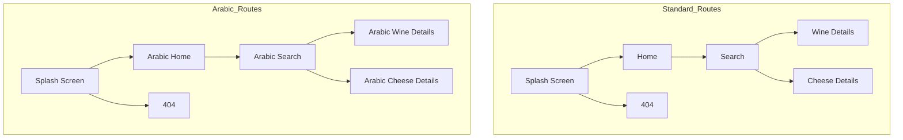
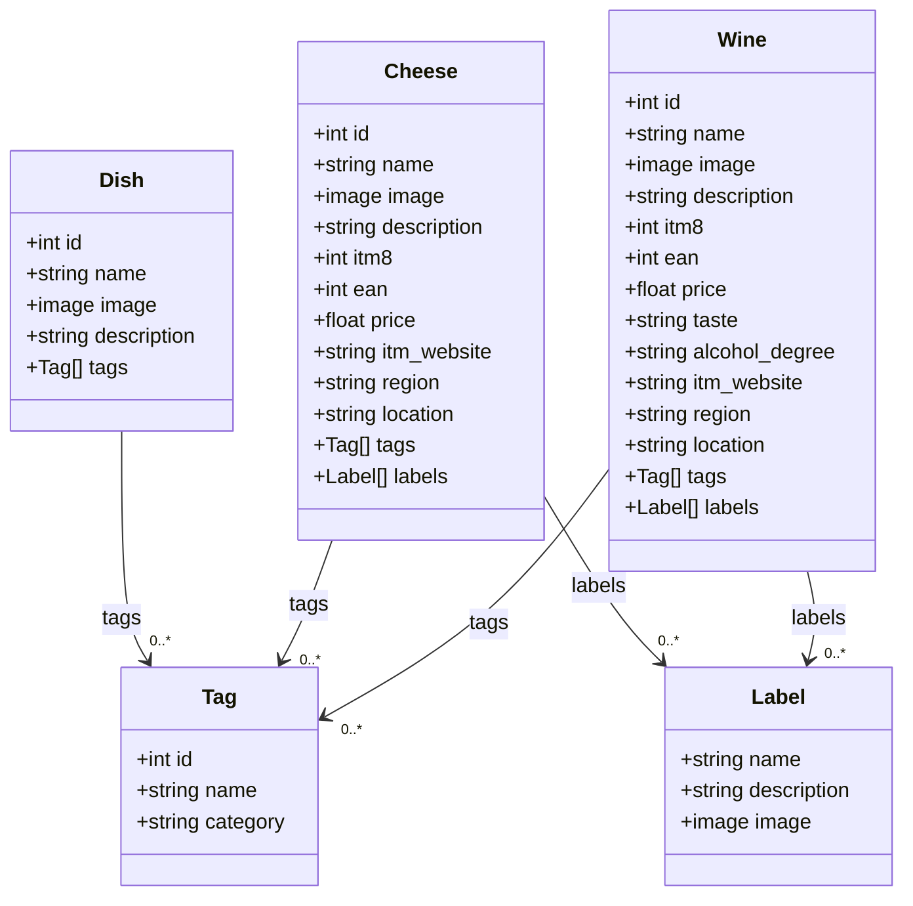

# Technical Specifications - BiteMatch <!-- omit in toc -->

<details>
<summary>Table of Contents</summary>

- [1. Introduction](#1-introduction)
  - [1.1. Glossary](#11-glossary)
  - [1.2. Project Overview](#12-project-overview)
  - [1.3. Project Defintion](#13-project-defintion)
    - [1.3.1. Vision](#131-vision)
    - [1.3.2. Objectives](#132-objectives)
    - [1.3.3. Scope](#133-scope)
    - [1.3.4. Target Audience](#134-target-audience)
    - [1.3.5. Deliverables](#135-deliverables)
- [2. Technology Used](#2-technology-used)
  - [2.1. Presentation](#21-presentation)
  - [2.2. Initial steps](#22-initial-steps)
    - [2.2.1. Create An Account](#221-create-an-account)
    - [2.2.2. Create an Application](#222-create-an-application)
  - [2.3. Minimum Required Versions for Android and iOS](#23-minimum-required-versions-for-android-and-ios)
    - [2.3.1. Android Compatibility](#231-android-compatibility)
    - [2.3.2. iOS Compatibility](#232-ios-compatibility)
  - [2.4. Bubble Components Architecture](#24-bubble-components-architecture)
- [3. Tehcnical Specifications](#3-tehcnical-specifications)
  - [3.1. Coding Conventions](#31-coding-conventions)
    - [3.1.1. Naming Conventions](#311-naming-conventions)
    - [3.1.2. File Architecture](#312-file-architecture)
  - [3.2. Routing and Pages](#32-routing-and-pages)
    - [3.2.1. Standard Pages](#321-standard-pages)
    - [3.2.2. Arabic-Language Pages](#322-arabic-language-pages)
    - [3.2.3. Navigation Flow between pages](#323-navigation-flow-between-pages)
  - [3.3. Bubble Plugins Used](#33-bubble-plugins-used)
  - [3.3. Application Logic](#33-application-logic)
    - [3.3.1. Workflows](#331-workflows)
      - [3.3.1.1. Workflow Execution Model](#3311-workflow-execution-model)
      - [3.3.1.2. Core Workflows](#3312-core-workflows)
        - [Workflow A : Localization on App Load](#workflow-a--localization-on-app-load)
        - [Workflow B: User-Initiated Language Change](#workflow-b-user-initiated-language-change)
        - [Workflow C : Tag-Based Dish Search](#workflow-c--tag-based-dish-search)
        - [Workflow D : Wine/Cheese Recommendation by Tags](#workflow-d--winecheese-recommendation-by-tags)
      - [3.3.1.3. Conditional Logic Handling](#3313-conditional-logic-handling)
      - [3.3.1.4. Error Handling and Fallbacks](#3314-error-handling-and-fallbacks)
  - [3.4. Data Management](#34-data-management)
    - [3.4.1. Database Structure](#341-database-structure)
  - [3.5. Caching \& Offline Support](#35-caching--offline-support)
    - [3.5.1. Caching Strategy](#351-caching-strategy)
      - [A. Types of Caching Used](#a-types-of-caching-used)
      - [B. Caching Strategy Flow](#b-caching-strategy-flow)
    - [3.5.2. Offline Support](#352-offline-support)
      - [A. Offline Behavior](#a-offline-behavior)
      - [B. Offline Startup Flow](#b-offline-startup-flow)
    - [3.5.3. Limitations](#353-limitations)
    - [3.5.4. Recommendations](#354-recommendations)
  - [3.6. Performance](#36-performance)
    - [3.6.1. Performance Overview](#361-performance-overview)
    - [3.6.2. Known Bottlenecks](#362-known-bottlenecks)
    - [3.6.3. Performance Optimization Techniques](#363-performance-optimization-techniques)
      - [3.6.3.1. Database Optimization](#3631-database-optimization)
      - [3.6.3.2. Workflow Optimization](#3632-workflow-optimization)
      - [3.6.3.3. UI/UX Optimization](#3633-uiux-optimization)
    - [3.6.4. Testing Metrics](#364-testing-metrics)
    - [3.6.5. Performance Recommendations](#365-performance-recommendations)
  - [3.7. Scalability](#37-scalability)
    - [3.7.1. Infrastructure and Hosting](#371-infrastructure-and-hosting)
    - [3.7.2. Capabilities on Free Tier](#372-capabilities-on-free-tier)
    - [3.7.3. Limitations on Free Tier](#373-limitations-on-free-tier)
    - [3.7.4. Upgrade and Scaling Strategy](#374-upgrade-and-scaling-strategy)
      - [3.7.4.1. Paid Bubble Plans](#3741-paid-bubble-plans)
      - [3.7.4.2. External API Offloading](#3742-external-api-offloading)
    - [3.7.5. Suitability Summary](#375-suitability-summary)
  - [3.8. Security \& Privacy](#38-security--privacy)
    - [3.8.1. Data Sensitivity \& Classification](#381-data-sensitivity--classification)
    - [3.8.2. Access Control](#382-access-control)
      - [3.8.2.1. Privacy Rule Configuration (Bubble)](#3821-privacy-rule-configuration-bubble)
      - [3.8.2.2. Access Limitations](#3822-access-limitations)
    - [3.8.3. Data Transmission \& Storage Security](#383-data-transmission--storage-security)
    - [3.8.4. Privacy Policy Considerations](#384-privacy-policy-considerations)
    - [3.8.5. Platform Limitations (Free Tier)](#385-platform-limitations-free-tier)
    - [3.8.6. Risk Mitigation](#386-risk-mitigation)
  - [3.9. Accessibility](#39-accessibility)
    - [3.9.1. Standards Compliance](#391-standards-compliance)
    - [3.9.2. Visual Accessibility](#392-visual-accessibility)
    - [3.9.3. Input Accessibility](#393-input-accessibility)
    - [3.9.4. Screen Reader \& Semantic Support](#394-screen-reader--semantic-support)
    - [3.9.5. Language \& Internationalization](#395-language--internationalization)
    - [3.9.6. Error Handling \& Validation](#396-error-handling--validation)
    - [3.9.7. Mobile Accessibility](#397-mobile-accessibility)
  - [3.10. Localization \& Internationalization](#310-localization--internationalization)
    - [3.10.1. Architecture Overview](#3101-architecture-overview)
    - [3.10.2. Language Support](#3102-language-support)
    - [3.10.3. Integration Pipeline](#3103-integration-pipeline)
    - [3.10.4. Key Features](#3104-key-features)
    - [3.10.5. Developer Notes](#3105-developer-notes)
    - [3.10.6. Compliance](#3106-compliance)
  - [3.11. Error Handling \& Logging](#311-error-handling--logging)
    - [3.11.1. Error Handling Strategy](#3111-error-handling-strategy)
    - [3.11.2. Logging \& Monitoring](#3112-logging--monitoring)
    - [3.11.3. Developer Access](#3113-developer-access)
    - [3.11.4. User Feedback Loop](#3114-user-feedback-loop)
  - [3.12. Bundling \& Deployment](#312-bundling--deployment)
    - [3.12.1. Overview](#3121-overview)
    - [3.12.2. Pipeline Diagram](#3122-pipeline-diagram)
    - [3.12.3. Stage Breakdown](#3123-stage-breakdown)
      - [1. Build](#1-build)
      - [2. Bundling](#2-bundling)
      - [3. Testing](#3-testing)
      - [4. Packaging](#4-packaging)
      - [5. Deployment](#5-deployment)
    - [3.12.4. Artifact Structure](#3124-artifact-structure)
    - [3.12.5. Versioning \& Rollback](#3125-versioning--rollback)
- [4. UI/UX Guidelines](#4-uiux-guidelines)
  - [4.1. Design Principles](#41-design-principles)
    - [4.1.1. Key Design Objectives](#411-key-design-objectives)
    - [4.1.2. User Experience Guidelines](#412-user-experience-guidelines)
  - [4.2. Styles \& Theming](#42-styles--theming)
    - [4.2.1. Color Palette](#421-color-palette)
    - [4.2.2. Typography](#422-typography)
    - [4.2.3. Themes](#423-themes)
    - [4.2.4. Global Style Variables](#424-global-style-variables)
  - [4.2.5. Component Styles](#425-component-styles)
    - [4.2.5.1. Structure of `styles.md`](#4251-structure-of-stylesmd)
    - [4.2.5.2. Usage](#4252-usage)

</details>

## 1. Introduction

### 1.1. Glossary

| Term | Definition |
| ---- | ---------- |

### 1.2. Project Overview

This project involves creating an application that recommends wine and cheese to users based on the meal they plan to eat.

The client is "Intermarché Saint-Rémy-de-Provence". Our contact points are Célia Moustier and Chrys Cadeau, respectively, the Intermarché's representative and the intern aisle responsible.

### 1.3. Project Defintion

#### 1.3.1. Vision

The vision of our application is to provide Intermarché's customers best wine and cheese associations with the dish they plan cooking, with the potential to retrieve the product they look for in the supermarket.

#### 1.3.2. Objectives

- **Helping client find meal assortiment**: The application should allow the user to find wine or cheese without any human help.
- **Bringing discovery to client**: The application should permit the client to discover new and local ingredients/wines. It would allow the client to have a new experience with the French culture.
- **Ease of use**: The application should be totally user-friendly and compatible in many languages. The application should be quick to use no more than 3 pages to navigate through-and accessible without connection.

#### 1.3.3. Scope

The project will be developed using **Bubble**, a no-code platform, ensuring compatibility across all mobile devices. If the concept is adapted for broader distribution or scaling, a different technology stack may be considered for development.

The primary focus will be on front-end implementation, given the project's emphasis on user experience (UX). Although a back-end will be integrated, it will be lightweight compared to the database structure. As a proof of concept, the project will prioritize quality over quantity.

#### 1.3.4. Target Audience

**Tourist**: People who aren't from the region, wanting to discover more about the culture and culinary habits of its inhabitants. They would use the application in their own language (or the most common one) to discover new wines and cheese quickly during their journey.

**Locals**: People who live annually or partially in the region. They could use the application for recommendations in particular events such as weddings or parties.

**Wine Amateurs**: People who like wines and have knowledge about them. They could use the application to know more about the different tastes of the wine, with what suits it best.

**Cheese Amateurs**: People who like cheeses and have knowlegde about them. They could use the application to know more about the different kind of the cheese and their best assortiment.

#### 1.3.5. Deliverables

The main deliverable of this project is the Bubble application. Alongside, five documents will be written:

- The Functional Specification
- The Technical Specification
- The Test Plan
- Management Planning and Weekly Reports

In addition, a 15-minute-long presentation will be done in front of the client to show our final product.

## 2. Technology Used

### 2.1. Presentation

Bubble is a visual web application development platform that allows users to build fully functional web apps without writing code. It provides a drag-and-drop interface for designing user interfaces and a powerful workflow editor to define logic, database interactions, and API calls.

From a technical standpoint, Bubble operates as a backend-as-a-service (BaaS) and frontend builder combined, managing hosting, database, user authentication, and dynamic content rendering. It abstracts infrastructure and code complexity while still enabling advanced features like real-time updates, custom plugins, and responsive design.

> [!IMPORTANT]
> We'll only be using Bubble Free Plan during this project. Some features are not available, and some might be limited. Those issues are mentioned in the relevant categories through the document.

### 2.2. Initial steps

#### 2.2.1. Create An Account

To start developping with Bubble, you first need to create an account:

1. Go to [Bubble's Signup Page](https://bubble.io/login?mode=signup) and enter your email and password.
2. Click the Verify Account link you received in the mailbox of the email you filled in and foloow the instructions on your screen

You are now ready to use Bubble.

#### 2.2.2. Create an Application

In order to build your project you need to create an application. To create an application:

1. On [Bubble Home Page](https://bubble.io/home/apps), click the **Create an app** button.
2. In the popup which opened, enter the name of the application (BiteMatch) and click **Get started**

After a few seconds, you will be shown an editor with a blank page of your app.

### 2.3. Minimum Required Versions for Android and iOS

As Bubble does not natively support mobile app bundling, the application will be packaged using the **Mobiloud Canvas wrapper**. This introduces specific constraints related to supported operating system versions for Android and iOS.

> [!NOTE]
> Since the app does not rely on native mobile features (e.g., camera, GPS, push notifications), compatibility is based solely on operating system version support.

#### 2.3.1. Android Compatibility

| Parameter                     | Value                                                                |
| ----------------------------- | -------------------------------------------------------------------- |
| **Packaging Tool**            | Mobiloud Canvas                                                      |
| **Minimum Supported Version** | Not explicitly defined by Mobiloud Canvas                            |
| **Store Requirement**         | Must target **Android 13+** (API level 33), per Google Play policies |
| **Deployment Target**         | Android 13 and above                                                 |
| **Distribution Method**       | Google Play Store only                                               |
| **Justification**             | Ensures compliance, performance, and compatibility                   |

#### 2.3.2. iOS Compatibility

| Parameter                                       | Value                                                              |
| ----------------------------------------------- | ------------------------------------------------------------------ |
| **Packaging Tool**                              | Mobiloud Canvas                                                    |
| **Minimum Supported Version (Mobiloud Canvas)** | iOS 9.1+                                                           |
| **Apple App Store Expectation**                 | Support for latest iOS version (currently iOS 17)                  |
| **Deployment Target**                           | iOS 17 and above                                                   |
| **Distribution Method**                         | Apple App Store                                                    |
| **Justification**                               | Aligns with Apple’s guidelines and ensures optimal user experience |

> [!NOTE]
> Further information can be found about Mobiloud Canvas in the [Bundling & Deployment section](#312-bundling--deployment).

### 2.4. Bubble Components Architecture


## 3. Tehcnical Specifications

### 3.1. Coding Conventions

#### 3.1.1. Naming Conventions

You can find a comprehensive list of all the naming conventions we will apply during this project in the [Conventions document](./conventions.md).

#### 3.1.2. File Architecture

> [!NOTE]
> No code will be directly created in the repository. Consequently, this file architecture only contains the folder linked to documents and repository administration:

```plaintext
/
  ├── .github/
  │     ├── ISSUE_TEMPLATE/
  │     │     │     ├── 01_documentation_report.yml
  │     │     │     ├── 02_software_bug_report.yml
  │     │     │     ├── 03_feature_request.yml
  │     │     │     ├── config.yml
  │     ├── pull_request_template.md
  ├── documents/
  │     ├── functional_specification/
  │     │     ├── img/
  │     │     │     ├── List of images included in the functional specifications
  │     │     ├── pdf/
  │     │     │     ├── List of PDFs included in the functional specifications
  │     │     ├── functional_specification.md
  │     ├── management/
  │     │     ├── weekly_reports/
  │     │     │     ├── cumulative.md
  │     │     │     ├── List of all the weekly reports from week_1.md to week
  │     │     ├── management_artifacts.md
  │     │     ├── project_charter.md
  │     ├── quality_assurance/
  │     │     ├── test_cases.md
  │     │     ├── test_plan.md
  │     ├── technical_specification
  │     │     ├── conventions.md
  │     │     ├── technical_specification.md
  ├── README.md
```

### 3.2. Routing and Pages

The application uses Bubble's pre-bundled router to handle all navigation. Below is a list of all routes, their query parameters, and their intended usage.

#### 3.2.1. Standard Pages

| Page URL     | Bubble Page Name | Query Parameters                                                                                            | Description                                  | Example query with params                   |
| ------------ | ---------------- | ----------------------------------------------------------------------------------------------------------- | -------------------------------------------- | ------------------------------------------- |
| `/`          | `index`          | None                                                                                                        | Splash screen of the application             | `/`                                         |
| `/home`      | `home`           | None                                                                                                        | Main interface for searching recipes         | `/home`                                     |
| `/search`    | `search`         | - `query`: `string` – Name of the searched dish <br> - `tags`: `string` – Comma-separated, URL-encoded tags | Displays search results for dishes           | `/search?query=pasta&tags=vegan%5C%2Cquick` |
| `/wine`      | `wine`           | - `id`: `string` – Database ID of the wine                                                                  | Displays detailed information about a wine   | `/wine?id=21`                               |
| `/cheese`    | `cheese`         | - `id`: `string` – Database ID of the cheese                                                                | Displays detailed information about a cheese | `/wine?id=21`                               |
| _Other URLs_ | `404`            | None                                                                                                        | Fallback page for non-existent routes        | `/driller`                                  |

#### 3.2.2. Arabic-Language Pages

All routes have an Arabic-specific equivalent with the `ar_` prefix. These pages present a horizontally mirrored layout to accommodate right-to-left reading. They mirror the structure and functionality of their English counterparts.

| English Page | Arabic Equivalent |
| ------------ | ----------------- |
| `/home`      | `/ar_home`        |
| `/search`    | `/ar_search`      |
| `/wine`      | `/ar_wine`        |
| `/cheese`    | `/ar_cheese`      |

> [!WARNING]
> All Arabic routes share the same query parameters and behavior as their English counterparts.

#### 3.2.3. Navigation Flow between pages



### 3.3. Bubble Plugins Used

The following plugins are integrated into the application to enhance functionality, localization, and user experience:

| Plugin Name                                                                                                  | Description                                                                                                      | Purpose                                          |
| ------------------------------------------------------------------------------------------------------------ | ---------------------------------------------------------------------------------------------------------------- | ------------------------------------------------ |
| **[Localize Translation](https://manual.bubble.io/core-resources/bubble-made-plugins/localize-translation)** | Integrates the app with [Localize.js](https://app.localizejs.com) to manage and inject translations dynamically. | Real-time localization and internationalization. |
| **[Feather Icons](https://bubble.io/plugin/feather-icons-1553889862898x186125300131692540)**                 | Provides scalable vector icons for use across UI components.                                                     | Consistent, lightweight iconography.             |

> [!NOTE]
> All plugins are vetted for performance and GDPR compliance. Only actively maintained, production-grade plugins are used.

### 3.3. Application Logic

#### 3.3.1. Workflows

The application logic is primarily implemented using **Bubble's visual workflow engine**, which enables reactive programming by defining sequences of actions triggered by events such as user interactions, data changes, or scheduled backend processes. Each workflow consists of a set of conditionally executed actions, often interacting with Bubble’s database or UI components through custom states and visibility logic. Plugin actions can also be triggered through these workflows.

This section documents the major workflow structures used in the application, including triggering mechanisms, conditional branches, state manipulations, data processing, and interaction with backend APIs or scheduled events.

> [!NOTE]
> Non-described workflows include :
>
> - Sole navigation between pages on user action
> - Sole appearance/disappearance of elements on the canvas

##### 3.3.1.1. Workflow Execution Model

In Bubble, workflows are divided into:

- **Frontend workflows (event-based)**: Triggered by UI elements (e.g., buttons, inputs) or page events.
- **Backend workflows (API Workflows)**: Executed via HTTP calls or scheduled server-side logic.
- **Custom Events**: Reusable workflow fragments invoked across multiple entry points.

All workflows follow a **deterministic execution path**. Actions are executed **sequentially** unless explicitly deferred (e.g., using `schedule API workflow`, `add a pause`, or asynchronous API calls).

##### 3.3.1.2. Core Workflows

Below are the primary workflow groups and their technical behavior:

###### Workflow A : Localization on App Load

- **Page**:
- **Trigger**: `Page is loaded`
- **Preconditions**:
  - Localize Translation Plugin is active.
  - Device/browser locale is detectable.
- **Execution**:


> [!IMPORTANT]
> Detecting a browser locale can be done with the following statement: `BrowserTimezone/Locale A’s Browser Locale`

- **Edge Handling**:
  - If locale not supported, fallback to `fr-FR`.
  - Log unsupported locales for analytics.

###### Workflow B: User-Initiated Language Change

- **Trigger**: `User selects language from dropdown`
- **Preconditions**:
  - Localize plugin loaded and UI wrapped in translatable tags.
- **Execution**:


- **Edge Handling**:
  - Language persists across sessions via local storage.
  - Manual fallback if Localize call fails.

###### Workflow C : Tag-Based Dish Search

- **Trigger**: `User types into search input`
- **Preconditions**:
  - Minimum 2 characters entered.
- **Execution**:


- **Edge Handling**:
  - If no match, show empty state with suggestions.
  - Throttled input to prevent excessive searches.

###### Workflow D : Wine/Cheese Recommendation by Tags

- **Trigger**: `User selects a dish (selected_dish ≠ null)`
- **Preconditions**:
  - Valid tags are extracted from the selected dish.
  - Allergy/dietary filters are applied if set.
- **Execution**:


- **Edge Handling**:
  - If no matches, set `state_no_match = yes` and render fallback.
  - Logged for improvement analysis in tagging logic.

##### 3.3.1.3. Conditional Logic Handling

All workflows implement conditional logic directly within Bubble’s step configuration using the `Only when` clause. Examples include:

- **Visibility control**: Groups are only shown when specific states or conditions are met
- **Role enforcement**: Admin-only workflows (e.g., content validation) are hidden unless `Current User.role = "admin"`
- **Fallback execution**: Match fallback only runs when both primary queries return empty lists

##### 3.3.1.4. Error Handling and Fallbacks

Bubble lacks native try/catch logic, so fallback behavior is enforced via:

- **Workflow branches**: e.g., check for empty result before proceeding
- **Conditional actions**: e.g., if `Search for Wine:first item is empty`, then trigger fallback workflow
- **Alert system**: User-friendly error messages triggered via `Show Message` or `Set State`

Logging for errors or unexpected states is handled via a custom data type `System_Log`, storing:

- Timestamp
- Workflow name
- Error context
- Affected user (if applicable)

<!-- ## 📌 Notes

- All workflows are **modularized** using **Custom Events** for reuse and maintainability.
- Bubble’s **backend workflows** are rate-limited and serialized by default. Concurrent execution is avoided using inter-step dependencies (e.g., conditional filters on input presence).
- Data privacy and workflow security are enforced by Bubble’s privacy rules and server-side condition checks. -->

### 3.4. Data Management

#### 3.4.1. Database Structure



### 3.5. Caching & Offline Support

#### 3.5.1. Caching Strategy

Bubble.io does not offer native server-side caching on the free tier, but it does support **client-side caching** via the browser and **custom states** for session-local data persistence.

##### A. Types of Caching Used

| Caching Layer       | Type                 | Scope              | Volatility                  | Purpose                                |
| ------------------- | -------------------- | ------------------ | --------------------------- | -------------------------------------- |
| Browser Cache       | Static file cache    | Browser memory     | Persistent                  | HTML, JS, CSS, images                  |
| Bubble Custom State | Runtime memory       | Page-level session | Volatile (reset on refresh) | Store selections, filtered lists       |
| Data Cache          | Implicit from Bubble | App session memory | Volatile                    | Temporarily caches repeated DB queries |

##### B. Caching Strategy Flow


**Key Notes:**

- Custom states avoid redundant DB queries during a session
- Repeating group elements benefit from implicit Bubble-level memoization for short durations
- Static assets are cached using the browser’s default caching policies

#### 3.5.2. Offline Support

Bubble applications are inherently **not designed for offline-first operation**. The frontend is delivered as a web app and requires an internet connection to:

- Authenticate users
- Query the Bubble database
- Execute workflows
- Fetch dynamic content

##### A. Offline Behavior

| Component               | Behavior Offline                    |
| ----------------------- | ----------------------------------- |
| App Shell (HTML/CSS/JS) | May load from cache                 |
| Database Queries        | Fail silently or with error message |
| Workflows               | Do not execute                      |
| UI Interactions         | Work if based on custom states      |
| Local Image Assets      | May load from browser cache         |

##### B. Offline Startup Flow


#### 3.5.3. Limitations

| Limitation                      | Description                                      |
| ------------------------------- | ------------------------------------------------ |
| No true offline support         | Dynamic content requires a live connection       |
| Volatile cache                  | Custom states lost on reload or tab close        |
| No background sync              | Changes made offline cannot be queued for upload |
| No service worker customization | Cannot define offline cache policy manually      |

#### 3.5.4. Recommendations

To improve perceived performance and prepare for offline-tolerant behavior:

- **Preload critical data** on page load and store in custom states
- **Defer non-essential data fetching** until needed (lazy loading)
- Use **conditional visibility** to show fallback content or cached values if data is missing

> [!NOTE]
> By default, Bubble does not support offline usage of its apps. Consequently, we will create a PWA as described in the [Bundling & Deployment section](#312-bundling--deployment).

### 3.6. Performance

#### 3.6.1. Performance Overview

The app runs on Bubble’s shared infrastructure with client-heavy rendering and server-side logic executed through visual workflows.

| Component       | Performance Characteristic                              |
| --------------- | ------------------------------------------------------- |
| Frontend UI     | Rendered client-side using dynamic Bubble elements      |
| Database Access | Server-side, synchronous and relatively slow under load |
| Workflows       | Executed on shared compute, limited throughput          |
| Page Load Times | Acceptable for small datasets (<200 items)              |

#### 3.6.2. Known Bottlenecks

The following bottlenecks can be observed as the dataset grows or the app gains more users:

- **Search latency**: Filtering meals, wines, or cheeses dynamically leads to high database read latency
- **Workflow execution delays**: Multiple concurrent workflows can queue up and timeout
- **UI rendering slowness**: Repeating groups with complex filters cause noticeable delay
- **File/image loading**: Use of large images slows page load and responsiveness

#### 3.6.3. Performance Optimization Techniques

##### 3.6.3.1. Database Optimization

- Use **constraints** inside repeating group searches rather than filtering with `:filtered`
- Avoid **nested searches** and instead rely on pre-linked data types (e.g., wine → grape → region)
- Limit the number of items retrieved and use **pagination** or **infinite scroll**

##### 3.6.3.2. Workflow Optimization

| Optimization Strategy                | Description                                                       |
| ------------------------------------ | ----------------------------------------------------------------- |
| Use Custom States                    | Store data client-side to avoid repeated DB reads                 |
| Delay Heavy Workflows                | Trigger backend workflows on paid plan or offload to external API |
| Break Down Multi-Step Workflows      | Avoid performance drops from long synchronous chains              |
| Avoid Triggers on Every Input Change | Use debounce logic or buttons to trigger filtering                |

##### 3.6.3.3. UI/UX Optimization

- Use **reusable elements** to reduce rendering complexity
- Lazy-load non-critical sections (e.g., recommendations or descriptions)
- Limit use of conditionals that show/hide elements on every user action

#### 3.6.4. Testing Metrics

Bubble does not expose detailed APM (Application Performance Monitoring) metrics on the free tier, but basic performance observations can be made manually.

| Scenario                  | Expected Response Time (Free Tier)  |
| ------------------------- | ----------------------------------- |
| Load meal pairing page    | 2–3 seconds (with <100 items)       |
| Search wines with filters | 1–2 seconds with indexed attributes |
| Execute pairing workflow  | 500ms – 1s                          |
| Image-heavy content       | 3–5 seconds total page render time  |

#### 3.6.5. Performance Recommendations

- **Prototype scale only**: App should remain under 1000 total database entries (meals + cheeses + wines)
- **Avoid live search for production**: Use search triggers or batch filters.
- **Preprocess data externally** if matching logic grows (e.g., using a backend API for pairing calculations).

### 3.7. Scalability

This section outlines the current scalability of the application built on the **Bubble.io free-tier**, as well as its limitations, performance considerations, and upgrade paths to support growth.

#### 3.7.1. Infrastructure and Hosting

The application runs on **Bubble.io**, a platform with the following integrated features:

| Feature           | Description                                                 |
| ----------------- | ----------------------------------------------------------- |
| Hosting Model     | Cloud-based, shared environment (multi-tenant)              |
| Deployment        | Handled automatically by Bubble                             |
| Backend Execution | Event-driven workflows, executed on Bubble’s infrastructure |
| Database          | Integrated with Bubble (non-relational, key-value style)    |
| Frontend          | Built with Bubble’s visual editor using reusable components |

#### 3.7.2. Capabilities on Free Tier

The free tier enables basic functionality suitable for prototypes, internal demos, and early user testing. Key scalability-related capabilities include:

- **Auto-managed hosting**: No setup or maintenance required
- **Integrated database**: Supports basic storage for wines, cheeses, meals, and user sessions
- **Reusable UI components**: Optimizes frontend rendering for small apps
- **Client-side rendering**: Reduces server-side load

**Recommended Usage Range:**

| Metric             | Approximate Limit (Free Tier) |
| ------------------ | ----------------------------- |
| Concurrent Users   | 3–5 active users              |
| Total Records (DB) | < 200 entries                 |
| Monthly Workflows  | \~100–200 (non-intensive)     |
| External API Calls | Limited (no API scheduling)   |

#### 3.7.3. Limitations on Free Tier

While functional for limited traffic, the free tier imposes key constraints that affect scalability:

- **Shared server**: Subject to variable performance based on other users
- **Capacity Units (CU)**: Low throughput limits the number of simultaneous actions
- **No backend workflows**: Cannot schedule background jobs (e.g., daily pairing updates)
- **No version control or staging**: Limited flexibility for continuous integration
- **Limited storage and bandwidth**

**Key Limitations Summary:**

| Area               | Limitation                                 |
| ------------------ | ------------------------------------------ |
| Server Performance | Slower response under load                 |
| Workflow Execution | Delays or timeouts for complex logic       |
| Data Querying      | Inefficient for large or filtered searches |
| Concurrency        | Not suitable for high-traffic apps         |
| Scheduled Tasks    | Not available (requires paid plan)         |

#### 3.7.4. Upgrade and Scaling Strategy

To support scaling as the app gains users or complexity, the following strategy is proposed:

##### 3.7.4.1. Paid Bubble Plans

Upgrade to Bubble’s paid plans to unlock:

| Feature                       | Benefit                                      |
| ----------------------------- | -------------------------------------------- |
| Increased Capacity Units (CU) | Supports more concurrent users and workflows |
| Backend Workflows             | Enables scheduled tasks (e.g., data sync)    |
| Priority Server Access        | Reduces latency during peak hours            |
| Collaboration Tools           | Allows team-based development                |

> [!NOTE]
> The recommended Bubble plan would be the **Growth plan**, containing the following features:
>
> - 2 app editors
> - Premium version control with 10 branches
> - Two-factor authentication support for users
> - 250k workload units/mo
> - 14 days of server logs
>
> You can have access to the comprehensive list of features of the **Growth plan** by checking the [Bubble Pricing Page](https://bubble.io/pricing).

##### 3.7.4.2. External API Offloading

Move compute-heavy logic (e.g., pairing algorithm) to an external backend (Node.js):


#### 3.7.5. Suitability Summary

| Use Case                                 | Free Tier Suitability |
| ---------------------------------------- | --------------------- |
| MVP / Prototype                          | Suitable              |
| Internal Demo / Stakeholder Presentation | Suitable              |
| Beta Testing (Low Traffic)               | ⚠️ Limited            |
| Public Launch (Moderate Traffic)         | ❌ Not Recommended    |
| High-Traffic Production                  | ❌ Not Supported      |

### 3.8. Security & Privacy

#### 3.8.1. Data Sensitivity & Classification

The application primarily stores **publicly accessible product metadata** with no user authentication or personal data collection at this stage.

| Data Type            | Sensitivity Level | Notes                          |
| -------------------- | ----------------- | ------------------------------ |
| Wine/Cheese metadata | Low               | Public product info, no PII    |
| Dish metadata        | Low               | Content curated by admins only |
| Tags / Labels        | Low               | Taxonomy for filtering         |

Since the application does **not collect user accounts, emails, or payments**, **GDPR/PII compliance** is not currently required.

#### 3.8.2. Access Control

Bubble provides **Role-Based Access Control (RBAC)** via **privacy rules** at the data type level. In this app:

- All data types (Wine, Cheese, Dish, Tag, Label) are **read-only for all users**
- The **Bubble editor** is the only place where data modifications are permitted by designated admins
- **No separate admin panel** exists beyond Bubble’s editor interface
- **API access is disabled** on the free-tier to prevent external scraping

> [!NOTE]
> Admins operate directly in the Bubble editor for content curation and updates.

##### 3.8.2.1. Privacy Rule Configuration (Bubble)

| Data Type | Who Can View | Who Can Modify | Notes                            |
| --------- | ------------ | -------------- | -------------------------------- |
| Wine      | Everyone     | Admin only     | Metadata only, no sensitive data |
| Cheese    | Everyone     | Admin only     |                                  |
| Dish      | Everyone     | Admin only     |                                  |
| Tag       | Everyone     | Admin only     |                                  |
| Label     | Everyone     | Admin only     |                                  |

##### 3.8.2.2. Access Limitations

| Data Type | Public User Access | Admin Access (via Bubble Editor) | Notes                                   |
| --------- | ------------------ | -------------------------------- | --------------------------------------- |
| Wine      | Read-only          | Full CRUD                        | Only metadata; no sensitive information |
| Cheese    | Read-only          | Full CRUD                        |                                         |
| Dish      | Read-only          | Full CRUD                        |                                         |
| Tag       | Read-only          | Full CRUD                        | Taxonomy data                           |
| Label     | Read-only          | Full CRUD                        | Descriptive metadata only               |

#### 3.8.3. Data Transmission & Storage Security

| Vector             | Protection Level         | Notes                                     |
| ------------------ | ------------------------ | ----------------------------------------- |
| HTTPS              | Enabled (via Bubble CDN) | All frontend/backend traffic is encrypted |
| Data at Rest       | Encrypted by Bubble      | Bubble handles data encryption internally |
| File/Image Storage | Bubble CDN               | Cached securely with read-only links      |
| Public API Access  | Disabled                 | Avoids uncontrolled exposure of data      |

#### 3.8.4. Privacy Policy Considerations

While the app doesn’t collect personal data today, the following considerations should be prepared for future expansion:

- **Cookie usage**: Bubble automatically sets session cookies (non-identifying)
- **Analytics**: Bubble may use its own analytics. If third-party tools are added, disclose them.
- **Future user accounts**: If added, must include Terms of Service and Privacy Policy documents
- **External APIs**: If using wine/cheese APIs, ensure compliance with their usage and storage guidelines

#### 3.8.5. Platform Limitations (Free Tier)

| Limitation                          | Impact                                 |
| ----------------------------------- | -------------------------------------- |
| No audit logging                    | No visibility on unauthorized access   |
| No field-level encryption options   | All encryption is platform-wide        |
| No DDoS protection or rate-limiting | May be vulnerable to excessive traffic |
| No version rollback or backups      | Data loss if accidentally deleted      |

#### 3.8.6. Risk Mitigation

| Risk                               | Mitigation Strategy                         |
| ---------------------------------- | ------------------------------------------- |
| Public data scraping               | Disable Bubble Data API and indexing        |
| Unauthorized data edits            | Restrict editor access, use privacy rules   |
| Data loss (manual error)           | Export backups regularly from Bubble editor |
| Downtime (Bubble-level outage)     | Communicate via status page or social media |
| Future GDPR compliance (if needed) | Add cookie banner, ToS, and Privacy Policy  |

### 3.9. Accessibility

> [!WARNING]
> Accessibility testing will be part of the QA acceptance criteria prior to production release.

#### 3.9.1. Standards Compliance

- The application shall conform to **[WCAG 2.1 Level AA](https://www.w3.org/TR/WCAG21/)** guidelines.
- All accessibility features shall be tested against standard assistive technologies (e.g., screen readers).

#### 3.9.2. Visual Accessibility

- All text elements shall maintain a **minimum contrast ratio of 4.5:1** relative to their background.
- The UI shall support **text scaling** via system/browser zoom settings up to 200% without loss of functionality or content.
- The default font is **Inter**, selected for readability at multiple sizes and weights.

#### 3.9.3. Input Accessibility

- All interactive elements (buttons, links, form fields) shall have a **minimum hit area of 44x44px**.
- Inputs should indicate their purpose and expected value format.

#### 3.9.4. Screen Reader & Semantic Support

- All form inputs and controls shall include **[aria-roledescriptions](https://developer.mozilla.org/en-US/docs/Web/Accessibility/ARIA/Reference/Attributes/aria-roledescription)**, **[aria-labels](https://developer.mozilla.org/en-US/docs/Web/Accessibility/ARIA/Reference/Attributes/aria-label)**, and **[aria-descriptions](https://developer.mozilla.org/en-US/docs/Web/Accessibility/ARIA/Reference/Attributes/aria-description)** as applicable.
- All images, icons, and non-text elements shall include **meaningful alt text** or **[ARIA-hidden](https://developer.mozilla.org/en-US/docs/Web/Accessibility/ARIA/Reference/Attributes/aria-hidden)="true"** if decorative.
- Dynamic content updates shall be announced via **[ARIA live regions](https://developer.mozilla.org/en-US/docs/Web/Accessibility/ARIA/Reference/Attributes/aria-live)** where necessary.

#### 3.9.5. Language & Internationalization

- The default UI language shall be **English**, with **French** provided as an alternative via Bubble's [Localize Translation Plugin](https://help.localizejs.com/docs/bubble).
- Cultural formatting (e.g., date, currency, measurement units) shall follow ISO standards by default and be formatted in the standard format of the locale.
- All elements on the UI should be updated in the current locale.

> [!NOTE]
> Further details for this section are described in the [3.10. Localization & Internationalization section](#310-localization--internationalization)

#### 3.9.6. Error Handling & Validation

- All form inputs shall include:
  - **Client-side validation** with clear, accessible [error messages](https://www.w3.org/TR/WCAG21/#status-messages).
  - **[ARIA-invalid](https://developer.mozilla.org/en-US/docs/Web/Accessibility/ARIA/Reference/Attributes/aria-invalid)** attributes where applicable.
  - **[Tooltips or helper text](https://www.w3.org/TR/WCAG21/#content-on-hover-or-focus)** to explain input requirements before submission.

#### 3.9.7. Mobile Accessibility

- The UI shall be fully responsive and accessible on any mobile devices.
- Tap targets shall comply with **[minimum spacing guidelines](https://www.w3.org/TR/WCAG21/#text-spacing)** to avoid interaction errors.
- All touch gestures (e.g., scrolling, tapping) shall have accessible alternatives where required.

### 3.10. Localization & Internationalization

#### 3.10.1. Architecture Overview

| Layer                  | Responsibility                                                                |
| ---------------------- | ----------------------------------------------------------------------------- |
| **UI Components**      | Render translatable keys using Localize-compatible tags.                      |
| **Translation Engine** | Manage keys and language variants via [Localize](https://app.localizejs.com). |
| **Content Sync**       | Automatically push Bubble text elements to Localize on change.                |
| **User Context**       | Detect language via browser or device locale; override via user settings.     |

#### 3.10.2. Language Support

- **Primary Locale**: `en-US`
- **Secondary Locale(s)**: `fr-FR`, `de-DE`, `gr-GR`, `ar-AR`, `es-ES`, `cn-CN`
- All content updates are reflected in real-time after approval in the Localize dashboard.

#### 3.10.3. Integration Pipeline


#### 3.10.4. Key Features

- **Automatic Key Extraction**: Texts wrapped in Localize tags are detected and synced.
- **Dynamic Text Replacement**: Keys are swapped at runtime based on active locale.
- **Locale Detection**: On app load, Bubble detects the device or browser’s language and auto-sets the matching translation layer.
- **Fallback Strategy**: If a translation key is missing, default (`fr-FR`) is displayed.
- **Admin Workflow**: Translations are reviewed and published via the Localize dashboard.

#### 3.10.5. Developer Notes

- All UI components must use text elements or HTML blocks supported by the Localize plugin.
- Avoid hardcoded strings outside of Bubble text fields to ensure complete i18n coverage.
- Translation keys should follow consistent naming (e.g., `menu.header.title`) for maintainability.

#### 3.10.6. Compliance

- All language handling respects **GDPR**, with no personally identifiable information sent to Localize.
- Users can manually override their preferred language via a settings dropdown stored in local storage.

> [!NOTE]
> Localize API usage is monitored; rate limits and quota should be validated for production readiness.

### 3.11. Error Handling & Logging

#### 3.11.1. Error Handling Strategy

| Type                  | Handling Approach                                                              |
| --------------------- | ------------------------------------------------------------------------------ |
| **User Errors**       | Display contextual error messages using modals or inline alerts.               |
| **Form Validation**   | Prevent submission and show specific guidance near affected fields.            |
| **API Failures**      | Fallback gracefully with retry logic and toast notifications if recoverable.   |
| **Navigation Errors** | Redirect to a fallback page with a descriptive message (e.g., 404 or timeout). |
| **Unhandled Errors**  | Log silently and prompt the user to refresh or restart the session.            |

#### 3.11.2. Logging & Monitoring

| Component       | Implementation                                                                                                                      |
| --------------- | ----------------------------------------------------------------------------------------------------------------------------------- |
| **Client-side** | Use Bubble's built-in error workflows (`An unhandled error occurs`) to log key events.                                              |
| **Server-side** | Capture API errors via Bubble’s Logs tab; include step-specific diagnostics.                                                        |
| **Third-party** | Canvas by Mobiloud ([Section 3.12](#312-bundling--deployment)) logs network and native wrapper errors accessible via its dashboard. |
| **Analytics**   | Optional integration with tools like Google Analytics or LogSnag for error funnel tracking.                                         |

#### 3.11.3. Developer Access

- Bubble Logs and error traces are accessible via the **Logs** tab.
- Real-time error monitoring requires **Bubble Professional** plan or above.
- Canvas crash logs (native) can be exported on demand from the MobiLoud admin panel.

#### 3.11.4. User Feedback Loop

- When a critical error is detected, the app prompts users to submit optional feedback via a lightweight form, described in the [functional spcecifications](../functional_specification/functional_specification.md)
- Non-blocking UI errors are logged silently and reviewed during regular QA cycles.

> [!NOTE]
> No personal data is captured in logs. All error logs are anonymized in compliance with [GDPR](https://eur-lex.europa.eu/legal-content/EN/TXT/PDF/?uri=CELEX:32016R0679).

### 3.12. Bundling & Deployment

> [!IMPORTANT]
> Mobile bundling and deployment will remain in **preview** only and will not proceed to **full release** due to current cost constraints.

#### 3.12.1. Overview

| Stage   | Description                                                                                 |
| ------- | ------------------------------------------------------------------------------------------- |
| Build   | Prepare Bubble assets and static resources.                                                 |
| Bundle  | Wrap the app using **[Canvas by MobiLoud](https://canvas.mobiloud.com)** for native export. |
| Test    | Run automated accessibility and UI validations.                                             |
| Package | Generate platform-ready binaries.                                                           |
| Release | Publish to distribution channels.                                                           |

#### 3.12.2. Pipeline Diagram


#### 3.12.3. Stage Breakdown

##### 1. Build

- Trigger: Manual or main branch commit.
- Tasks:
  - Export Bubble UI and logic.
  - Generate stylesheets, translations, and metadata.

##### 2. Bundling

- Tool: [Canvas by MobiLoud](https://canvas.mobiloud.com/)
- Platforms: Android (APK, AAB), iOS (IPA)
- Features:
  - Offline support via embedded WebView.
  - Native navigation, push, and splash handling.

##### 3. Testing

- Automated:
  - UI and visual regression tests.
  - WCAG 2.1 AA checks (Axe CLI).
- Manual:
  - Keyboard navigation, screen reader compatibility, tap targets.

##### 4. Packaging

- Tasks:
  - Sign mobile builds (Apple Developer / Google Play).
  - Version builds using SemVer.
  - Attach manifest for tracking and updates.

##### 5. Deployment

- Channels:
  - App Store / Google Play.
  - Optional kiosk/tablet sideloading.
- Update Strategy:
  - Live updates handled via Bubble.
  - Native wrapper updates through app store resubmission when required.

#### 3.12.4. Artifact Structure

```
dist/
├── wine-cheese-app.apk
├── wine-cheese-app.ipa
├── manifest.json
├── styles.md
└── assets/
    ├── icons/
    ├── fonts/
    └── translations/
```

#### 3.12.5. Versioning & Rollback

- **Versioning**: Follows Semantic Versioning (`MAJOR.MINOR.PATCH`)
- **Rollback**: Previous builds retained for 3 versions; Bubble logic can be hot-fixed without republishing the wrapper.

> [!NOTE]
> MobiLoud manages native build, submission, and wrapper maintenance. Configuration is handled via the Canvas dashboard.

## 4. UI/UX Guidelines

### 4.1. Design Principles

The Intermarché Wine & Cheese Pairing App is designed for **tourists and non-experts** in wine, cheese, or gastronomy. The goal is to offer a **simple, intuitive, and accessible** experience for all users.

#### 4.1.1. Key Design Objectives

| Principle              | Description                                                                     |
| ---------------------- | ------------------------------------------------------------------------------- |
| **Simplicity**         | Use of plain language, minimal UI complexity, and clear visual hierarchy.       |
| **Accessibility**      | High contrast, readable text, touch-friendly buttons, and multilingual support. |
| **Guided Use**         | Step-by-step user flows (e.g., dish → recommended wine/cheese).                 |
| **Consistency**        | Reusable UI patterns and predictable interactions.                              |
| **Cultural Relevance** | Local French design elements to enhance authenticity and engagement.            |

#### 4.1.2. User Experience Guidelines

- **Icons and visuals** support understanding without relying on text.
- **Pairing suggestions** explain "why it works" in simple terms.
- **No prior knowledge** is assumed; tooltips and helper texts are included where needed.

### 4.2. Styles & Theming

#### 4.2.1. Color Palette

| Name             | Preview                                                                                            | Hex     | RGB              |
| ---------------- | -------------------------------------------------------------------------------------------------- | ------- | ---------------- |
| Primary          | <span style="background-color: #E00E1F; width: 10px; height: 10px; display: inline-block;"></span> | #E00E1F | rgb(224,14,31)   |
| Primary Contrast | <span style="background-color: #DECE9C; width: 10px; height: 10px; display: inline-block;"></span> | #DECE9C | rgb(222,206,156) |
| Text             | <span style="background-color: #000000; width: 10px; height: 10px; display: inline-block;"></span> | #000000 | rgb(0,0,0)       |
| Surface          | <span style="background-color: #F1F1F2; width: 10px; height: 10px; display: inline-block;"></span> | #F1F1F2 | rgb(241,241,242) |
| Background       | <span style="background-color: #FFFFFF; width: 10px; height: 10px; display: inline-block;"></span> | #FFFFFF | rgb(255,255,255) |
| Destructive      | <span style="background-color: #B0200C; width: 10px; height: 10px; display: inline-block;"></span> | #B0200C | rgb(176,32,12)   |
| Success          | <span style="background-color: #1E6C30; width: 10px; height: 10px; display: inline-block;"></span> | #1E6C30 | rgb(30,108,48)   |
| Alert            | <span style="background-color: #DCA114; width: 10px; height: 10px; display: inline-block;"></span> | #DCA114 | rgb(220,161,20)  |

To set those colors as the default colors in the application, click **Styles > Style Variables > Colors** and apply the value of the color to the corresponding name.

> [!WARNING]
> Any colors **not listed** in this table are considered deprecated and should not be used in the final application. Ohter colors than these can be safely discarded from the default colors loaded in the application **Styles Variables**.

#### 4.2.2. Typography

The application uses the **Inter** typeface—a modern, legible, and highly versatile font that enhances readability and consistency across the interface.

To set this font as the default font of the app, click **Styles > Style Variables > Fonts** and apply the `Inter` value.

#### 4.2.3. Themes

- **Theme Supported**: Light Theme Only
- Dark mode and additional themes are not required for this application.

#### 4.2.4. Global Style Variables

To maintain consistent styling, the following global variables are defined:

| Variable         | Value   |
| ---------------- | ------- |
| App Font         | Inter   |
| Primary          | #E00E1F |
| Primary Contrast | #DECE9C |
| Text             | #000000 |
| Surface          | #F1F1F2 |
| Background       | #FFFFFF |
| Destructive      | #B0200C |
| Success          | #1E6C30 |
| Alert            | #DCA114 |

> [!NOTE]
> All values are considered with 100% opacity. Default color scales are disabled for this project.

### 4.2.5. Component Styles

To ensure design consistency and maintainability across the application, a set of predefined styles has been established and documented in the [`styles.md`](./styles.md) file. These styles serve as the foundation for all UI components implemented in the Bubble platform.

#### 4.2.5.1. Structure of `styles.md`

The `styles.md` file is organized into structured tables, with each style grouped under a specific **tab** (e.g., _Appearance_, _Layout_, _Conditional Logic_). Each entry includes the property name and its assigned value.

Example format:

<table>
  <tr>
    <th>Tab</th>
    <th>Property</th>
    <th>Value</th>
  </tr>
  <tr>
    <td rowspan="4">Appearance</td>
    <td>Font</td>
    <td>Inter</td>
  </tr>
  <tr><td>Font Size</td><td>20px</td></tr>
  <tr><td>Font Weight</td><td>Bold (700)</td></tr>
  <tr><td>Text Alignment</td><td>Center</td></tr>
  <tr>
    <td rowspan="4">Layout</td>
    <td>Gap</td>
    <td>12px</td>
  </tr>
  <tr><td>Padding Left</td><td>12px</td></tr>
  <tr><td>Padding Right</td><td>12px</td></tr>
  <tr><td>Padding Top / Bottom</td><td>0px</td></tr>
  <tr>
    <td rowspan="1">Conditional Logic</td>
    <td>Event</td>
    <td>Updated Properties</td>
  </tr>
</table>

> [!NOTE]
> Due to Markdown limitations with tables, and to enhance readability for developers, the style tables in `styles.md` are written using raw HTML.

#### 4.2.5.2. Usage

These styles must be implemented within the **Styles** tab of the Bubble editor. They define the visual identity of the application and should be consistently applied across all components.

> [!WARNING]
> Any styles **not listed** in `styles.md` are considered deprecated and should not be used in the final application.
