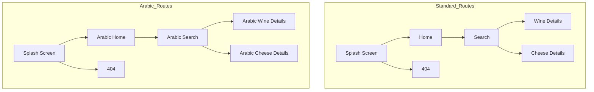
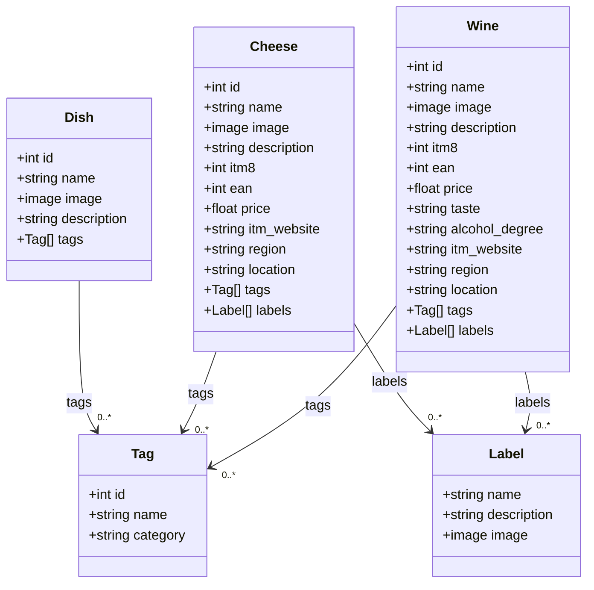

# Technical Specifications - BiteMatch <!-- omit in toc -->

<details>
<summary>Table of Contents</summary>

- [1. Introduction](#1-introduction)
  - [1.1. Glossary](#11-glossary)
  - [1.2. Project Overview](#12-project-overview)
  - [1.3. Project Defintion](#13-project-defintion)
    - [1.3.1. Vision](#131-vision)
    - [1.3.2. Objectives](#132-objectives)
    - [1.3.3. Scope](#133-scope)
    - [1.3.4. Target Audience](#134-target-audience)
    - [1.3.5. Deliverables](#135-deliverables)
- [2. Technology Used](#2-technology-used)
  - [2.1. Presentation](#21-presentation)
  - [2.2. Initial steps](#22-initial-steps)
    - [2.2.1. Create An Account](#221-create-an-account)
    - [2.2.2. Create an Application](#222-create-an-application)
  - [2.3. Minimum Required Versions for Android and iOS](#23-minimum-required-versions-for-android-and-ios)
    - [2.3.1. Android Compatibility](#231-android-compatibility)
    - [2.3.2. iOS Compatibility](#232-ios-compatibility)
  - [2.4. Bubble Components Architecture](#24-bubble-components-architecture)
- [3. Tehcnical Specifications](#3-tehcnical-specifications)
  - [3.1. Coding Conventions](#31-coding-conventions)
    - [3.1.1. Naming Conventions](#311-naming-conventions)
    - [3.1.2. File Architecture](#312-file-architecture)
  - [3.2. Routing and Pages](#32-routing-and-pages)
    - [3.2.1. Standard Pages](#321-standard-pages)
    - [3.2.2. Arabic-Language Pages](#322-arabic-language-pages)
    - [3.2.3. Navigation Flow between pages](#323-navigation-flow-between-pages)
  - [3.3. Application Logic](#33-application-logic)
    - [3.3.1. Workflows](#331-workflows)
      - [3.3.1.1. Workflow Execution Model](#3311-workflow-execution-model)
      - [3.3.1.2. Core Workflows](#3312-core-workflows)
        - [Workflow B: Matching Engine Execution](#workflow-b-matching-engine-execution)
        - [Workflow C: Save Recommendation](#workflow-c-save-recommendation)
      - [3.3.1.3. Backend Workflows and Scheduled Events](#3313-backend-workflows-and-scheduled-events)
        - [Workflow D: Daily Product Sync](#workflow-d-daily-product-sync)
        - [Workflow E: Expired Data Cleanup](#workflow-e-expired-data-cleanup)
      - [3.3.1.4. Conditional Logic Handling](#3314-conditional-logic-handling)
      - [3.3.1.5. Error Handling and Fallbacks](#3315-error-handling-and-fallbacks)
  - [3.4. Data Management](#34-data-management)
    - [3.4.1. Database Structure](#341-database-structure)
  - [3.5. Caching \& Offline Support](#35-caching--offline-support)
    - [3.5.1. Caching Strategy](#351-caching-strategy)
      - [A. Types of Caching Used](#a-types-of-caching-used)
      - [B. Caching Strategy Flow](#b-caching-strategy-flow)
    - [3.5.2. Offline Support](#352-offline-support)
      - [A. Offline Behavior](#a-offline-behavior)
      - [B. Offline Startup Flow](#b-offline-startup-flow)
    - [3.5.3. Limitations](#353-limitations)
    - [3.5.4. Recommendations](#354-recommendations)
  - [3.6. Performance](#36-performance)
    - [3.6.1. Performance Overview](#361-performance-overview)
    - [3.6.2. Known Bottlenecks](#362-known-bottlenecks)
    - [3.6.3. Performance Optimization Techniques](#363-performance-optimization-techniques)
      - [3.6.3.1. Database Optimization](#3631-database-optimization)
      - [3.6.3.2. Workflow Optimization](#3632-workflow-optimization)
      - [3.6.3.3. UI/UX Optimization](#3633-uiux-optimization)
    - [3.6.4. Testing Metrics](#364-testing-metrics)
    - [3.6.5. Performance Recommendations](#365-performance-recommendations)
  - [3.7. Scalability](#37-scalability)
    - [3.7.1. Infrastructure and Hosting](#371-infrastructure-and-hosting)
    - [3.7.2. Capabilities on Free Tier](#372-capabilities-on-free-tier)
    - [3.7.3. Limitations on Free Tier](#373-limitations-on-free-tier)
    - [3.7.4. Upgrade and Scaling Strategy](#374-upgrade-and-scaling-strategy)
      - [3.7.4.1. Paid Bubble Plans](#3741-paid-bubble-plans)
      - [3.7.4.2. External API Offloading](#3742-external-api-offloading)
    - [3.7.5. Suitability Summary](#375-suitability-summary)
  - [3.8. Security \& Privacy](#38-security--privacy)
  - [3.9. Accessibility](#39-accessibility)
  - [3.10. Localization \& Internationalization](#310-localization--internationalization)
  - [3.11. Error Handling \& Logging](#311-error-handling--logging)
  - [3.12. Bundling \& Deployment](#312-bundling--deployment)
- [4. UI/UX Guidelines](#4-uiux-guidelines)
  - [4.1. Design Principles](#41-design-principles)
    - [4.1.1. Key Design Objectives](#411-key-design-objectives)
    - [4.1.2. User Experience Guidelines](#412-user-experience-guidelines)
  - [4.2. Styles \& Theming](#42-styles--theming)
    - [4.2.1. Color Palette](#421-color-palette)
    - [4.2.2. Typography](#422-typography)
    - [4.2.3. Themes](#423-themes)
    - [4.2.4. Global Style Variables](#424-global-style-variables)
  - [4.2.5. Component Styles](#425-component-styles)
    - [4.2.5.1. Structure of `styles.md`](#4251-structure-of-stylesmd)
    - [4.2.5.2. Usage](#4252-usage)

</details>

## 1. Introduction

### 1.1. Glossary

| Term | Definition |
| ---- | ---------- |

### 1.2. Project Overview

This project involves creating an application that recommends wine and cheese to users based on the meal they plan to eat.

The client is "Intermarché Saint-Rémy-de-Provence". Our contact points are Célia Moustier and Chrys Cadeau, respectively, the Intermarché's representative and the intern aisle responsible.

### 1.3. Project Defintion

#### 1.3.1. Vision

The vision of our application is to provide Intermarché's customers best wine and cheese associations with the dish they plan cooking, with the potential to retrieve the product they look for in the supermarket.

#### 1.3.2. Objectives

- **Helping client find meal assortiment**: The application should allow the user to find wine or cheese without any human help.
- **Bringing discovery to client**: The application should permit the client to discover new and local ingredients/wines. It would allow the client to have a new experience with the French culture.
- **Ease of use**: The application should be totally user-friendly and compatible in many languages. The application should be quick to use no more than 3 pages to navigate through-and accessible without connection.

#### 1.3.3. Scope

The project will be developed using **Bubble**, a no-code platform, ensuring compatibility across all mobile devices. If the concept is adapted for broader distribution or scaling, a different technology stack may be considered for development.

The primary focus will be on front-end implementation, given the project's emphasis on user experience (UX). Although a back-end will be integrated, it will be lightweight compared to the database structure. As a proof of concept, the project will prioritize quality over quantity.

#### 1.3.4. Target Audience

**Tourist**: People who aren't from the region, wanting to discover more about the culture and culinary habits of its inhabitants. They would use the application in their own language (or the most common one) to discover new wines and cheese quickly during their journey.

**Locals**: People who live annually or partially in the region. They could use the application for recommendations in particular events such as weddings or parties.

**Wine Amateurs**: People who like wines and have knowledge about them. They could use the application to know more about the different tastes of the wine, with what suits it best.

**Cheese Amateurs**: People who like cheeses and have knowlegde about them. They could use the application to know more about the different kind of the cheese and their best assortiment.

#### 1.3.5. Deliverables

The main deliverable of this project is the Bubble application. Alongside, five documents will be written:

- The Functional Specification
- The Technical Specification
- The Test Plan
- Management Planning and Weekly Reports

In addition, a 15-minute-long presentation will be done in front of the client to show our final product.

## 2. Technology Used

### 2.1. Presentation

Bubble is a visual web application development platform that allows users to build fully functional web apps without writing code. It provides a drag-and-drop interface for designing user interfaces and a powerful workflow editor to define logic, database interactions, and API calls.

From a technical standpoint, Bubble operates as a backend-as-a-service (BaaS) and frontend builder combined, managing hosting, database, user authentication, and dynamic content rendering. It abstracts infrastructure and code complexity while still enabling advanced features like real-time updates, custom plugins, and responsive design.

> [!IMPORTANT]
> We'll only be using Bubble Free Plan during this project. Some features are not available, and some might be limited. Those issues are mentioned in the relevant categories through the document.

### 2.2. Initial steps

#### 2.2.1. Create An Account

To start developping with Bubble, you first need to create an account:

1. Go to [Bubble's Signup Page](https://bubble.io/login?mode=signup) and enter your email and password.
2. Click the Verify Account link you received in the mailbox of the email you filled in and foloow the instructions on your screen

You are now ready to use Bubble.

#### 2.2.2. Create an Application

In order to build your project you need to create an application. To create an application:

1. On [Bubble Home Page](https://bubble.io/home/apps), click the **Create an app** button.
2. In the popup which opened, enter the name of the application (BiteMatch) and click **Get started**

After a few seconds, you will be shown an editor with a blank page of your app.

### 2.3. Minimum Required Versions for Android and iOS

As Bubble does not natively support mobile app bundling, the application will be packaged using the **BDK Native wrapper**. This introduces specific constraints related to supported operating system versions for Android and iOS.

> [!NOTE]
> Since the app does\*not rely on native mobile features (e.g., camera, GPS, push notifications), compatibility is based solely on operating system version support.

#### 2.3.1. Android Compatibility

| Parameter                     | Value                                                                |
| ----------------------------- | -------------------------------------------------------------------- |
| **Packaging Tool**            | BDK Native                                                           |
| **Minimum Supported Version** | Not explicitly defined by BDK                                        |
| **Store Requirement**         | Must target **Android 13+** (API level 33), per Google Play policies |
| **Deployment Target**         | Android 13 and above                                                 |
| **Distribution Method**       | Google Play Store only                                               |
| **Justification**             | Ensures compliance, performance, and compatibility                   |

#### 2.3.2. iOS Compatibility

| Parameter                           | Value                                                              |
| ----------------------------------- | ------------------------------------------------------------------ |
| **Packaging Tool**                  | BDK Native                                                         |
| **Minimum Supported Version (BDK)** | iOS 9.1+                                                           |
| **Apple App Store Expectation**     | Support for latest iOS version (currently iOS 17)                  |
| **Deployment Target**               | iOS 17 and above                                                   |
| **Distribution Method**             | Apple App Store                                                    |
| **Justification**                   | Aligns with Apple’s guidelines and ensures optimal user experience |

### 2.4. Bubble Components Architecture


## 3. Tehcnical Specifications

### 3.1. Coding Conventions

#### 3.1.1. Naming Conventions

You can find a comprehensive list of all the naming conventions we will apply during this project in the [Conventions document](./conventions.md).

#### 3.1.2. File Architecture

> [!NOTE]
> No code will be directly created in the repository. Consequently, this file architecture only contains the folder linked to documents and repository administration:

```plaintext
/
  ├── .github/
  │     ├── ISSUE_TEMPLATE/
  │     │     │     ├── 01_documentation_report.yml
  │     │     │     ├── 02_software_bug_report.yml
  │     │     │     ├── 03_feature_request.yml
  │     │     │     ├── config.yml
  │     ├── pull_request_template.md
  ├── documents/
  │     ├── functional_specification/
  │     │     ├── img/
  │     │     │     ├── List of images included in the functional specifications
  │     │     ├── pdf/
  │     │     │     ├── List of PDFs included in the functional specifications
  │     │     ├── functional_specification.md
  │     ├── management/
  │     │     ├── weekly_reports/
  │     │     │     ├── cumulative.md
  │     │     │     ├── List of all the weekly reports from week_1.md to week
  │     │     ├── management_artifacts.md
  │     │     ├── project_charter.md
  │     ├── quality_assurance/
  │     │     ├── test_cases.md
  │     │     ├── test_plan.md
  │     ├── technical_specification
  │     │     ├── conventions.md
  │     │     ├── technical_specification.md
  ├── README.md
```

### 3.2. Routing and Pages

The application uses Bubble's pre-bundled router to handle all navigation. Below is a list of all routes, their query parameters, and their intended usage.

#### 3.2.1. Standard Pages

| Page URL     | Bubble Page Name | Query Parameters                                                                                            | Description                                  | Example query with params                   |
| ------------ | ---------------- | ----------------------------------------------------------------------------------------------------------- | -------------------------------------------- | ------------------------------------------- |
| `/`          | `index`          | None                                                                                                        | Splash screen of the application             | `/`                                         |
| `/home`      | `home`           | None                                                                                                        | Main interface for searching recipes         | `/home`                                     |
| `/search`    | `search`         | - `query`: `string` – Name of the searched dish <br> - `tags`: `string` – Comma-separated, URL-encoded tags | Displays search results for dishes           | `/search?query=pasta&tags=vegan%5C%2Cquick` |
| `/wine`      | `wine`           | - `id`: `string` – Database ID of the wine                                                                  | Displays detailed information about a wine   | `/wine?id=21`                               |
| `/cheese`    | `cheese`         | - `id`: `string` – Database ID of the cheese                                                                | Displays detailed information about a cheese | `/wine?id=21`                               |
| _Other URLs_ | `404`            | None                                                                                                        | Fallback page for non-existent routes        | `/driller`                                  |

#### 3.2.2. Arabic-Language Pages

All routes have an Arabic-specific equivalent with the `ar_` prefix. These pages present a horizontally mirrored layout to accommodate right-to-left reading. They mirror the structure and functionality of their English counterparts.

| English Page | Arabic Equivalent |
| ------------ | ----------------- |
| `/home`      | `/ar_home`        |
| `/search`    | `/ar_search`      |
| `/wine`      | `/ar_wine`        |
| `/cheese`    | `/ar_cheese`      |

> [!WARNING]
> All Arabic routes share the same query parameters and behavior as their English counterparts.

#### 3.2.3. Navigation Flow between pages



### 3.3. Application Logic

#### 3.3.1. Workflows

The application logic is primarily implemented using **Bubble's visual workflow engine**, which enables reactive programming by defining sequences of actions triggered by events such as user interactions, data changes, or scheduled backend processes. Each workflow consists of a set of conditionally executed actions, often interacting with Bubble’s database or UI components through custom states and visibility logic. Plugin actions can also be triggered through these workflows.

This section documents the major workflow structures used in the application, including triggering mechanisms, conditional branches, state manipulations, data processing, and interaction with backend APIs or scheduled events.

> [!NOTE]
> Non-described workflows include :
>
> - Sole navigation between pages on user action
> - Sole appearance/disappearance of elements on the canvas

##### 3.3.1.1. Workflow Execution Model

In Bubble, workflows are divided into:

- **Frontend workflows (event-based)**: Triggered by UI elements (e.g., buttons, inputs) or page events.
- **Backend workflows (API Workflows)**: Executed via HTTP calls or scheduled server-side logic.
- **Custom Events**: Reusable workflow fragments invoked across multiple entry points.

All workflows follow a **deterministic execution path**. Actions are executed **sequentially** unless explicitly deferred (e.g., using `schedule API workflow`, `add a pause`, or asynchronous API calls).

---

##### 3.3.1.2. Core Workflows

Below are the primary workflow groups and their technical behavior:

###### Workflow B: Matching Engine Execution

- Trigger: `Button "Find My Match" is clicked`
- Preconditions:

  - `Custom State: selected_dish` is not empty
  - `Current User` has accepted cookie/session storage (for data persistence)

- Execution:

  1. Run a `Search for Dishes` where `name = selected_dish`
  2. Extract tags (`taste`, `season`, `occasion`) from dish
  3. Filter `Wine` entries using intersecting tags + availability flag
  4. Repeat for `Cheese` entries, adding dietary and allergy filters
  5. Store results in custom states (`state_wine_result`, `state_cheese_result`)
  6. Show recommendation group using conditional visibility based on result state

- Edge Handling:

  - If no result found, store `state_no_match = yes`
  - Trigger fallback content rendering

###### Workflow C: Save Recommendation

- **Trigger**: `Button "Save Pairing"` is clicked
- **Actions**:

  1. Create a new `Recommendation` thing:

     - `user_id = Current User`
     - `dish_id = selected_dish`
     - `wine_id = wine_result`
     - `cheese_id = cheese_result`

  2. Trigger toast confirmation
  3. Optionally redirect to “Saved Matches” if `Custom State: auto_redirect = yes`

---

##### 3.3.1.3. Backend Workflows and Scheduled Events

###### Workflow D: Daily Product Sync

- Type: Scheduled API Workflow
- Trigger: Daily at 03:00 UTC via Bubble Scheduler
- Steps:

  1. Make external API call to Intermarché catalog (secured with Bearer token)
  2. For each item:

     - Create or update `Wine`, `Cheese`, or `Dish` entry
     - Normalize tags based on controlled vocabulary (`label`, `taste`, `season`)

  3. Store timestamp in `System_Log` for auditability

###### Workflow E: Expired Data Cleanup

- Type: Scheduled API Workflow
- Trigger: Weekly at 04:00 UTC
- Steps:

  - Delete `Recommendation` entries older than 90 days where `user_id is empty` (i.e., anonymous session)
  - Purge logs not linked to persistent users

##### 3.3.1.4. Conditional Logic Handling

All workflows implement conditional logic directly within Bubble’s step configuration using the `Only when` clause. Examples include:

- **Visibility control**: Groups are only shown when specific states or conditions are met
- **Role enforcement**: Admin-only workflows (e.g., content validation) are hidden unless `Current User.role = "admin"`
- **Fallback execution**: Match fallback only runs when both primary queries return empty lists

##### 3.3.1.5. Error Handling and Fallbacks

Bubble lacks native try/catch logic, so fallback behavior is enforced via:

- **Workflow branches**: e.g., check for empty result before proceeding
- **Conditional actions**: e.g., if `Search for Wine:first item is empty`, then trigger fallback workflow
- **Alert system**: User-friendly error messages triggered via `Show Message` or `Set State`

Logging for errors or unexpected states is handled via a custom data type `System_Log`, storing:

- Timestamp
- Workflow name
- Error context
- Affected user (if applicable)

<!-- ## 📌 Notes

- All workflows are **modularized** using **Custom Events** for reuse and maintainability.
- Bubble’s **backend workflows** are rate-limited and serialized by default. Concurrent execution is avoided using inter-step dependencies (e.g., conditional filters on input presence).
- Data privacy and workflow security are enforced by Bubble’s privacy rules and server-side condition checks. -->

### 3.4. Data Management

#### 3.4.1. Database Structure



### 3.5. Caching & Offline Support

This section outlines the current caching mechanisms available in the application and how the system handles offline scenarios, especially given Bubble.io’s cloud-based, web-first environment.

#### 3.5.1. Caching Strategy

Bubble.io does not offer native server-side caching on the free tier, but it does support **client-side caching** via the browser and **custom states** for session-local data persistence.

##### A. Types of Caching Used

| Caching Layer       | Type                 | Scope              | Volatility                  | Purpose                                |
| ------------------- | -------------------- | ------------------ | --------------------------- | -------------------------------------- |
| Browser Cache       | Static file cache    | Browser memory     | Persistent                  | HTML, JS, CSS, images                  |
| Bubble Custom State | Runtime memory       | Page-level session | Volatile (reset on refresh) | Store selections, filtered lists       |
| Data Cache          | Implicit from Bubble | App session memory | Volatile                    | Temporarily caches repeated DB queries |

##### B. Caching Strategy Flow


**Key Notes:**

* Custom states avoid redundant DB queries during a session
* Repeating group elements benefit from implicit Bubble-level memoization for short durations
* Static assets are cached using the browser’s default caching policies

#### 3.5.2. Offline Support

Bubble applications are inherently **not designed for offline-first operation**. The frontend is delivered as a web app and requires an internet connection to:

* Authenticate users
* Query the Bubble database
* Execute workflows
* Fetch dynamic content

##### A. Offline Behavior

| Component               | Behavior Offline                    |
| ----------------------- | ----------------------------------- |
| App Shell (HTML/CSS/JS) | May load from cache                 |
| Database Queries        | Fail silently or with error message |
| Workflows               | Do not execute                      |
| UI Interactions         | Work if based on custom states      |
| Local Image Assets      | May load from browser cache         |

##### B. Offline Startup Flow

```mermaid
flowchart TD
    A[User opens app with no connection] --> B{App previously loaded?}
    B -- Yes --> C[Load from browser cache]
    B -- No --> D[Show "No Internet" error]
    C --> E[Basic UI visible]
    E --> F{Data needed from DB?}
    F -- No --> G[Allow interaction with static UI]
    F -- Yes --> H[Show fallback / empty state]
```

#### 3.5.3. Limitations

| Limitation                      | Description                                      |
| ------------------------------- | ------------------------------------------------ |
| No true offline support         | Dynamic content requires a live connection       |
| Volatile cache                  | Custom states lost on reload or tab close        |
| No background sync              | Changes made offline cannot be queued for upload |
| No service worker customization | Cannot define offline cache policy manually      |

#### 3.5.4. Recommendations

To improve perceived performance and prepare for offline-tolerant behavior:

* **Preload critical data** on page load and store in custom states
* **Defer non-essential data fetching** until needed (lazy loading)
* Use **conditional visibility** to show fallback content or cached values if data is missing
* Consider **PWA migration** for full offline capability (requires leaving Bubble)

### 3.6. Performance

#### 3.6.1. Performance Overview

The app runs on Bubble’s shared infrastructure with client-heavy rendering and server-side logic executed through visual workflows.

| Component       | Performance Characteristic                              |
| --------------- | ------------------------------------------------------- |
| Frontend UI     | Rendered client-side using dynamic Bubble elements      |
| Database Access | Server-side, synchronous and relatively slow under load |
| Workflows       | Executed on shared compute, limited throughput          |
| Page Load Times | Acceptable for small datasets (<1000 items)             |

#### 3.6.2. Known Bottlenecks

The following bottlenecks can be observed as the dataset grows or the app gains more users:

- **Search latency**: Filtering meals, wines, or cheeses dynamically leads to high database read latency
- **Workflow execution delays**: Multiple concurrent workflows can queue up and timeout
- **UI rendering slowness**: Repeating groups with complex filters cause noticeable delay
- **File/image loading**: Use of large images slows page load and responsiveness

#### 3.6.3. Performance Optimization Techniques

##### 3.6.3.1. Database Optimization

- Use **constraints** inside repeating group searches rather than filtering with `:filtered`
- Avoid **nested searches** and instead rely on pre-linked data types (e.g., wine → grape → region)
- Limit the number of items retrieved and use **pagination** or **infinite scroll**

##### 3.6.3.2. Workflow Optimization

| Optimization Strategy                | Description                                                       |
| ------------------------------------ | ----------------------------------------------------------------- |
| Use Custom States                    | Store data client-side to avoid repeated DB reads                 |
| Delay Heavy Workflows                | Trigger backend workflows on paid plan or offload to external API |
| Break Down Multi-Step Workflows      | Avoid performance drops from long synchronous chains              |
| Avoid Triggers on Every Input Change | Use debounce logic or buttons to trigger filtering                |

##### 3.6.3.3. UI/UX Optimization

- Use **reusable elements** to reduce rendering complexity
- Lazy-load non-critical sections (e.g., recommendations or descriptions)
- Limit use of conditionals that show/hide elements on every user action

#### 3.6.4. Testing Metrics

Bubble does not expose detailed APM (Application Performance Monitoring) metrics on the free tier, but basic performance observations can be made manually.

| Scenario                  | Expected Response Time (Free Tier)  |
| ------------------------- | ----------------------------------- |
| Load meal pairing page    | 2–3 seconds (with <100 items)       |
| Search wines with filters | 1–2 seconds with indexed attributes |
| Execute pairing workflow  | 500ms – 1s                          |
| Image-heavy content       | 3–5 seconds total page render time  |

#### 3.6.5. Performance Recommendations

- **Prototype scale only**: App should remain under 1000 total database entries (meals + cheeses + wines)
- **Avoid live search for production**: Use search triggers or batch filters.
- **Preprocess data externally** if matching logic grows (e.g., using a backend API for pairing calculations).

### 3.7. Scalability

This section outlines the current scalability of the application built on the **Bubble.io free-tier**, as well as its limitations, performance considerations, and upgrade paths to support growth.

#### 3.7.1. Infrastructure and Hosting

The application runs on **Bubble.io**, a platform with the following integrated features:

| Feature           | Description                                                 |
| ----------------- | ----------------------------------------------------------- |
| Hosting Model     | Cloud-based, shared environment (multi-tenant)              |
| Deployment        | Handled automatically by Bubble                             |
| Backend Execution | Event-driven workflows, executed on Bubble’s infrastructure |
| Database          | Integrated with Bubble (non-relational, key-value style)    |
| Frontend          | Built with Bubble’s visual editor using reusable components |

#### 3.7.2. Capabilities on Free Tier

The free tier enables basic functionality suitable for prototypes, internal demos, and early user testing. Key scalability-related capabilities include:

- **Auto-managed hosting**: No setup or maintenance required
- **Integrated database**: Supports basic storage for wines, cheeses, meals, and user sessions
- **Reusable UI components**: Optimizes frontend rendering for small apps
- **Client-side rendering**: Reduces server-side load

**Recommended Usage Range:**

| Metric             | Approximate Limit (Free Tier) |
| ------------------ | ----------------------------- |
| Concurrent Users   | 3–5 active users              |
| Total Records (DB) | < 200 entries                 |
| Monthly Workflows  | \~100–200 (non-intensive)     |
| External API Calls | Limited (no API scheduling)   |

#### 3.7.3. Limitations on Free Tier

While functional for limited traffic, the free tier imposes key constraints that affect scalability:

- **Shared server**: Subject to variable performance based on other users
- **Capacity Units (CU)**: Low throughput limits the number of simultaneous actions
- **No backend workflows**: Cannot schedule background jobs (e.g., daily pairing updates)
- **No version control or staging**: Limited flexibility for continuous integration
- **Limited storage and bandwidth**

**Key Limitations Summary:**

| Area               | Limitation                                 |
| ------------------ | ------------------------------------------ |
| Server Performance | Slower response under load                 |
| Workflow Execution | Delays or timeouts for complex logic       |
| Data Querying      | Inefficient for large or filtered searches |
| Concurrency        | Not suitable for high-traffic apps         |
| Scheduled Tasks    | Not available (requires paid plan)         |

#### 3.7.4. Upgrade and Scaling Strategy

To support scaling as the app gains users or complexity, the following strategy is proposed:

##### 3.7.4.1. Paid Bubble Plans

Upgrade to Bubble’s paid plans to unlock:

| Feature                       | Benefit                                      |
| ----------------------------- | -------------------------------------------- |
| Increased Capacity Units (CU) | Supports more concurrent users and workflows |
| Backend Workflows             | Enables scheduled tasks (e.g., data sync)    |
| Priority Server Access        | Reduces latency during peak hours            |
| Collaboration Tools           | Allows team-based development                |

> [!NOTE]
> The recommended Bubble plan would be the **Growth plan**, containing the following features:
>
> - 2 app editors
> - Premium version control with 10 branches
> - Two-factor authentication support for users
> - 250k workload units/mo
> - 14 days of server logs
>
> You can have access to the comprehensive list of features of the **Growth plan** by checking the [Bubble Pricing Page](https://bubble.io/pricing).

##### 3.7.4.2. External API Offloading

Move compute-heavy logic (e.g., pairing algorithm) to an external backend (Node.js):


#### 3.7.5. Suitability Summary

| Use Case                                 | Free Tier Suitability |
| ---------------------------------------- | --------------------- |
| MVP / Prototype                          | ✅ Suitable           |
| Internal Demo / Stakeholder Presentation | ✅ Suitable           |
| Beta Testing (Low Traffic)               | ⚠️ Limited            |
| Public Launch (Moderate Traffic)         | ❌ Not Recommended    |
| High-Traffic Production                  | ❌ Not Supported      |

### 3.8. Security & Privacy

| Role | Description                | Permissions                                                                |
| ---- | -------------------------- | -------------------------------------------------------------------------- |
| User | End-user of the mobile app | - View and select recipes<br>- Receive recommendations<br>- Save favorites |

> [!NOTE]
> As this application is a proof of concept, it will only contain the end user side, with the user role. In future updates, interfaces of rhte administrators of the website will need to be created in order to manage more easily the app's data.

### 3.9. Accessibility

### 3.10. Localization & Internationalization

### 3.11. Error Handling & Logging

### 3.12. Bundling & Deployment

## 4. UI/UX Guidelines

### 4.1. Design Principles

The Intermarché Wine & Cheese Pairing App is designed for **tourists and non-experts** in wine, cheese, or gastronomy. The goal is to offer a **simple, intuitive, and accessible** experience for all users.

#### 4.1.1. Key Design Objectives

| Principle              | Description                                                                     |
| ---------------------- | ------------------------------------------------------------------------------- |
| **Simplicity**         | Use of plain language, minimal UI complexity, and clear visual hierarchy.       |
| **Accessibility**      | High contrast, readable text, touch-friendly buttons, and multilingual support. |
| **Guided Use**         | Step-by-step user flows (e.g., dish → recommended wine/cheese).                 |
| **Consistency**        | Reusable UI patterns and predictable interactions.                              |
| **Cultural Relevance** | Local French design elements to enhance authenticity and engagement.            |

#### 4.1.2. User Experience Guidelines

- **Icons and visuals** support understanding without relying on text.
- **Pairing suggestions** explain "why it works" in simple terms.
- **No prior knowledge** is assumed; tooltips and helper texts are included where needed.

### 4.2. Styles & Theming

#### 4.2.1. Color Palette

| Name             | Preview                                                                                            | Hex     | RGB              |
| ---------------- | -------------------------------------------------------------------------------------------------- | ------- | ---------------- |
| Primary          | <span style="background-color: #E00E1F; width: 10px; height: 10px; display: inline-block;"></span> | #E00E1F | rgb(224,14,31)   |
| Primary Contrast | <span style="background-color: #DECE9C; width: 10px; height: 10px; display: inline-block;"></span> | #DECE9C | rgb(222,206,156) |
| Text             | <span style="background-color: #000000; width: 10px; height: 10px; display: inline-block;"></span> | #000000 | rgb(0,0,0)       |
| Surface          | <span style="background-color: #F1F1F2; width: 10px; height: 10px; display: inline-block;"></span> | #F1F1F2 | rgb(241,241,242) |
| Background       | <span style="background-color: #FFFFFF; width: 10px; height: 10px; display: inline-block;"></span> | #FFFFFF | rgb(255,255,255) |
| Destructive      | <span style="background-color: #B0200C; width: 10px; height: 10px; display: inline-block;"></span> | #B0200C | rgb(176,32,12)   |
| Success          | <span style="background-color: #1E6C30; width: 10px; height: 10px; display: inline-block;"></span> | #1E6C30 | rgb(30,108,48)   |
| Alert            | <span style="background-color: #DCA114; width: 10px; height: 10px; display: inline-block;"></span> | #DCA114 | rgb(220,161,20)  |

To set those colors as the default colors in the application, click **Styles > Style Variables > Colors** and apply the value of the color to the corresponding name.

> [!WARNING]
> Any colors **not listed** in this table are considered deprecated and should not be used in the final application. Ohter colors than these can be safely discarded from the default colors loaded in the application **Styles Variables**.

#### 4.2.2. Typography

The application uses the **Inter** typeface—a modern, legible, and highly versatile font that enhances readability and consistency across the interface.

To set this font as the default font of the app, click **Styles > Style Variables > Fonts** and apply the `Inter` value.

#### 4.2.3. Themes

- **Theme Supported**: Light Theme Only
- Dark mode and additional themes are not required for this application.

#### 4.2.4. Global Style Variables

To maintain consistent styling, the following global variables are defined:

| Variable         | Value   |
| ---------------- | ------- |
| App Font         | Inter   |
| Primary          | #E00E1F |
| Primary Contrast | #DECE9C |
| Text             | #000000 |
| Surface          | #F1F1F2 |
| Background       | #FFFFFF |
| Destructive      | #B0200C |
| Success          | #1E6C30 |
| Alert            | #DCA114 |

> [!NOTE]
> All values are considered with 100% opacity. Default color scales are disabled for this project.

### 4.2.5. Component Styles

To ensure design consistency and maintainability across the application, a set of predefined styles has been established and documented in the [`styles.md`](./styles.md) file. These styles serve as the foundation for all UI components implemented in the Bubble platform.

#### 4.2.5.1. Structure of `styles.md`

The `styles.md` file is organized into structured tables, with each style grouped under a specific **tab** (e.g., _Appearance_, _Layout_, _Conditional Logic_). Each entry includes the property name and its assigned value.

Example format:

<table>
  <tr>
    <th>Tab</th>
    <th>Property</th>
    <th>Value</th>
  </tr>
  <tr>
    <td rowspan="14">Appearance</td>
    <td>Font</td>
    <td>Inter</td>
  </tr>
  <tr><td>Font Size</td><td>20px</td></tr>
  <tr><td>Font Weight</td><td>Bold (700)</td></tr>
  <tr><td>Text Alignment</td><td>Center</td></tr>
  <tr>
    <td rowspan="4">Layout</td>
    <td>Gap</td>
    <td>12px</td>
  </tr>
  <tr><td>Padding Left</td><td>12px</td></tr>
  <tr><td>Padding Right</td><td>12px</td></tr>
  <tr><td>Padding Top / Bottom</td><td>0px</td></tr>
  <tr>
    <td rowspan="1">Conditional Logic</td>
    <td>Event</td>
    <td>Updated Properties</td>
  </tr>
</table>

> [!NOTE]
> Due to Markdown limitations with tables, and to enhance readability for developers, the style tables in `styles.md` are written using raw HTML.

#### 4.2.5.2. Usage

These styles must be implemented within the **Styles** tab of the Bubble editor. They define the visual identity of the application and should be consistently applied across all components.

> [!WARNING]
> Any styles **not listed** in `styles.md` are considered deprecated and should not be used in the final application.
